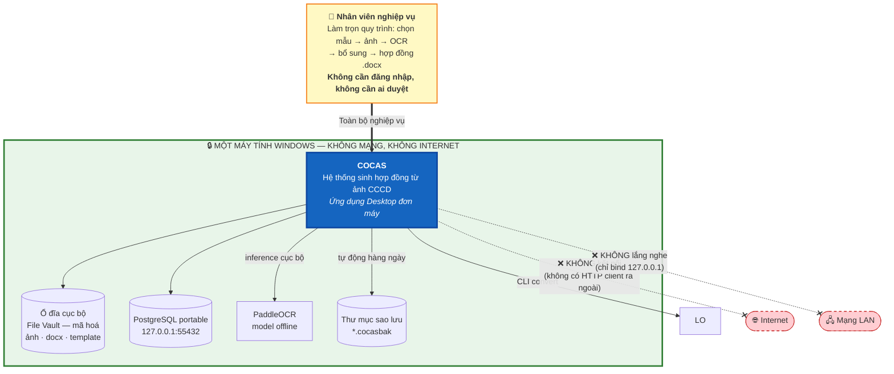
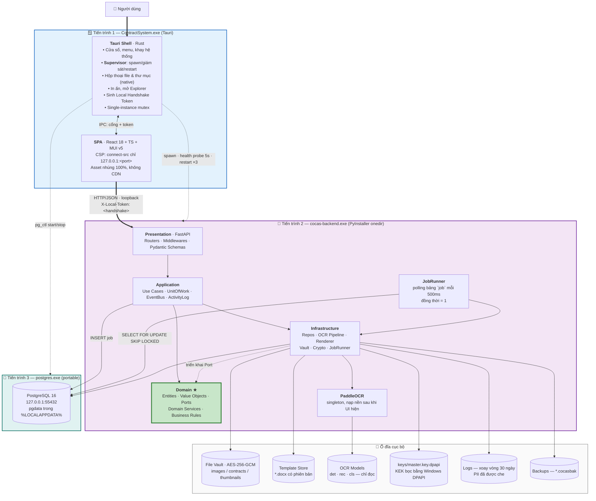
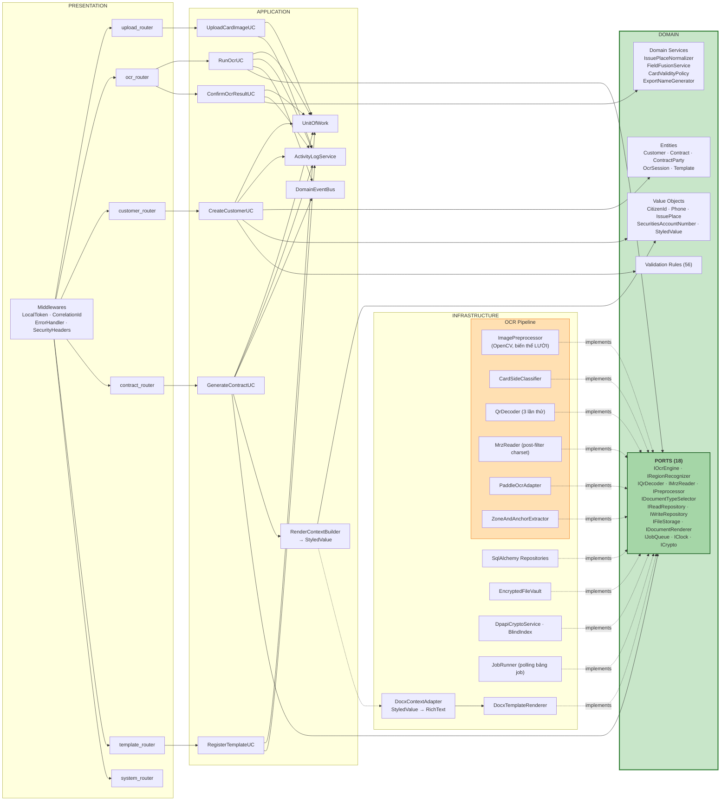
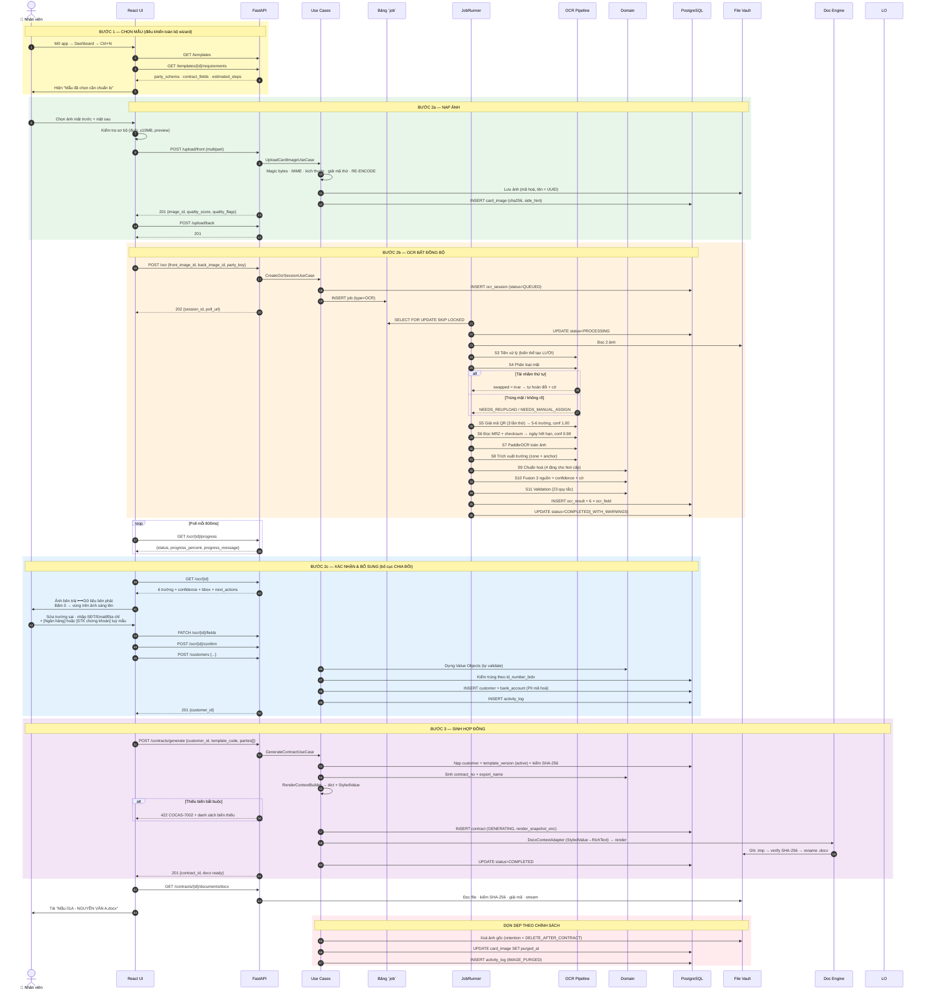
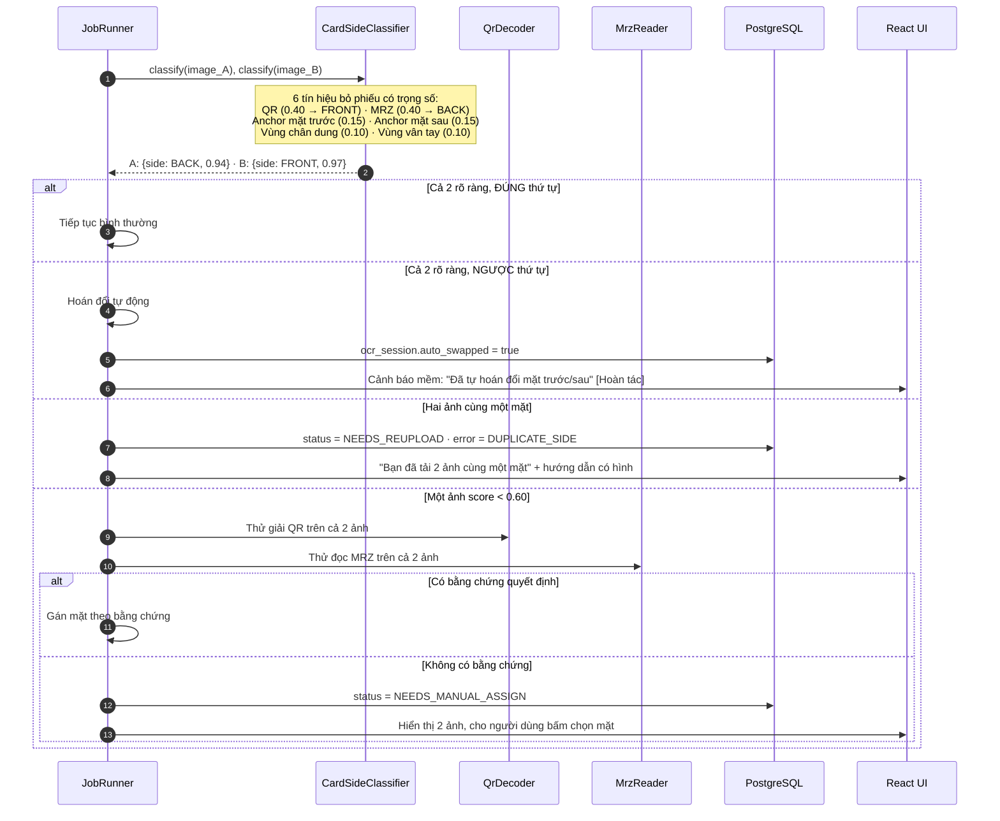
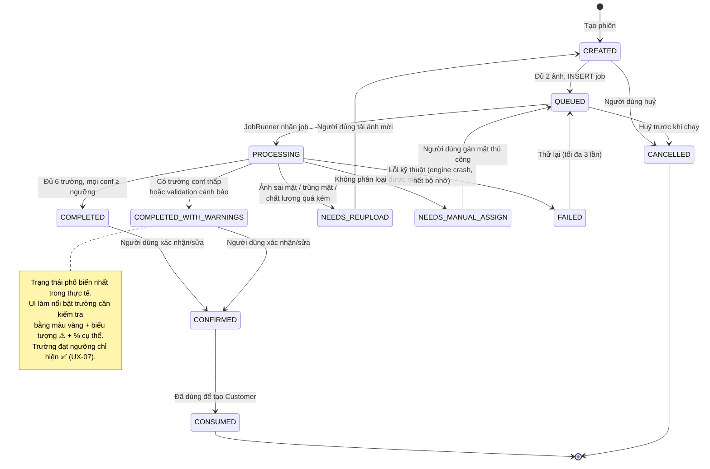
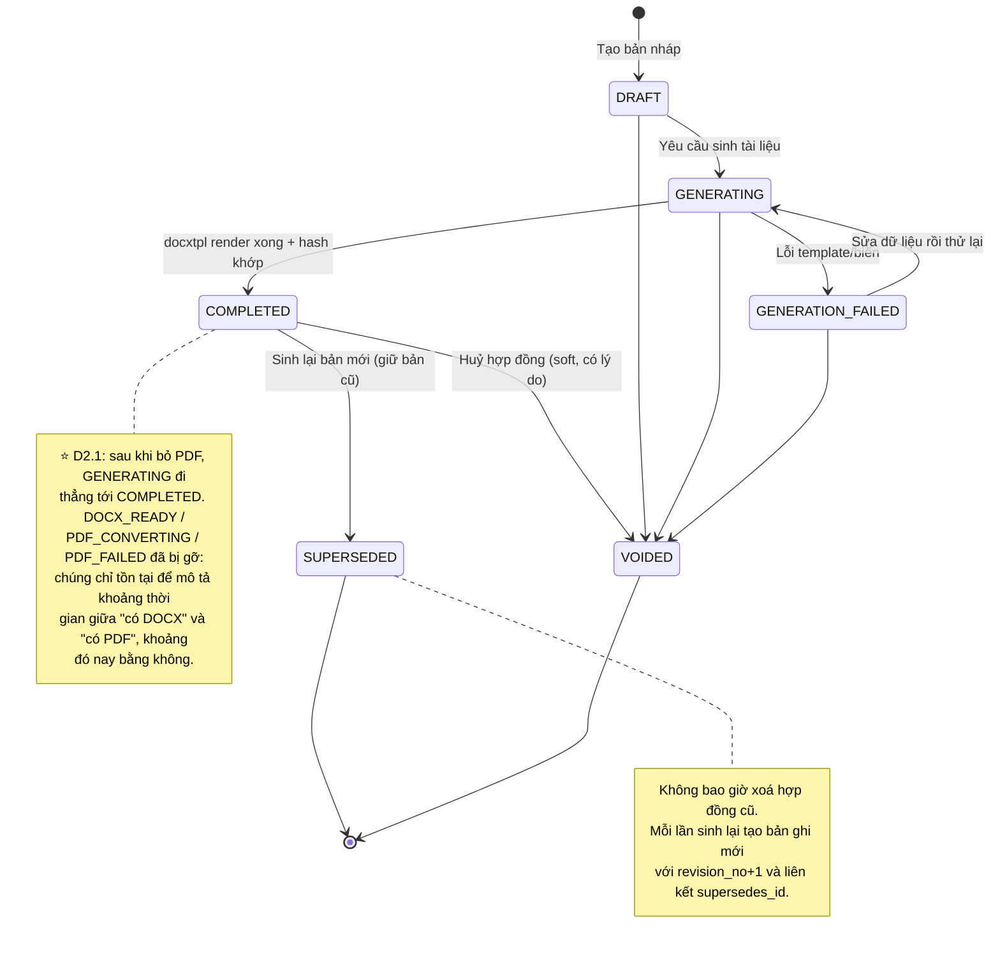
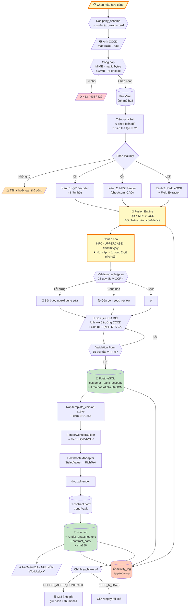
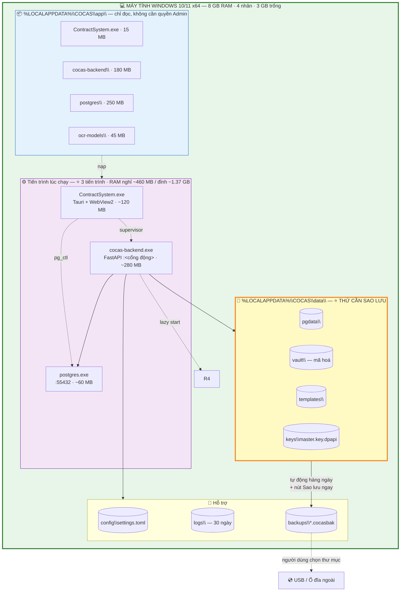
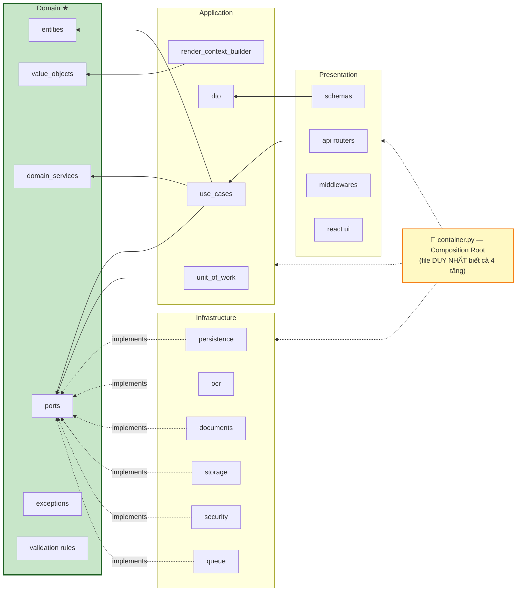

# 02 — Sơ đồ hệ thống

[← Mục lục](README.md)

---

## 2.1. C4 Level 1 — Sơ đồ ngữ cảnh

---

## 2.2. C4 Level 2 — Sơ đồ Container

---

## 2.3. C4 Level 3 — Sơ đồ Component (Backend)

---

## 2.4. Sơ đồ tuần tự — Toàn trình tạo hợp đồng

---

## 2.5. Sơ đồ tuần tự — Xử lý tải nhầm thứ tự mặt

---

## 2.6. Máy trạng thái — Phiên OCR

---

## 2.7. Máy trạng thái — Hợp đồng

---

## 2.8. Sơ đồ luồng dữ liệu (DFD Level 1)

---

## 2.9. Sơ đồ triển khai

---

## 2.10. Sơ đồ phụ thuộc theo tầng (kiểm chứng Dependency Rule)

> **Kiểm chứng tự động:** `import-linter` với contract `layers` — CI đỏ nếu bất kỳ file nào trong `domain/` import từ `infrastructure/`, `application/` hay `presentation/`. Ngoại lệ duy nhất được khai báo: `container.py`.

---

[← 01 — Kiến trúc](01-kien-truc-tong-the.md) · [Mục lục](README.md) · [Tiếp: 03 — Luồng dữ liệu →](03-luong-du-lieu.md)
