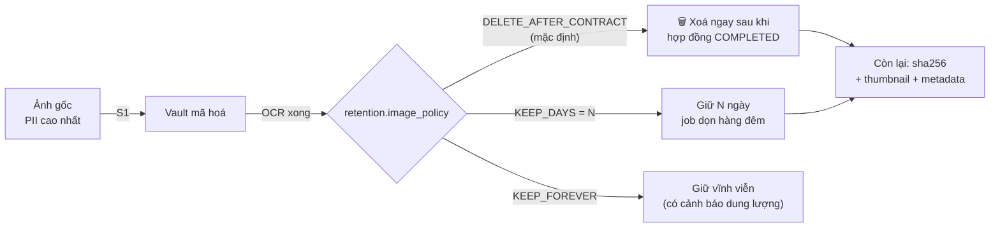

# 03 — Luồng xử lý dữ liệu

[← Mục lục](README.md)

---

## 3.1. Tổng quan pipeline — 14 chặng

| Chặng | Tên | Đầu vào | Đầu ra | Đồng bộ? | Thất bại → |
|---|---|---|---|---|---|
| **S0** | ⭐ **Chọn mẫu & nở bản khai báo** | `template_code` | `party_schema` đã resolve → số bước wizard | Sync | HTTP 404 |
| **S0b** | Kiểm tra phía client | File người dùng chọn | File hợp lệ sơ bộ | Sync (UI) | Hiện lỗi ngay |
| **S1** | Nạp & kiểm định (Ingestion) | Multipart file | `card_image` + file trong Vault | Sync | HTTP 4xx |
| **S2** | Tạo phiên OCR | 2 × `image_id` | `ocr_session` (QUEUED) + `job` | Sync | HTTP 4xx |
| **S3** | Tiền xử lý ảnh | Ảnh gốc | Biến thể (tạo lười) + ma trận biến đổi | Async | `FAILED`, retry |
| **S4** | Phân loại mặt trước/sau | 2 ảnh | Nhãn `FRONT`/`BACK` + độ tin cậy | Async | `NEEDS_REUPLOAD` |
| **S5** | Kênh QR | Ảnh mặt trước | Dict trường + conf = 1.00 | Async | Bỏ qua kênh |
| **S6** | Kênh MRZ | Ảnh mặt sau | Dict trường + checksum status | Async | Bỏ qua kênh |
| **S7** | Kênh OCR | 2 ảnh (hoặc ROI) | `[(bbox, text, conf)]` | Async | `FAILED` nếu cả 3 kênh chết |
| **S8** | Trích xuất trường | Text OCR + layout | 6 trường thô | Async | Trường = null, conf = 0 |
| **S9** | Chuẩn hoá | Trường thô | Trường đã chuẩn hoá | Async (Domain) | Giữ giá trị thô + cờ |
| **S10** | Hợp nhất & tính tin cậy | 3 nguồn | 6 trường cuối + conf + source | Async (Domain) | — |
| **S11** | Validation OCR | 6 trường cuối | Danh sách lỗi/cảnh báo có mã | Async (Domain) | `COMPLETED_WITH_WARNINGS` |
| **S12** | Xác nhận & bổ sung | Dữ liệu OCR + form | `customer` + `bank_account` | Sync | HTTP 422 |
| **S13** | Sinh hợp đồng | `customer` + `template_version` | DOCX → PDF | Sync (DOCX) + Async (PDF) | `GENERATION_FAILED` / `PDF_FAILED` |

---

## 3.2. Đặc tả chi tiết từng chặng

### S0 — Chọn mẫu & nở bản khai báo ⭐

Đây là chặng **đầu tiên** của toàn bộ quy trình (P-12). Mẫu hợp đồng quyết định mọi thứ phía sau.

| Bước | Nội dung |
|---|---|
| 0.1 | Người dùng chọn mẫu từ danh sách |
| 0.2 | `GET /templates/{id}/requirements` trả `party_schema` đã resolve |
| 0.3 | Frontend đọc `parties[]` → sinh danh sách bước wizard |
| 0.4 | Đọc `parties[].documents[]` → biết cần bao nhiêu ảnh, loại giấy tờ gì |
| 0.5 | Đọc `parties[].collect[]` → biết hiện/ẩn khối "Ngân hàng" |
| 0.6 | Đọc `parties[].extra_fields[]` → sinh ô nhập động (ví dụ `securities_account_no`) |
| 0.7 | Đọc `contract_fields[]` → nếu rỗng thì **bỏ qua bước "Thông tin hợp đồng"** |
| 0.8 | Hiển thị khối "Mẫu đã chọn cần chuẩn bị" |
| 0.9 | ⭐ Khởi động LibreOffice listener ở luồng nền (để lúc sinh PDF thì đã ấm) |

**Kết quả cho 2 mẫu hiện tại:**

| Mẫu | Bước | Khối bổ sung | Biến |
|---|---|---|---|
| `01A_HD_GDN` | 3 | Liên hệ + **Ngân hàng** | 12 |
| `01A_GDKQ` | 3 | Liên hệ + **STK chứng khoán** | 10 |

---

### S0b — Kiểm tra phía client

| Mục | Nội dung |
|---|---|
| **Mục đích** | Bắt lỗi sớm, cải thiện UX. **Không tin tưởng ở server** |
| **Kiểm tra** | Đuôi ∈ {`.jpg`,`.jpeg`,`.png`,`.webp`,`.bmp`,`.tif`,`.tiff`}; ≤ 10 MB; đọc được bằng `Image` API; cạnh dài ≥ 640 px |
| **Cảnh báo mềm** | Cạnh dài < 1000 px → "Ảnh có thể quá nhỏ"; histogram quá tối/sáng → cảnh báo |

---

### S1 — Nạp & kiểm định (Ingestion Gate)

**Biên giới bảo mật đầu tiên.** Mọi thứ vượt qua đây được coi là dữ liệu tin cậy có kiểm soát.

| Bước | Kiểm tra | Từ chối với |
|---|---|---|
| 1.1 | `Content-Length` ≤ `upload.max_size_mb` (10 MB), đọc theo chunk có giới hạn | `413` |
| 1.2 | Đọc 32 byte đầu → xác định **magic bytes** thật. **Không tin `Content-Type`** | `415` |
| 1.3 | Đối chiếu magic bytes ↔ allowlist ↔ đuôi file | `415` |
| 1.4 | Mở bằng Pillow với `Image.MAX_IMAGE_PIXELS` giới hạn, `verify()` rồi `load()` | `422` |
| 1.5 | Chiều rộng/cao ∈ [320, 12000] px | `422` |
| 1.6 | ⭐ **Re-encode toàn bộ ảnh** sang JPEG/PNG sạch → loại bỏ polyglot, payload nhúng, ICC profile lạ | — |
| 1.7 | Trích và lưu riêng EXIF `Orientation`, rồi **xoá toàn bộ EXIF** (GPS trong EXIF là PII!) | — |
| 1.8 | Tính `SHA-256` của ảnh đã re-encode | — |
| 1.9 | Sinh tên file = `UUIDv7` — **không dùng tên file gốc** (chống Path Traversal tuyệt đối) | — |
| 1.10 | Mã hoá AES-256-GCM rồi ghi `vault/images/{yyyy}/{mm}/{dd}/{uuid}.enc` | — |
| 1.11 | Ghi `card_image` + `activity_log` action=`IMAGE_UPLOADED` | — |

**Output:** `{image_id, sha256, width, height, size_bytes, detected_mime, quality_score, quality_flags[]}`

> `side_hint` là gợi ý từ endpoint (`/upload/front` → `FRONT`) nhưng **chỉ là gợi ý**. S4 mới quyết định thật.

---

### S2 — Tạo phiên OCR

- Kiểm tra 2 `image_id` tồn tại, chưa bị purge.
- Kiểm tra 2 ảnh **khác nhau** (`sha256` khác) → nếu giống, trả `409 COCAS-4004`.
- Tạo `ocr_session` trạng thái `QUEUED`, gắn `correlation_id`, `party_key`, `party_index`.
- ⭐ `INSERT` vào bảng `job` (type=`OCR`) — **đây là toàn bộ việc enqueue**.
- Trả `202 Accepted` + `Location` + `poll_url`.

---

### S3 — Tiền xử lý ảnh

Chuỗi 9 phép biến đổi, mỗi phép **bật/tắt và tinh chỉnh được qua cấu hình**.

| # | Phép biến đổi | Kỹ thuật | Khoá cấu hình |
|---|---|---|---|
| 3.1 | Sửa hướng theo EXIF | Áp `Orientation` đã lưu ở S1 | `preproc.exif_transpose` |
| 3.2 | Giới hạn kích thước | Resize cạnh dài → 1600 px (`INTER_AREA` khi thu nhỏ) | `preproc.target_long_edge` |
| 3.3 | Nắn phối cảnh | Contour tứ giác, tỉ lệ ≈ 85.6/54 (ISO ID-1) → `warpPerspective` về 1012×638. **Bảo vệ:** tỉ lệ ∈ [1.45, 1.72] và diện tích ≥ 25% ảnh; thất bại → `warp_succeeded=False` | `preproc.perspective.*` |
| 3.4 | Phát hiện lộn ngược 180° | 3 tín hiệu bỏ phiếu: `cls` model · số vùng text ở 0° vs 180° · vị trí chân dung/MRZ | `preproc.orientation.strategy` |
| 3.5 | Khử nghiêng | Hough Line → góc trung vị → `warpAffine`, giới hạn ±15° | `preproc.deskew.max_angle` |
| 3.6 | Khử nhiễu | `bilateralFilter` (mặc định) hoặc `fastNlMeansDenoisingColored` | `preproc.denoise.method` |
| 3.7 | Cân bằng sáng | CLAHE trên kênh L của LAB + gamma tự động | `preproc.clahe.clip_limit` |
| 3.8 | Tăng nét | Unsharp masking — ⭐ **chỉ khi** phương sai Laplacian < ngưỡng | `preproc.sharpen.laplacian_threshold` |
| 3.9 | Khử loá | Vùng V>250 trong HSV → inpaint. Mặc định **tắt** | `preproc.deglare.enabled` |

### ⭐ Chiến lược đa biến thể — TẠO LƯỜI

| Biến thể | Tạo bằng | Dùng cho | Vì sao |
|---|---|---|---|
| `v0` | Ảnh gốc đã re-encode | Dự phòng cuối | Không mất thông tin |
| `v1` | + EXIF + resize | **Kênh QR** | QR chịu nhiễu tốt nhưng **rất nhạy với khử nhiễu** |
| `v2` | v1 + nắn phối cảnh | Cơ sở cho v3, v4 | |
| `v3` | v2 + khử nhiễu + CLAHE + tăng nét | **Kênh OCR văn bản** | Tối ưu cho chữ có dấu |
| `v4` | v2 → xám → nhị phân adaptive | **Kênh MRZ** | MRZ là chữ đơn cách đen trắng |

> ⭐ **Biến thể được tạo LƯỜI (lazy) khi kênh tương ứng yêu cầu, có cache trong phạm vi một phiên xử lý.** Nếu QR đọc được ngay, `v3`/`v4` của mặt trước không bao giờ được tạo. Giảm ~15% RAM đỉnh và ~15% thời gian.

**Retry đa biến thể:** kênh thất bại trên biến thể ưu tiên → thử biến thể dự phòng theo thứ tự đã định.

---

### S4 — Phân loại mặt trước/sau

| Tín hiệu | Trọng số | Cách phát hiện | Chỉ định |
|---|---|---|---|
| Có QR giải mã được | **0.40** | Payload khớp `^\d{12}\|` | → FRONT |
| Có vùng MRZ | **0.40** | 20% đáy ảnh, ≥3 dòng, mật độ `<` > 15% | → BACK |
| Anchor text mặt trước | 0.15 | Fuzzy ≥80%: "CĂN CƯỚC CÔNG DÂN", "CỘNG HÒA XÃ HỘI CHỦ NGHĨA VIỆT NAM", "Số / No.", "Họ và tên / Full name" | → FRONT |
| Anchor text mặt sau | 0.15 | Fuzzy: "Đặc điểm nhân dạng", "Ngày, tháng, năm", "CỤC TRƯỞNG", "Personal identification" | → BACK |
| Vùng chân dung góc trái-dưới | 0.10 | Haar cascade / texture | → FRONT |
| Vùng vân tay góc trái | 0.10 | Mẫu vân tần số cao có hướng | → BACK |

**Ngưỡng:** ≥ 0.60 chấp nhận · 0.35–0.60 cần bằng chứng thứ hai · < 0.35 → `AMBIGUOUS`.

---

### S5 — Kênh QR (Nguồn tin cậy hạng A)

QR mặt trước CCCD gắn chip chứa dữ liệu số hoá trực tiếp từ CSDL dân cư — **không phải nhận dạng ảnh** → chính xác 100% nếu giải mã thành công.

| Lần thử | Ảnh | Kỹ thuật |
|---|---|---|
| 1 | `v0` độ phân giải gốc | `zxingcpp.read_barcodes` (`try_rotate` · `try_downscale` · `try_invert`) |
| 2 | `v1` phóng 2× | Cùng bộ giải mã — bù ca QR quá nhỏ sau khi thu về 1600px |
| 3 | `v0` góc phải-trên, làm nét rồi phóng 3× | QR trên CCCD nằm ở góc này |

> ⭐ Bộ giải mã là **`zxing-cpp`**, không phải WeChat/pyzbar như bản D2.0 gốc — lý do và số liệu đo thật: [`07-module-ocr.md §7.4.3`](07-module-ocr.md#743-zxingqrdecoder).

> ⭐ **Rút từ 5 xuống 3 lần thử.** Hai lần cuối (quét 4 góc phần tư) có lợi ích biên rất thấp nhưng tốn ~0.8 giây ở ca xấu. Nếu 3 lần đều trượt thì QR thực sự không đọc được, và kênh MRZ đã đủ bù.

**Phân tích payload:** tách theo `|`, ánh xạ theo vị trí. **Kiểm tra hợp lý bắt buộc:** phần tử đầu phải là 12 chữ số; ngày phải parse được `ddmmyyyy`. Không khớp → `layout_recognized=False`, `qr_available=False`, ghi log cảnh báo với payload đã che PII.

> **Nguyên tắc chống vỡ:** nếu bố cục QR thay đổi trong tương lai, hệ thống **không sinh dữ liệu sai** — nó chỉ tắt kênh QR và rơi về MRZ + OCR. Không có im lặng hỏng.

---

### S6 — Kênh MRZ (Nguồn tin cậy hạng B)

MRZ chuẩn ICAO 9303 TD1: 3 dòng × 30 ký tự, **có ký tự kiểm tra**.

| Bước | Nội dung |
|---|---|
| 6.1 | ⭐ Định vị: dải **y 0.62–0.98** đã hiệu chỉnh bằng ảnh thật (cũ 0.82–0.98 nằm dưới hai dòng đầu, đọc trúng khối địa chỉ). Việc chọn đâu là MRZ do bước 6.5 làm theo cấu trúc, không do toạ độ |
| 6.2 | ⭐ **Đọc bằng `recognize_region()` trên `v3` trước, `v4` dự phòng** (nhị phân hoá mất 8/20 khối — xem [`07 §7.4.4`](07-module-ocr.md#744-td1mrzreader)) |
| 6.3 | ⭐ **Ánh xạ cưỡng bức hậu xử lý** mọi ký tự về `[A-Z0-9<]` theo bảng nhầm lẫn hình dạng: `O,o,Q,D→0` · `I,l,\|→1` · `S,s→5` · `B→8` · `Z,z→2` · `G→6` · `T→7` · `A→4` · `«,‹→<` · chữ thường→hoa · không ánh xạ được → `<` |
| 6.4 | Chuẩn hoá cấu trúc: ép mỗi dòng đúng 30 ký tự, ghép 3 dòng |
| 6.5 | ⭐ **Gán ô dòng theo cấu trúc**, không theo thứ tự tìm thấy. Phân tích TD1: dòng 1 loại tài liệu + `VNM` + số tài liệu · dòng 2 ngày sinh + giới tính + **ngày hết hạn** · dòng 3 họ tên |
| 6.6 | ⭐ **Nắn đuôi dòng** (đưa số kiểm bị chuỗi `<` nuốt về đúng cột), rồi **xác thực 4 số kiểm nhóm** theo trọng số 7-3-1 của ICAO. Số kiểm tổng là nhân chứng, không phải cổng chặn |
| 6.7 | Sửa lỗi có kiểm soát: thử hoán vị nhầm lẫn phổ biến — ⭐ **tối đa 3 vị trí**. Khối đã sửa chỉ được tin khi số kiểm tổng cũng khớp |
| 6.8 | Chấm điểm: sạch → 0.98 · sửa được hoặc mất số kiểm tổng → 0.90 · không bao giờ đúng → 0.50 + cờ `MRZ_CHECKSUM_FAILED`. ⭐ Giá trị dị dạng bị loại tại đây |

> ⭐ **Chỉ tiêu ≥ 75% ĐÃ ĐẠT — đo được 22/22 = 100%** trên ảnh thật (2026-08-10), 0 lần phải sửa lỗi, 2/2 ảnh có cả hai kênh cho số CCCD khớp nhau. Chi tiết phương pháp và bảng bóc tách đóng góp của từng thay đổi: [`07 §7.4.4`](07-module-ocr.md#744-td1mrzreader). Vẫn cần Golden Set xác nhận vì mẫu chưa gán nhãn.

> **Giá trị:** MRZ là **nguồn duy nhất ngoài OCR** cho trường "Ngày hết hạn" — trường mà QR không chứa.

---

### S7 — Kênh OCR (PaddleOCR)

| Bước | Nội dung |
|---|---|
| 7.1 | Model nạp một lần lúc khởi động (nền), giữ trong RAM |
| 7.2 | Cấu hình: `det` (phát hiện vùng) + `rec` (nhận dạng, `lang='vi'`) + `cls` (phân loại góc) |
| 7.3 | ⭐ **Chiến lược ROI:** nếu `warp_succeeded` → dùng `document_type.zone_map` cắt từng ô trước khi OCR. OCR vùng nhỏ chính xác hơn OCR toàn ảnh rất nhiều |
| 7.4 | Nếu không nắn được → OCR toàn ảnh, dùng chiến lược anchor (S8) |
| 7.5 | ⭐ Chạy trong `run_in_executor` — CPU-bound, không chặn event loop |
| 7.6 | Chuẩn hoá Unicode về **NFC** ngay tại đây (tiếng Việt có 2 dạng tổ hợp) |
| 7.7 | `bbox` chuyển sang toạ độ **tương đối 0..1** |

---

### S8 — Trích xuất trường

Hai chiến lược chạy song song, lấy kết quả có confidence cao hơn cho mỗi trường.

**Chiến lược ZONE** (khi `warp_succeeded=True`) — bản đồ vùng trong `document_type.zone_map`:

| Trường | Vùng tương đối (x, y, w, h) | Mặt |
|---|---|---|
| `id_number` | (0.38, 0.27, 0.58, 0.11) | FRONT |
| `full_name` | (0.38, 0.39, 0.61, 0.10) | FRONT |
| `date_of_birth` | (0.38, 0.50, 0.35, 0.08) | FRONT |
| `expiry_date` | (0.38, 0.80, 0.35, 0.08) | FRONT |
| `issue_place` | (0.05, 0.60, 0.90, 0.12) | BACK |
| `issue_date` | (0.05, 0.73, 0.60, 0.08) | BACK |
| `mrz` | (0.02, 0.82, 0.96, 0.16) | BACK |

> ⚠️ **Toạ độ trên là giá trị khởi tạo, phải hiệu chỉnh bằng ảnh thật ở giai đoạn P2.** Lưu trong CSDL để tinh chỉnh được mà không rebuild.

**Chiến lược ANCHOR** (dự phòng):

| Trường | Anchor (fuzzy ≥75%, chuỗi đã bỏ dấu) | Quy tắc lấy giá trị |
|---|---|---|
| `id_number` | "Số", "No.", "Số / No." | Chuỗi 12 chữ số gần nhất; ⭐ ưu tiên vùng có **chiều cao lớn nhất** (số CCCD in to nhất trên thẻ) |
| `full_name` | "Họ và tên", "Full name" | Chuỗi in hoa có dấu bên phải/dòng kế; loại nhãn tiếng Anh |
| `date_of_birth` | "Ngày sinh", "Date of birth" | Mẫu `\d{2}/\d{2}/\d{4}` gần nhất |
| `expiry_date` | "Có giá trị đến", "Date of expiry" | Mẫu ngày **hoặc** chuỗi khớp "KHÔNG THỜI HẠN" |
| `issue_date` | "Ngày, tháng, năm", "Date, month, year" | Mẫu ngày ở nửa dưới mặt sau |
| `issue_place` | *(không có nhãn cố định)* | ⭐ Vùng in hoa nằm **trên** dòng ngày cấp; hoặc dòng dài nhất khớp fuzzy với 1 trong 2 giá trị chuẩn |

**Xử lý tiếng Việt bắt buộc:** mọi so khớp fuzzy thực hiện trên chuỗi đã **bỏ dấu** (NFD → lọc ký tự kết hợp) và UPPERCASE. Không làm bước này, tỉ lệ khớp anchor giảm khoảng một nửa.

---

### S9 — Chuẩn hoá

#### Quy tắc Nơi cấp — 4 tầng

```
Đầu vào thô
   │
   ├─ Tầng 0: Tiền chuẩn hoá
   │    NFC → UPPERCASE → thu gọn khoảng trắng → bỏ dấu câu biên
   │
   ├─ Tầng 1: Khớp chính xác (sau khi bỏ dấu)          → conf 1.00
   │    "BO CONG AN" → BỘ CÔNG AN
   │    "CUC CANH SAT QUAN LY HANH CHINH VE TRAT TU XA HOI"
   │                 → CỤC CẢNH SÁT QUẢN LÝ HÀNH CHÍNH VỀ TRẬT TỰ XÃ HỘI
   │
   ├─ Tầng 2: Khớp bí danh (bảng `normalization_alias`) → conf theo alias
   │    ⭐ Admin thêm alias mới qua UI, KHÔNG cần sửa code
   │
   ├─ Tầng 3: Khớp mờ (token_set_ratio trên chuỗi bỏ dấu)
   │    ≥ 85       → chấp nhận, conf 0.90
   │    70 ≤ x <85 → chấp nhận + cờ NEEDS_REVIEW, conf 0.65
   │    < 70       → sang Tầng 4
   │
   └─ Tầng 4: Khớp từ khoá đặc trưng                    → conf 0.60
        {"CUC","CANH","SAT"} hoặc {"QLHC","TTXH","C06"} → CỤC CẢNH SÁT...
        {"BO","CONG","AN"} hoặc {"BCA"}                 → BỘ CÔNG AN
        Không khớp → NULL + cờ ISSUE_PLACE_UNRECOGNIZED
                     → UI hiện dropdown 2 lựa chọn, BẮT BUỘC chọn
```

⭐ **Bất biến:** hệ thống **không bao giờ** lưu giá trị Nơi cấp ngoài 2 giá trị chuẩn. Cưỡng chế ở **3 tầng**: Value Object `IssuePlace` (Domain) · Pydantic `Literal` (API) · `CHECK` constraint (CSDL). Giá trị thô lưu riêng ở `ocr_field.raw_value_enc` phục vụ cải tiến.

#### Chuẩn hoá các trường khác

| Trường | Quy tắc |
|---|---|
| Họ và tên | ⭐ **NFC trước, UPPERCASE sau** → thu gọn khoảng trắng → sửa nhầm OCR (`0→O`, `1→I`, `5→S`, `8→B` chỉ khi nằm giữa chữ cái) → loại ký tự ngoài tập tiếng Việt |
| Số CCCD | Chỉ giữ chữ số → sửa `O→0`, `I,l→1`, `S→5`, `B→8`, `Z→2`, `G→6`, `D→0` → phải còn đúng 12 |
| Ngày | Chấp nhận `dd/mm/yyyy`, `dd-mm-yyyy`, `dd.mm.yyyy`, `ddmmyyyy` → đối tượng `date`. Sửa nhầm `1↔7`, `3↔8`, `0↔6`: thử biến thể, chọn ngày hợp lệ duy nhất (conf 0.75) |
| Ngày hết hạn | Fuzzy khớp "KHONG THOI HAN"/"KHÔNG THỜI HẠN" → `no_expiry = True`, `expiry_date = NULL` |
| STK chứng khoán | Bỏ khoảng trắng/gạch → UPPERCASE → nếu chỉ 6 chữ số thì tự thêm tiền tố `008C` |

---

### S10 — Hợp nhất & tính độ tin cậy (Fusion Engine)

| # | Quy tắc |
|---|---|
| 1 | Thu thập ứng viên `(value, confidence, source)` từ QR / MRZ / OCR |
| 2 | **Ưu tiên nguồn:** QR (1.00) > MRZ-checksum-đúng (0.98) > OCR (conf × hệ số trường) > MRZ-checksum-sai (0.50) |
| 3 | **Thưởng đồng thuận:** ≥ 2 nguồn cùng giá trị → `+0.10` (trần 1.00), `agreement = true` |
| 4 | **Phát hiện xung đột:** 2 nguồn ≥ 0.90 cho giá trị khác nhau → chọn nguồn ưu tiên cao hơn nhưng **hạ conf xuống 0.50** + cờ `SOURCE_CONFLICT`. UI hiện cả hai để người dùng chọn |
| 5 | ⭐ **Kiểm tra khớp thẻ:** số CCCD từ QR ≠ từ MRZ → cờ `CARD_MISMATCH` → **chặn cứng** tạo Customer |
| 6 | ⭐ **Suy luận từ mã số:** 3 số đầu = mã tỉnh · số thứ 4 = giới tính + thế kỷ · số 5–6 = 2 số cuối năm sinh → **đối chiếu chéo** với ngày sinh và giới tính đã trích. Mâu thuẫn → hạ conf + cờ |
| 7 | **Tính điểm tổng** có trọng số: `id_number` 0.30 · `full_name` 0.25 · `date_of_birth` 0.15 · `issue_date` 0.10 · `expiry_date` 0.10 · `issue_place` 0.10 |
| 8 | Gắn cờ `needs_review` khi `confidence < ocr.review_threshold` (mặc định 0.85) |

**Cấu trúc mã CCCD 12 số:**

```
0 0 1   1   9 9   0 1 2 3 4 5
└─┬─┘   │   └┬┘   └────┬────┘
  │     │    │         └── 6 số ngẫu nhiên
  │     │    └── 2 số cuối năm sinh (99 = 1999)
  │     └── giới tính + thế kỷ:
  │         0=Nam TK20 · 1=Nữ TK20 · 2=Nam TK21 · 3=Nữ TK21 · 4=Nam TK22 · 5=Nữ TK22
  └── mã tỉnh nơi đăng ký khai sinh (001–096)
```

> ⭐ Đây là kiểm tra rất mạnh mà ít hệ thống làm — nó bắt được lỗi OCR đọc sai **một chữ số ở giữa**, điều mà `^\d{12}$` không bao giờ phát hiện.

---

### S11 — Validation OCR

| Mức | Ý nghĩa | Hành vi UI |
|---|---|---|
| 🔴 **ERROR** | Vi phạm ràng buộc cứng | Ô đỏ, chặn nút "Tiếp tục" |
| 🟡 **WARNING** | Đáng ngờ nhưng có thể đúng | Ô vàng + %, cần tick checkbox xác nhận |
| 🔵 **INFO** | Thông tin bổ trợ | Chú thích xám |

Chi tiết 23 quy tắc: xem [08-validation.md](08-validation.md).

---

### S12 — Xác nhận & bổ sung

- Người dùng **được phép sửa mọi trường OCR**.
- ⭐ Mỗi lần sửa, ghi `ocr_field.user_corrected = true` và `user_value_enc` → **dữ liệu vàng để cải thiện mô hình** (Chương 19).
- Form bổ sung theo `party_schema.collect`: `contact` (SĐT, Email, Địa chỉ) · `bank_account` (NH, STK, Chi nhánh) · `extra_fields` (STK chứng khoán).
- Validation hai lớp: Zod (client, phản hồi tức thì) + Pydantic (server, nguồn chân lý), đồng bộ qua **file ca kiểm thử chung**.
- Kiểm trùng theo `id_number_bidx` → nếu trùng, hỏi: "Cập nhật khách hàng hiện có" hay "Tạo mới".

---

### S13 — Sinh hợp đồng

- ⭐ **Snapshot bất biến:** toàn bộ context render lưu vào `contract.render_snapshot_enc` (JSONB mã hoá). Khách đổi SĐT sau này, hợp đồng cũ vẫn tái tạo y hệt.
- ⭐ **Tách DOCX và PDF thành 2 giao dịch:** DOCX đồng bộ (~500 ms) → trả `201` ngay; PDF bất đồng bộ → UI hiện spinner riêng.
- ⭐ **Kiểm tra toàn vẹn sau khi ghi:** đọc lại file, tính SHA-256, so với giá trị lúc ghi. Chỉ khi khớp mới chuyển trạng thái.

---

## 3.3. Luồng thay thế & xử lý ngoại lệ

| Mã | Tình huống | Phát hiện | Xử lý | Trải nghiệm người dùng |
|---|---|---|---|---|
| ALT-01 | Tải nhầm thứ tự 2 mặt | S4 | Tự hoán đổi, ghi cờ | Thông báo mềm xanh + [Hoàn tác] |
| ALT-02 | Tải 2 ảnh cùng một mặt | S4 | Chặn | Lỗi rõ + hướng dẫn có hình minh hoạ |
| ALT-03 | Ảnh mờ, OCR ra rác | S10 (`overall_conf` < 0.40) | Trả kết quả + cảnh báo mạnh | Nút "Chụp lại" nổi bật + checklist ảnh tốt |
| ALT-04 | QR bị che/hỏng | S5 | Bỏ qua kênh, dựa MRZ + OCR | Không thấy khác biệt (chỉ nhiều ô vàng hơn) |
| ALT-05 | MRZ checksum sai | S6 | Hạ conf, vẫn dùng làm ứng viên | Ô vàng |
| ALT-06 | QR và MRZ cho số CCCD khác nhau | S10 | Cờ `CARD_MISMATCH`, **chặn cứng** | "Hai ảnh có vẻ không thuộc cùng một thẻ" |
| ALT-07 | Nơi cấp không nhận dạng được | S9 | Trả `NULL` + dropdown bắt buộc | Dropdown 2 lựa chọn, không cho nhập tự do |
| ALT-08 | CCCD đã tồn tại | S12 | Hỏi cập nhật hay tạo mới | Dialog so sánh dữ liệu cũ ↔ mới |
| ALT-09 | Template thiếu biến bắt buộc | S13 | `422` + danh sách biến thiếu **có nhãn tiếng Việt** | Hiện tên biến và gợi ý sửa |
| ALT-10 | Template có biến không xác định | Lúc đăng ký | Cảnh báo, không chặn | Bảng đối chiếu biến |
| ALT-11 | LibreOffice không phản hồi | S13 | Kill cây tiến trình, retry ×3 backoff, rồi `PDF_FAILED` | ⭐ DOCX vẫn tải được + nút "Thử lại tạo PDF" |
| ALT-12 | Hết dung lượng đĩa | S1/S13 | `507`, rollback | Thông báo kèm dung lượng còn lại + nút mở thư mục |
| ALT-13 | Mất điện giữa chừng | Lúc khởi động | Job `RUNNING` quá `heartbeat` 5 phút → `FAILED` | "Công việc bị gián đoạn" ở Dashboard |
| ALT-14 | Model OCR không nạp được | Lúc khởi động | Health `DEGRADED`; cho phép **nhập tay hoàn toàn** | Banner cảnh báo, hệ thống vẫn dùng được |
| ALT-15 | Đóng app giữa chừng | — | Nháp lưu `localStorage` mỗi 3 giây | Mở lại → khôi phục dữ liệu đang nhập |

**Nguyên tắc bao trùm:** OCR thất bại **không bao giờ** chặn người dùng tạo hợp đồng. Luôn có đường nhập tay (P-08).

---

## 3.4. Idempotency, retry và ranh giới giao dịch

| Chủ đề | Thiết kế |
|---|---|
| **Chống double-click** | ⭐ Vô hiệu hoá nút ngay khi bấm (frontend) + ràng buộc UNIQUE sẵn có (`contract.contract_no`, `card_image.sha256`). **Không có bảng `idempotency_record`** |
| **Chống trùng ảnh** | `uq_card_image__uploader_sha` UNIQUE `(uploaded_by, sha256)` WHERE `purged_at IS NULL AND created_at > now() - 24h` |
| **Retry job** | `job.attempt_count` / `max_attempts` (3) / `next_retry_at`, backoff luỹ thừa 5s→25s→125s. Chỉ retry lỗi **tạm thời** (`is_retryable_error = true`) |
| **Ranh giới giao dịch** | 1 Use Case = 1 UoW = 1 DB transaction. Thao tác file **ngoài** transaction: *ghi `.tmp` → commit DB → rename* |
| **Chống file mồ côi** | Job `ORPHAN_SWEEP` hàng đêm đối chiếu file ↔ CSDL; file không chủ > 7 ngày → xoá; bản ghi trỏ file không tồn tại → cờ `FILE_MISSING` |
| **Lấy job** | `SELECT … FROM job WHERE status='QUEUED' ORDER BY priority, created_at FOR UPDATE SKIP LOCKED LIMIT 1` |
| **Khoá lạc quan** | ⭐ Chỉ `contract` có cột `version`. PUT gửi `If-Match: <version>`; lệch → `409` |

---

## 3.5. Vòng đời dữ liệu & chính sách lưu trữ



| Loại dữ liệu | Phân loại | Mặc định lưu | Mã hoá | Xoá được? |
|---|---|---|---|---|
| Ảnh CCCD gốc | Nhạy cảm cấp 1 | Xoá sau khi hoàn tất | ✅ | Có (hard delete) |
| Thumbnail | Cấp 3 | 90 ngày | ✅ | Có |
| Số CCCD, ngày sinh, địa chỉ | Nhạy cảm cấp 1 | Vĩnh viễn | ✅ field-level | Soft delete + hard delete |
| Số tài khoản NH | Nhạy cảm cấp 1 | Vĩnh viễn | ✅ field-level | Như trên |
| Họ tên, SĐT, Email, STK CK | Cấp 2 | Vĩnh viễn | ❌ (cần cho tìm kiếm) | Như trên |
| Text OCR thô | Cấp 2 | 180 ngày | ✅ | Có |
| File DOCX/PDF hợp đồng | Nhạy cảm cấp 1 | Vĩnh viễn (chứng từ) | ✅ | Chỉ khi VOIDED + xác nhận |
| `render_snapshot` | Nhạy cảm cấp 1 | Vĩnh viễn | ✅ | Cùng hợp đồng |
| Nhật ký hoạt động | Nội bộ | ⭐ ≥ 5 năm, sau đó xuất + lưu trữ lạnh | ❌ (đã che PII) | Chỉ sau khi xuất |
| Log ứng dụng | Nội bộ | 30 ngày, xoay vòng | ❌ | Tự động |

### Job dọn dẹp

| Job | Lịch | Nội dung |
|---|---|---|
| `RETENTION_PURGE` | Hàng ngày 02:00 (hoặc lúc khởi động nếu quá hạn) | Xoá ảnh theo policy; xoá `ocr_result.raw_engine_output_enc` quá 180 ngày |
| `ORPHAN_SWEEP` | Hàng ngày 02:30 | Đối chiếu Vault ↔ CSDL |
| `LOG_ROTATE` | Loguru tự động | Xoay theo ngày, nén, giữ 30 ngày |
| `BACKUP_AUTO` | Theo `backup.auto_time` | Sao lưu, giữ `backup.keep_count` bản |

---

## 3.6. Ma trận phân loại dữ liệu

| Cấp | Tên | Ví dụ | CSDL | Log | API response | Màn hình |
|---|---|---|---|---|---|---|
| **1** | Bí mật | Số CCCD, STK, địa chỉ, ảnh gốc | 🔒 Mã hoá | ❌ Che | ✅ Đầy đủ | ✅ Hiện |
| **2** | Mật | Họ tên, SĐT, Email, STK CK | 📖 Rõ | ⚠️ Che một phần | ✅ Đầy đủ | ✅ Hiện |
| **3** | Nội bộ | ID hợp đồng, tên template, trạng thái | 📖 Rõ | 📖 Rõ | ✅ | ✅ |
| **4** | Công khai | Phiên bản app, danh mục ngân hàng | 📖 Rõ | 📖 Rõ | ✅ | ✅ |

> **Lưu ý:** cột "API response" và "Màn hình" trả **đầy đủ** vì D1.6 đã bỏ cơ chế che PII trên giao diện (máy nội bộ, không có phân quyền). Cột `*_masked` trong CSDL vẫn giữ để dùng cho nhật ký, log và cột hiển thị ngắn trong bảng danh sách.

---

[← 02 — Sơ đồ](02-so-do-he-thong.md) · [Mục lục](README.md) · [Tiếp: 04 — Cơ sở dữ liệu →](04-co-so-du-lieu.md)
