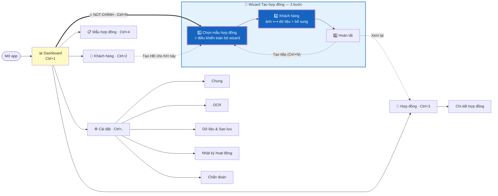

# 06 — Thiết kế giao diện

[← Mục lục](README.md)

**React 18 + TypeScript 5 + MUI v5 · 8 wireframe · Wizard 3 bước**

---

## 6.1. Nguyên tắc UX

Người dùng là **nhân viên nghiệp vụ làm lặp lại cùng một việc 30–80 lần mỗi ngày**. Đây không phải phần mềm để khám phá — đây là phần mềm để làm nhanh.

| Mã | Nguyên tắc | Hệ quả thiết kế cụ thể |
|---|---|---|
| **UX-01** | **Một luồng chính, không rẽ nhánh** | 80% thời gian người dùng ở trong Wizard. Nút này to nhất, vị trí dễ nhất, phím tắt `Ctrl+N` |
| **UX-02** | **Bàn phím trước, chuột sau** | Toàn wizard đi được bằng `Tab` + `Enter`. Con trỏ tự vào ô cần sửa đầu tiên |
| **UX-03** | **Hiển thị độ tin cậy, không giấu** | Trường `confidence` thấp tô vàng ngay, kèm % cụ thể |
| **UX-04** | **Ảnh và dữ liệu luôn cạnh nhau** | ⭐ Màn hình kiểm tra OCR chia đôi. **Bấm ô nào thì vùng tương ứng trên ảnh sáng lên.** Đây là tính năng quan trọng nhất của toàn giao diện |
| **UX-05** | **Không bao giờ mất dữ liệu đang nhập** | Tự lưu nháp vào `localStorage` mỗi 3 giây |
| **UX-06** | **Lỗi phải nói cách sửa** | Mọi thông báo hiển thị `hint` từ API. Không có "Đã xảy ra lỗi" trống rỗng |
| **UX-07** | ⭐ **Chỉ hiện con số ở nơi con số có ý nghĩa** | Trường đạt ngưỡng chỉ hiện ✅. Trường dưới ngưỡng mới hiện % cụ thể. Hiển thị "100%" cạnh 4 trường liên tiếp không giúp gì — nó làm loãng sự chú ý khỏi trường thực sự cần kiểm tra |

---

## 6.2. Hệ thống thiết kế

### 6.2.1. Bảng màu

| Token | Giá trị | Dùng cho |
|---|---|---|
| `primary.main` | `#1565C0` | Nút chính, thanh tiêu đề, liên kết |
| `primary.dark` | `#0D47A1` | Hover/active |
| `secondary.main` | `#00695C` | Nút phụ, nhãn phân loại |
| `success.main` | `#2E7D32` | ✅ Trường tin cậy cao, hợp đồng `COMPLETED` |
| `warning.main` | `#ED6C02` | ⚠️ Trường cần kiểm tra, cảnh báo |
| `error.main` | `#C62828` | ❌ Lỗi validation, hợp đồng `VOIDED` |
| `info.main` | `#0288D1` | Thông tin, gợi ý |
| `confidence.high` | nền `#E8F5E9` + viền trái 4px `#2E7D32` | Trường ≥ 0.95 |
| `confidence.medium` | `#FFF8E1` + `#ED6C02` | 0.85–0.95 |
| `confidence.low` | `#FFF3E0` + `#E65100` | 0.60–0.85 — **cần kiểm tra** |
| `confidence.critical` | `#FFEBEE` + `#C62828` | < 0.60 — **bắt buộc xác nhận** |
| `confidence.manual` | `#E3F2FD` + `#1565C0` | Trường người dùng đã sửa |

### 6.2.2. Kiểu chữ

| Vai trò | Font | Cỡ | Đậm |
|---|---|---|---|
| Giao diện chung | **Inter** (nhúng, không CDN) | 14px | 400 |
| Tiêu đề màn hình | Inter | 24px | 600 |
| Tiêu đề mục | Inter | 18px | 600 |
| Nhãn ô nhập | Inter | 13px | 500 |
| ⭐ **Dữ liệu số** (CCCD, STK, ngày) | **JetBrains Mono** | 15px | 500 |
| Ghi chú / phụ | Inter | 12px | 400 |

> **Vì sao font đơn cách cho số:** CCCD 12 chữ số và STK 13–14 chữ số cực dễ đọc nhầm với font tỉ lệ. Font đơn cách + nhóm 4 chữ số (`0011 9901 2345`) giảm đáng kể lỗi kiểm tra bằng mắt.

### 6.2.3. Khoảng cách & kích thước

- Đơn vị cơ sở **8px**, mọi khoảng cách là bội số (8, 16, 24, 32, 48).
- Chiều cao ô nhập **44px** · chiều cao dòng bảng **48px**.
- Bo góc **6px** (nút, ô nhập) · **10px** (thẻ, hộp thoại).
- Cửa sổ tối thiểu **1280 × 800**. Tối ưu cho **1920 × 1080**.
- Vùng bấm tối thiểu **40 × 40 px**.

### 6.2.4. Chế độ sáng / tối

Hỗ trợ cả hai, mặc định theo cài đặt Windows. Mọi token màu có cặp giá trị sáng/tối.
⭐ **Ảnh CCCD luôn hiển thị trên nền xám trung tính** ở cả hai chế độ — nền tối làm sai lệch cảm nhận độ sáng ảnh.

---

## 6.3. Bản đồ điều hướng



> ⭐ **Điểm mấu chốt:** từ Dashboard tới hợp đồng hoàn chỉnh chỉ có **một** đường. Không menu con, không lựa chọn "bạn muốn làm gì". Người dùng bấm một nút và đi thẳng.

### Wizard là ĐỘNG — sinh từ `party_schema`

```
Bước 1        : Chọn mẫu hợp đồng                        ← luôn có
Bước 2..N+1   : Một bước cho mỗi BÊN trong party_schema  ← động (v1.0: 1 bên)
Bước N+2      : Thông tin hợp đồng (contract_fields)     ← BỎ QUA nếu rỗng
Bước N+3      : Hoàn tất                                 ← luôn có
```

Với 2 mẫu hiện tại (`party_schema` 1 bên, `contract_fields` rỗng) → **3 bước**.

---

## 6.4. Khung layout chung (App Shell)

```
┌─────────────────────────────────────────────────────────────────────────────────┐
│ ▤ COCAS                              🔍 Tìm nhanh (Ctrl+K)     👤 nvnghiep      │ ← 56px
├────────────┬────────────────────────────────────────────────────────────────────┤
│            │                                                                    │
│ ┌────────┐ │                                                                    │
│ │   ➕   │ │                    VÙNG NỘI DUNG CHÍNH                             │
│ │ TẠO HỢP│ │                                                                    │
│ │  ĐỒNG  │ │                                                                    │
│ │ Ctrl+N │ │                                                                    │
│ └────────┘ │                                                                    │
│            │                                                                    │
│ 📊 Tổng quan│                                                                   │
│ 👥 Khách hàng│                                                                  │
│ 📄 Hợp đồng │                                                                   │
│ 📋 Mẫu HĐ  │                                                                    │
│ ⚙️ Cài đặt │                                                                    │
│            │                                                                    │
│  ────────  │                                                                    │
│ ⚠️ Chưa sao│                                                                    │
│   lưu 9 ngày│  ← Cảnh báo ngữ cảnh                                             │
│            │                                                                    │
├────────────┴────────────────────────────────────────────────────────────────────┤
│ 🟢 Hệ thống bình thường │ OCR: sẵn sàng │ 💾 47.2 GB trống │ v1.0.0             │ ← 28px
└─────────────────────────────────────────────────────────────────────────────────┘
   ↑ 220px (thu gọn về 64px bằng Ctrl+B)
```

| Khu vực | Nội dung |
|---|---|
| **Thanh trên** (56px) | Logo · Tìm nhanh toàn cục (`Ctrl+K`: tra số CCCD, tên KH, số hợp đồng) · ⭐ Tên tài khoản Windows (chữ xám, **không có** nút Đăng xuất) |
| **Thanh bên** (220px) | ⭐ Nút "TẠO HỢP ĐỒNG" nổi bật · Menu điều hướng — **mọi mục đều hiện** (không phân quyền) · Cảnh báo ngữ cảnh |
| **Thanh dưới** (28px) | Trạng thái hệ thống · OCR · Dung lượng đĩa · Phiên bản. Chấm màu: 🟢 bình thường · 🟡 suy giảm · 🔴 lỗi |

> **Không có màn hình đăng nhập.** Mở app → vào thẳng Dashboard (P-11).

---

## 6.5. Wireframe chi tiết

### W1 — Dashboard

```
┌──────────────────────────────────────────────────────────────────────────────┐
│ Tổng quan                                        [Hôm nay ▾] [Tuần] [Tháng]  │
├──────────────────────────────────────────────────────────────────────────────┤
│  ┌───────────────┐ ┌───────────────┐ ┌───────────────┐ ┌───────────────┐    │
│  │      12       │ │       9       │ │    96.4%      │ │      0        │    │
│  │  Hợp đồng     │ │  Khách hàng   │ │  Tỉ lệ OCR    │ │  Việc lỗi     │    │
│  │  đã tạo       │ │  mới          │ │  thành công   │ │      ✅       │    │
│  │  ↑ 3 so hôm qua│ │              │ │  ↑ 1.2%       │ │               │    │
│  └───────────────┘ └───────────────┘ └───────────────┘ └───────────────┘    │
│                                                                              │
│  ┌───────────────────────────────────────┐ ┌──────────────────────────────┐ │
│  │ 📄 HỢP ĐỒNG GẦN ĐÂY                   │ │ ⚠️ CẦN CHÚ Ý                 │ │
│  │ ───────────────────────────────────── │ │ ──────────────────────────── │ │
│  │ 01A-KQ-…00042   NGUYỄN VĂN AN         │ │ ⚠️ Chưa sao lưu 9 ngày       │ │
│  │ 09:16  Mẫu 01A/GDKQ        🟢 Hoàn tất│ │    [Sao lưu ngay]            │ │
│  │ ───────────────────────────────────── │ │                              │ │
│  │ 01A-GDN-…00041  TRẦN THỊ BÌNH         │ │ 🟡 2 hợp đồng chờ tạo PDF    │ │
│  │ 09:02  Mẫu 01A/HĐ-GĐN      🟡 Đang PDF│ │    [Xem]                     │ │
│  │ ───────────────────────────────────── │ │                              │ │
│  │ 01A-GDN-…00040  LÊ VĂN CƯỜNG          │ │ 💾 Còn 47.2 GB trống         │ │
│  │ 08:47  Mẫu 01A/HĐ-GĐN      🟢 Hoàn tất│ │    (đủ cho ~15.000 HĐ)       │ │
│  │              [Xem tất cả →]           │ └──────────────────────────────┘ │
│  └───────────────────────────────────────┘                                  │
│                                                                              │
│  ┌──────────────────────────────────────────────────────────────────────┐   │
│  │ 📈 ĐỘ CHÍNH XÁC OCR THEO TRƯỜNG (30 ngày)                            │   │
│  │ ──────────────────────────────────────────────────────────────────── │   │
│  │  Họ và tên      ████████████████████░  98.2%   (QR: 100% · OCR: 94%) │   │
│  │  Số CCCD        █████████████████████  99.7%   (QR: 100% · OCR: 96%) │   │
│  │  Ngày sinh      ████████████████████░  98.9%                         │   │
│  │  Ngày cấp       ████████████████░░░░░  87.3%   ← thấp nhất           │   │
│  │  Ngày hết hạn   ███████████████████░░  95.1%   (MRZ chủ đạo)         │   │
│  │  Nơi cấp        ██████████████████░░░  92.6%                         │   │
│  │                                                                      │   │
│  │  💡 "Ngày cấp" bị sửa tay 12.7% số lần — cân nhắc bổ sung alias      │   │
│  └──────────────────────────────────────────────────────────────────────┘   │
└──────────────────────────────────────────────────────────────────────────────┘
```

> ⭐ **Khối "Độ chính xác OCR" là điểm khác biệt lớn.** Nó biến `ocr_field.user_corrected` thành thông tin hành động được: biết chính xác trường nào cần cải thiện và cải thiện bằng cách nào.

---

### W2 — Wizard bước 1: Chọn mẫu hợp đồng ⭐ Bước đầu tiên

```
┌──────────────────────────────────────────────────────────────────────────────┐
│  Tạo hợp đồng                                                        [✕ Huỷ] │
│  ●━━━━━━━━━○━━━━━━━━━○         Chọn mẫu hợp đồng                              │
├──────────────────────────────────────────────────────────────────────────────┤
│  🔍 [Tìm mẫu...]                                    [Tất cả nhóm ▾]          │
│                                                                              │
│  ┌────────────────────────────────────────────────────────────────────────┐ │
│  │ (•) 📄  Mẫu số 01A/HĐ-GĐN                                   v1 · 4 trang│ │
│  │         👤 1 bên · 📇 1 CCCD · 🏦 Cần thông tin ngân hàng               │ │
│  └────────────────────────────────────────────────────────────────────────┘ │
│  ┌────────────────────────────────────────────────────────────────────────┐ │
│  │ ( ) 📄  Mẫu 01A/GDKQ                                        v1 · 3 trang│ │
│  │         👤 1 bên · 📇 1 CCCD · 📈 Cần số TK chứng khoán                 │ │
│  └────────────────────────────────────────────────────────────────────────┘ │
│                                                                              │
│  ┌────────────────────────────────────────────────────────────────────────┐ │
│  │ 📋 MẪU ĐÃ CHỌN CẦN CHUẨN BỊ                                            │ │
│  │ ────────────────────────────────────────────────────────────────────── │ │
│  │  Bước 2  👤 Khách hàng                                                 │ │
│  │          • Ảnh CCCD mặt trước + mặt sau                                │ │
│  │          • Số điện thoại, Email, Địa chỉ                               │ │
│  │          • Tài khoản ngân hàng (NH, STK, Chi nhánh)                    │ │
│  │  Bước 3  ✅ Hoàn tất                                                   │ │
│  └────────────────────────────────────────────────────────────────────────┘ │
│                                                                              │
│                                      [👁 Xem thử mẫu]      [Tiếp tục →]     │
└──────────────────────────────────────────────────────────────────────────────┘
```

> ⭐ **Khối "Mẫu đã chọn cần chuẩn bị" là giá trị lớn nhất của việc đưa bước chọn mẫu lên đầu.** Người dùng biết trước phải chuẩn bị gì — không còn cảnh quét xong CCCD rồi mới phát hiện còn thiếu thứ khác.

**Hành vi nền khi chọn mẫu:** khởi động LibreOffice listener (để lúc sinh PDF đã ấm sẵn).

---

### W3 — Wizard bước 2: Khách hàng ⭐ MÀN HÌNH QUAN TRỌNG NHẤT

#### Đầu bước — chọn nguồn dữ liệu

```
┌──────────────────────────────────────────────────────────────────────────────┐
│  Tạo hợp đồng — Mẫu số 01A/HĐ-GĐN                                    [✕ Huỷ] │
│  ●━━━━━━━━━●━━━━━━━━━○       👤 Khách hàng                                    │
├──────────────────────────────────────────────────────────────────────────────┤
│  ( ) 📷 Quét CCCD mới        (•) 🔍 Chọn khách hàng đã có                    │
│  ┌────────────────────────────────────────────────────────────────────────┐ │
│  │ 🔍 nguyễn văn an                                                       │ │
│  ├────────────────────────────────────────────────────────────────────────┤ │
│  │ NGUYỄN VĂN AN    001199012345   0912345678   3 HĐ   [Chọn]            │ │
│  │ NGUYỄN VĂN ANH   001188008891   0908887766   1 HĐ   [Chọn]            │ │
│  └────────────────────────────────────────────────────────────────────────┘ │
```

> ⭐ Khách hàng cũ mở thêm tài khoản → **bỏ qua hoàn toàn bước quét CCCD**, tạo hợp đồng trong ~20 giây.

#### Trạng thái đang xử lý OCR

```
│                          ⟳  Đang xử lý ảnh...                                │
│           ██████████████████████████░░░░░░░░░░░░░  65%                        │
│           ✅ Tiền xử lý ảnh                                                   │
│           ✅ Phân loại mặt trước / mặt sau      ⚠️ đã hoán đổi                │
│           ✅ Giải mã mã QR                      → 5 trường                    │
│           ⟳  Đang đọc vùng MRZ mặt sau...                                    │
│           ○  Nhận dạng ký tự                                                 │
│           ○  Hợp nhất & kiểm tra                                             │
│                                     [Huỷ]                                    │
```

#### Trạng thái hoàn tất — bố cục CHIA ĐÔI ⭐

```
┌──────────────────────────────────────────────────────────────────────────────┐
│  Tạo hợp đồng — Mẫu số 01A/HĐ-GĐN                                    [✕ Huỷ] │
│  ●━━━━━━━━━●━━━━━━━━━○       👤 Khách hàng                                    │
├─────────────────────────────────┬────────────────────────────────────────────┤
│  ẢNH GỐC                        │  📇 THÔNG TIN TỪ CCCD                      │
│  ┌─Mặt trước─┐ ┌─Mặt sau─┐      │  ┌──────────────────────────────────────┐  │
│  ┌───────────────────────────┐  │  │ Họ và tên                         ✅ │  │
│  │                           │  │  │ NGUYỄN VĂN AN                        │  │
│  │  ┌────────────────────┐   │  │  ├──────────────────────────────────────┤  │
│  │  │▓▓▓▓▓▓▓▓▓▓▓▓▓▓▓▓▓▓▓▓│   │  │  │ Số CCCD                           ✅ │  │
│  │  └────────────────────┘   │  │  │ 0011 9901 2345                       │  │
│  │   ↑ vùng của ô đang chọn  │  │  ├───────────────────┬──────────────────┤  │
│  │                           │  │  │ Ngày sinh      ✅ │ Giới tính     ✅ │  │
│  │      [ảnh CCCD]           │  │  │ 14/05/1990        │ Nam              │  │
│  │                           │  │  ├───────────────────┼──────────────────┤  │
│  └───────────────────────────┘  │  │ Ngày cấp   🟡 88% │ Ngày hết hạn  ✅ │  │
│                                 │  │ 20/08/2021        │ 14/05/2030       │  │
│  🔍− ────────●──────── 🔍+   ↻  │  │                   │ ☐ Không thời hạn │  │
│                                 │  ├───────────────────┴──────────────────┤  │
│  ⚠️ Đã tự hoán đổi mặt trước và │  │ Nơi cấp                    🟠 72%  ⓘ │  │
│     mặt sau      [Hoàn tác]     │  │ [CỤC CẢNH SÁT QUẢN LÝ HÀNH CHÍNH… ▾] │  │
│                                 │  └──────────────────────────────────────┘  │
│  ▸ Chi tiết kỹ thuật            │                                            │
│                                 │  📞 LIÊN HỆ                                │
│                                 │  ┌───────────────────┬──────────────────┐  │
│                                 │  │ Số điện thoại *   │ Email *          │  │
│                                 │  │ 0912345678     ✅ │ an@example.com ✅│  │
│                                 │  │ Viettel           │                  │  │
│                                 │  ├───────────────────┴──────────────────┤  │
│                                 │  │ Địa chỉ thường trú *              ✅ │  │
│                                 │  │ Số 12, ngõ 34, phố Kim Mã, phường    │  │
│                                 │  │ Kim Mã, quận Ba Đình, Hà Nội         │  │
│                                 │  │ 💡 Điền sẵn từ mã QR — kiểm tra lại  │  │
│                                 │  └──────────────────────────────────────┘  │
│                                 │                                            │
│                                 │  🏦 TÀI KHOẢN NGÂN HÀNG                    │
│                                 │  ┌───────────────────┬──────────────────┐  │
│                                 │  │ Ngân hàng *       │ Số tài khoản *   │  │
│                                 │  │ [Vietcombank  ▾]  │ 1234567890123 ✅ │  │
│                                 │  │                   │ 13/13 chữ số     │  │
│                                 │  ├───────────────────┼──────────────────┤  │
│                                 │  │ Chi nhánh *    ✅ │ Chủ tài khoản    │  │
│                                 │  │ Chi nhánh Ba Đình │ NGUYEN VAN AN    │  │
│                                 │  └───────────────────┴──────────────────┘  │
│                                 │  ↑ Khối này CHỈ HIỆN vì party_schema khai  │
│                                 │    báo collect: ["contact","bank_account"] │
│                                 │                                            │
│                                 │  ☑ Tôi đã đối chiếu các ô ⚠️ với ảnh gốc   │
├─────────────────────────────────┴────────────────────────────────────────────┤
│  [🔄 Chạy lại OCR]  [↔ Đổi mặt]     💾 09:15:42   [← Quay lại]  [Tiếp tục →] │
└──────────────────────────────────────────────────────────────────────────────┘
```

**Với mẫu `01A/GDKQ`:** khối "TÀI KHOẢN NGÂN HÀNG" **tự động ẩn**, thay bằng:

```
│                                 │  📈 TÀI KHOẢN CHỨNG KHOÁN                  │
│                                 │  ┌──────────────────────────────────────┐  │
│                                 │  │ Số tài khoản chứng khoán *        ✅ │  │
│                                 │  │ 008C 123456                          │  │
│                                 │  │ 💡 Lấy từ hồ sơ khách hàng           │  │
│                                 │  └──────────────────────────────────────┘  │
```

> ⭐ **Hai luồng khác nhau hoàn toàn về nội dung nhưng dùng chung 100% mã nguồn.** Khác biệt duy nhất là 2 bản ghi `party_schema` trong CSDL. Đây là bằng chứng cụ thể P-06 hoạt động.

#### Khối "Chi tiết kỹ thuật" (thu gọn, mặc định đóng)

```
│  ▾ Chi tiết kỹ thuật                                                        │
│  ┌───────────────────────────────────────────────────────────────────────┐  │
│  │ Mã QR       ✅ 5 trường · độ tin cậy 100% · 1 lần thử                 │  │
│  │ Vùng MRZ    ✅ 3 trường · checksum hợp lệ · 0 ký tự phải sửa          │  │
│  │ OCR văn bản ✅ 23 vùng  · trung bình 89%                              │  │
│  │ Tiền xử lý  Nắn phối cảnh: thành công · Khử nghiêng: −2.4°            │  │
│  │ Thời gian   3.82 giây · Engine: PaddleOCR 2.9.0                       │  │
│  │ Mã truy vết c1a4e0b2-9f33-4a11-8d77-2e5b1c9f0a44          [📋 Sao chép]│  │
│  └───────────────────────────────────────────────────────────────────────┘  │
```

#### Sáu hành vi tương tác then chốt

| # | Hành vi | Chi tiết |
|---|---|---|
| 1 | ⭐ **Bấm ô CCCD → sáng vùng trên ảnh** | Dùng `bbox` từ API. Ảnh tự chuyển sang mặt tương ứng, phóng vừa khung, vẽ viền vàng nhấp nháy 2 lần rồi giữ sáng. **Người dùng đối chiếu trong 1 giây thay vì 10 giây** |
| 2 | **Bấm ô bổ sung → ảnh về khung đầy đủ** | Nhóm Liên hệ/Ngân hàng không có `bbox`; ảnh thu về toàn cảnh thay vì giữ khung cũ gây nhầm lẫn |
| 3 | **Sửa ô → viền chuyển xanh dương** | `source` thành `MANUAL`, biểu tượng thành ✅, validate ngay bằng Zod |
| 4 | **Nơi cấp là dropdown 2 lựa chọn** | Không cho nhập tự do. Biểu tượng ⓘ hiện giá trị OCR thô |
| 5 | **Checkbox xác nhận chỉ hiện khi có ô ⚠️** | Mọi trường ≥ ngưỡng → checkbox biến mất, nút "Tiếp tục" bật ngay |
| 6 | **`Ctrl+↑ / ↓` duyệt các ô CCCD** | Ảnh tự highlight theo — đối chiếu 6 trường bằng bàn phím trong ~8 giây |

#### Ba chi tiết nâng chất lượng dữ liệu

- Nhập SĐT → hiện **tên nhà mạng** ngay (Viettel/Vinaphone/Mobifone…) → phát hiện gõ nhầm đầu số.
- Chọn ngân hàng → ô STK **tự áp dụng độ dài hợp lệ** từ `bank_directory`, hiện đếm `13/13 chữ số`.
- Địa chỉ **điền sẵn từ mã QR** — người dùng chỉ kiểm tra thay vì gõ lại 60 ký tự.

#### Điều kiện bật nút "Tiếp tục →"

| Điều kiện | Bắt buộc |
|---|---|
| 6 trường CCCD không trống và hợp lệ | ✅ |
| Không còn lỗi mức `ERROR` | ✅ |
| Mọi trường trong `collect` và `extra_fields` hợp lệ | ✅ |
| Checkbox xác nhận đã tick (nếu có ô ⚠️) | ✅ |
| Không có cờ `CARD_MISMATCH` | ✅ — **chặn cứng, không có checkbox bỏ qua** |

**Khi bấm "Tiếp tục":** gọi `POST /customers` (tạo khách hàng + TK ngân hàng trong một giao dịch), rồi chuyển bước 3.

#### Trạng thái lỗi — tải trùng một mặt

```
├──────────────────────────────────────────────────────────────────────────────┤
│              ❌ Bạn đã tải hai ảnh của cùng một mặt                          │
│              Cả hai ảnh đều được nhận diện là MẶT TRƯỚC.                     │
│                                                                              │
│         ┌──────────────────┐        ┌──────────────────┐                    │
│         │    [ảnh 1]       │        │    [ảnh 2]       │                    │
│         │  Nhận diện: TRƯỚC│        │  Nhận diện: TRƯỚC│                    │
│         └──────────────────┘        └──────────────────┘                    │
│                                                                              │
│    👉 Vui lòng tải ảnh MẶT SAU — mặt có vân tay và dòng "Ngày, tháng, năm"   │
│              [🔄 Tải lại ảnh]      [⚙️ Tôi muốn tự gán mặt]                 │
└──────────────────────────────────────────────────────────────────────────────┘
```

---

### W4 — Wizard bước 3: Hoàn tất

```
┌──────────────────────────────────────────────────────────────────────────────┐
│  ●━━━━━━━━━●━━━━━━━━━●         Hoàn tất                                       │
├─────────────────────────────────┬────────────────────────────────────────────┤
│  ┌───────────────────────────┐  │  ✅ TẠO HỢP ĐỒNG THÀNH CÔNG                │
│  │                           │  │                                            │
│  │   [Xem trước PDF          │  │  Số hợp đồng   01A-GDN-202608-00042        │
│  │    trang 1/4]             │  │  Tên file      Mẫu 01A - NGUYỄN VĂN AN     │
│  │                           │  │  Khách hàng    NGUYỄN VĂN AN               │
│  │                           │  │  CCCD          001199012345                │
│  │                           │  │  Mẫu           Mẫu số 01A/HĐ-GĐN (v1)      │
│  │                           │  │  Tạo lúc       08/08/2026 09:16:11         │
│  │                           │  │                                            │
│  │                           │  │  📎 TÀI LIỆU                               │
│  │                           │  │  ┌──────────────────────────────────────┐  │
│  │                           │  │  │ 📄 DOCX   45 KB      ✅  [⬇ Tải]    │  │
│  └───────────────────────────┘  │  │ 📕 PDF   183 KB·4tr  ✅  [⬇][🖨]    │  │
│  ◀ 1 / 4 ▶     🔍− ──●── 🔍+   │  └──────────────────────────────────────┘  │
│                                 │                                            │
│                                 │  ┌──────────────────────────────────────┐  │
│                                 │  │      ➕ TẠO HỢP ĐỒNG TIẾP THEO       │  │
│                                 │  │              (Ctrl+N)                │  │
│                                 │  └──────────────────────────────────────┘  │
│                                 │  [📂 Mở thư mục]  [👤 Xem khách hàng]      │
│                                 │                                            │
│                                 │  🗑 Ảnh CCCD đã được xoá tự động           │
└─────────────────────────────────┴────────────────────────────────────────────┘
```

**Trạng thái PDF đang xử lý** (DOCX đã sẵn sàng):
```
│  │ 📄 DOCX   45 KB    ✅  [⬇ Tải xuống]                       │
│  │ 📕 PDF    ⟳ Đang tạo... (≈3 giây)   ████████░░  70%        │
│  ↑ Người dùng tải DOCX và làm tiếp ngay, không phải chờ                    │
```

---

### W5 — Màn hình danh sách (mẫu chung)

Dùng chung bố cục cho **Khách hàng** và **Hợp đồng**.

```
┌──────────────────────────────────────────────────────────────────────────────┐
│  {TIÊU ĐỀ}                                     🔍 [Tìm kiếm...]              │
│                                    [Bộ lọc 1 ▾] [Bộ lọc 2 ▾]  [+ Thêm mới]  │
├──────────────────────────────────────────────────────────────────────────────┤
│  ☐ │ CỘT 1            │ CỘT 2        │ CỘT 3      │ CỘT 4      │ ... │ NGÀY  │
│ ───┼──────────────────┼──────────────┼────────────┼────────────┼─────┼───────│
│  ☐ │ …                │ …            │ …          │ …          │ …   │ …     │
│  ☐ │ …                │ …            │ …          │ …          │ …   │ …     │
│    │   ↑ dòng phụ (cảnh báo / lý do huỷ / liên kết bản thay thế)             │
│ ───┴──────────────────┴──────────────┴────────────┴────────────┴─────┴───────│
│  Hiển thị 1–20 / 137        ◀ 1 [2] 3 4 ... 7 ▶      [⬇ Xuất Excel]         │
└──────────────────────────────────────────────────────────────────────────────┘
```

#### Khác biệt theo màn hình

| | **Khách hàng** (`Ctrl+2`) | **Hợp đồng** (`Ctrl+3`) |
|---|---|---|
| Tìm kiếm | Tên, CCCD, SĐT, Email, STK CK | Số HĐ, tên KH, tên file |
| Bộ lọc | Trạng thái thẻ · Khoảng ngày | Trạng thái · Mẫu HĐ · Khoảng ngày |
| Cột | Họ tên · Số CCCD · Ngày sinh · SĐT · Số HĐ · Ngày tạo | Số HĐ · Khách hàng · Mẫu · Trạng thái · Tài liệu |
| Dòng phụ | ⚠️ "CCCD hết hạn trong 45 ngày" | Lý do huỷ · liên kết bản thay thế · lỗi PDF + nút [🔄] |
| Bấm dòng | Chi tiết khách hàng | Chi tiết hợp đồng |
| Sắp xếp mặc định | `-created_at` | `-created_at` |

**Ví dụ dòng phụ ở màn hình Hợp đồng:**
```
│  01A-GDN-…00039  │ LÊ VĂN CƯỜNG   │ 01A/HĐ-GĐN v1 │ ⚪ Bị thay │ 📄 📕    │
│    └─ Đã thay bằng 01A-GDN-202608-00040 (revision 2)                         │
│  01A-GDN-…00038  │ HOÀNG VĂN EM   │ 01A/HĐ-GĐN v1 │ 🔴 Đã huỷ  │ 📄 📕    │
│    └─ Lý do: Khách hàng thay đổi thông tin tài khoản                         │
│  01A-KQ-…00037   │ VŨ THỊ PHƯƠNG  │ 01A/GDKQ v1   │ 🟠 Lỗi PDF │ 📄 [🔄]  │
│    └─ LibreOffice hết thời gian chờ  [Thử lại tạo PDF]                       │
```

---

### W6 — Chi tiết hợp đồng

```
┌──────────────────────────────────────────────────────────────────────────────┐
│  ← Hợp đồng   01A-GDN-202608-00042              🟢 Hoàn tất   [⋯ Thao tác ▾] │
├─────────────────────────────────┬────────────────────────────────────────────┤
│  ┌───────────────────────────┐  │  📋 THÔNG TIN CHUNG                        │
│  │                           │  │  Tên file      Mẫu 01A - NGUYỄN VĂN AN     │
│  │   [Xem trước PDF]         │  │  Mẫu           Mẫu số 01A/HĐ-GĐN           │
│  │                           │  │  Phiên bản mẫu v1 (SHA a1b2c3…)            │
│  │                           │  │  Ngày HĐ       08/08/2026                  │
│  │                           │  │  Tạo bởi       nvnghiep                    │
│  │                           │  │  Tạo lúc       08/08/2026 09:16:11         │
│  │                           │  │  Bản sửa       1                           │
│  └───────────────────────────┘  │                                            │
│  ◀ 1 / 4 ▶     🔍− ──●── 🔍+   │  👥 CÁC BÊN THAM GIA (1)                   │
│                                 │  ┌──────────────────────────────────────┐  │
│                                 │  │ 👤 Khách hàng (chính)                │  │
│                                 │  │ NGUYỄN VĂN AN · 001199012345         │  │
│                                 │  │ VCB 1234567890123 · CN Ba Đình       │  │
│                                 │  │                    [👤 Xem khách hàng]│  │
│                                 │  └──────────────────────────────────────┘  │
│                                 │                                            │
│                                 │  📎 TÀI LIỆU                               │
│                                 │  📄 DOCX  45 KB · 3 lượt tải   [⬇]        │
│                                 │  📕 PDF  183 KB · 4 trang      [⬇][🖨]    │
│                                 │                                            │
│                                 │  📜 LỊCH SỬ                                │
│                                 │  09:16:11  Tạo hợp đồng                    │
│                                 │  09:16:12  Sinh DOCX (712 ms)              │
│                                 │  09:16:15  Chuyển PDF (2.8 s)              │
│                                 │  09:16:18  Xoá ảnh CCCD gốc                │
├─────────────────────────────────┴────────────────────────────────────────────┤
│  Thao tác ▾:  [🔄 Sinh lại]  [🚫 Huỷ hợp đồng]  [📂 Mở thư mục]             │
└──────────────────────────────────────────────────────────────────────────────┘
```

---

### W7 — Quản lý mẫu hợp đồng

```
┌──────────────────────────────────────────────────────────────────────────────┐
│  Mẫu hợp đồng                                          [+ Thêm mẫu mới]      │
├──────────────────────────────────────────────────────────────────────────────┤
│  ┌────────────────────────────────────────────────────────────────────────┐ │
│  │ 📄 Mẫu số 01A/HĐ-GĐN                          01A_HD_GDN  🟢 Hoạt động │ │
│  │ ─────────────────────────────────────────────────────────────────────  │ │
│  │ Phiên bản đang dùng: v1 · 08/08/2026 · 68 KB · 12 biến · ✅ Hợp lệ     │ │
│  │ Tên file xuất: Mẫu 01A - {full_name}                                   │ │
│  │ Số HĐ: 01A-GDN-{yyyy}{MM}-{seq:05d}          Đã tạo: 89 hợp đồng      │ │
│  │ Bên tham gia: 👤 1 cá nhân · 📇 CCCD · 🏦 Ngân hàng                     │ │
│  │                                                                        │ │
│  │ 📋 Lịch sử phiên bản                                                   │ │
│  │    v1  08/08/2026  nvnghiep  "Bản đầu tiên"          🟢 Đang dùng      │ │
│  │                                                                        │ │
│  │ [⬆ Tải phiên bản mới] [👁 Xem thử] [✏️ Sửa thông tin] [⏸ Tạm dừng]    │ │
│  └────────────────────────────────────────────────────────────────────────┘ │
│  ┌────────────────────────────────────────────────────────────────────────┐ │
│  │ 📄 Mẫu 01A/GDKQ                                  01A_GDKQ  🟢 Hoạt động │ │
│  │ v1 · 10 biến · Bên: 👤 1 cá nhân · 📇 CCCD · 📈 STK chứng khoán (đậm)  │ │
│  └────────────────────────────────────────────────────────────────────────┘ │
└──────────────────────────────────────────────────────────────────────────────┘
```

**Hộp thoại tải mẫu mới — bước kiểm tra biến:**

```
┌─────────────────────── KIỂM TRA MẪU HỢP ĐỒNG ────────────────────────┐
│  📄 mau-01a-gdkq.docx · 68 KB                                         │
│                                                                       │
│  ✅ Cú pháp Jinja2 hợp lệ · Không có vòng lặp · Không có điều kiện    │
│  ✅ Không phát hiện cấu trúc nguy hiểm                                │
│                                                                       │
│  ✅ 9 BIẾN HỆ THỐNG — điền tự động                                    │
│     full_name · id_number · dob · issue_date · expiry_date            │
│     issue_place · phone · email · address                             │
│                                                                       │
│  🔵 1 BIẾN BỔ SUNG — người dùng nhập khi tạo hợp đồng                 │
│     securities_account_no   Số TK chứng khoán  [In đậm ▾] ☑ Bắt buộc │
│     ✅ Viết đúng dạng rich text: {{r securities_account_no }}          │
│                                                                       │
│  ⚪ 5 BIẾN BỊ TẮT (suppressed) — render thành chuỗi rỗng              │
│     contract_date · contract_date_text · day · month · year           │
│                                                                       │
│                                    [Huỷ]  [👁 Xem thử]  [✅ Đăng ký] │
└───────────────────────────────────────────────────────────────────────┘
```

> ⭐ Nếu template viết `{{ securities_account_no }}` (dạng thường) trong khi khai báo `render_style.bold` → cảnh báo `COCAS-6008` kèm hướng dẫn sửa thành `{{r securities_account_no }}`.

---

### W8 — Cài đặt (5 tab)

```
┌──────────────────────────────────────────────────────────────────────────────┐
│  Cài đặt                                                                     │
│  [Chung] [OCR] [Dữ liệu & Sao lưu] [Nhật ký hoạt động] [Chẩn đoán]           │
├──────────────────────────────────────────────────────────────────────────────┤
│  ── TAB "OCR" ──                                                             │
│                                                                              │
│  Ngưỡng cần kiểm tra lại              ●───────────── 0.85                     │
│  Trường có độ tin cậy dưới ngưỡng này sẽ được tô vàng                        │
│                                                                              │
│  Engine nhận dạng                     [PaddleOCR (khuyến nghị)         ▾]    │
│  Kênh trích xuất                      ☑ Mã QR   ☑ Vùng MRZ   ☑ OCR văn bản  │
│  Số luồng CPU cho OCR                 [2]  (máy có 4 nhân)                   │
│  Hồ sơ tiền xử lý ảnh                 [Mặc định                        ▾]    │
│    ☑ Tự động xoay theo EXIF     ☑ Nắn phối cảnh    ☑ Khử nghiêng            │
│    ☑ Cân bằng sáng (CLAHE)      [Khử nhiễu: Bilateral ▾]  ☐ Khử loá         │
│  Cạnh dài ảnh sau resize              [1600] px                              │
│                                                                              │
│  ── TỪ ĐIỂN CHUẨN HOÁ "NƠI CẤP" ──                        [+ Thêm cách viết] │
│  ┌────────────────────────────────────────────────────────────────────────┐ │
│  │ OCR đọc ra                          │ Chuẩn hoá thành          │ Tầng  │ │
│  │ BO CONG AN                          │ BỘ CÔNG AN               │  1    │ │
│  │ BCA                                 │ BỘ CÔNG AN               │  2    │ │
│  │ CUC CS QLHC VE TTXH                 │ CỤC CẢNH SÁT QLHC...     │  2    │ │
│  │ C06                                 │ CỤC CẢNH SÁT QLHC...     │  2    │ │
│  │ ... (16 mục)                                              [Xem tất cả] │ │
│  └────────────────────────────────────────────────────────────────────────┘ │
│  💡 Khi gặp cách viết mới mà hệ thống đọc sai, thêm vào đây — không cần      │
│     cập nhật phần mềm                                                        │
│                                                    [Khôi phục mặc định] [Lưu]│
└──────────────────────────────────────────────────────────────────────────────┘
```

**Tab "Chẩn đoán":**
```
│  TRẠNG THÁI PHỤ THUỘC                        [🔄 Kiểm tra lại]               │
│  🟢 Cơ sở dữ liệu        PostgreSQL 16.2 · 3 ms                              │
│  🟢 Engine OCR           PaddleOCR 2.9.0 · model đã nạp · 148 MB RAM         │
│  ⚪ Chuyển đổi PDF       LibreOffice 7.6.4 · chưa khởi động (lazy)           │
│  🟢 Kho tệp              Ghi được · còn 47.2 GB                              │
│  🟢 Mã hoá               Khoá đã nạp từ Windows DPAPI                        │
│                                                                              │
│  KÍCH THƯỚC DỮ LIỆU                                                          │
│  Nhật ký hoạt động    128 MB (48.213 bản ghi)   ✅ dưới ngưỡng 2 GB          │
│  Kho tệp              1.4 GB                                                 │
│  Cơ sở dữ liệu        312 MB                                                 │
│                                                                              │
│  KIỂM TRA TOÀN VẸN                                                           │
│  [🔍 Đối chiếu tệp ↔ CSDL]  → ⚠️ 3 tệp mồ côi (12 MB)  [Dọn dẹp]            │
│                                                                              │
│  [📦 Xuất gói chẩn đoán]  → file zip: log 7 ngày (đã che PII), cấu hình,     │
│                             thông tin hệ thống — để gửi hỗ trợ              │
```

---

## 6.6. Thư viện thành phần dùng chung (11)

| Thành phần | Mô tả | Dùng ở |
|---|---|---|
| ⭐ `<ConfidenceField>` | Ô nhập có viền trái màu theo `confidence`, badge % **chỉ khi dưới ngưỡng** (UX-07), nhãn nguồn trong tooltip, đồng bộ với ảnh | W3 |
| ⭐ `<ImageInspector>` | Xem ảnh có zoom/pan/xoay + vẽ `bbox` highlight theo trường đang chọn | W3, W6 |
| `<WizardStepper>` | Thanh bước **động** (số bước từ `party_schema`), cho quay lại bước đã qua, chặn nhảy tới trước | Wizard |
| `<JobProgress>` | Thanh tiến độ có nhãn từng chặng, tự poll `/jobs/{id}` hoặc `/ocr/{id}/progress` | W3, W4 |
| ⭐ `<DynamicFieldSet>` | Sinh ô nhập từ khai báo JSON (`extra_fields`) — **5 kiểu**: `text`, `number`, `date`, `select`, `securities_account` | W3 |
| `<ValidationSummary>` | Gom lỗi/cảnh báo, bấm vào nhảy tới ô tương ứng | W3 |
| `<StatusChip>` | Chip màu chuẩn hoá cho mọi enum trạng thái | W5, W6, W7 |
| `<TechnicalDetailsPanel>` | Khối thu gọn "Chi tiết kỹ thuật" + nút sao chép `correlation_id` | W3 |
| `<EmptyState>` | Trạng thái rỗng có minh hoạ + **một** nút hành động chính | Mọi danh sách |
| `<ErrorBoundary>` | Bắt lỗi React, hiện `correlation_id` + nút xuất log | Toàn app |
| `<DraftBanner>` | "Bản nháp tự lưu lúc 09:15:42" + nút Khôi phục / Bỏ | Wizard |

---

## 6.7. Ba trạng thái bắt buộc của mọi màn hình

| Trạng thái | Yêu cầu |
|---|---|
| **Đang tải** | Dùng **skeleton** đúng hình dạng nội dung thật, **không** spinner giữa màn hình trắng |
| **Rỗng** | Minh hoạ + câu giải thích + **một** nút hành động chính. Ví dụ: *"Chưa có hợp đồng nào. Bắt đầu bằng cách chọn mẫu hợp đồng. [➕ Tạo hợp đồng]"* |
| **Lỗi** | Thông điệp tiếng Việt + `hint` từ API + nút "Thử lại" + `correlation_id` cỡ nhỏ ở góc |

---

## 6.8. Phím tắt

| Phím | Hành động | Phạm vi |
|---|---|---|
| `Ctrl+N` | Tạo hợp đồng mới | Toàn cục |
| `Ctrl+K` | Tìm nhanh | Toàn cục |
| `Ctrl+1..4` | Chuyển màn hình | Toàn cục |
| `Ctrl+,` | Cài đặt | Toàn cục |
| `Ctrl+B` | Thu gọn thanh bên | Toàn cục |
| `Enter` | Bước tiếp theo | Wizard |
| `Alt+←` | Bước trước | Wizard |
| `Esc` | Huỷ / đóng hộp thoại | Toàn cục |
| `Ctrl+S` | Lưu nháp thủ công | Wizard |
| `F2` | Sửa trường đang chọn | W3 |
| ⭐ `Ctrl+↑ / ↓` | Chuyển giữa các trường CCCD (ảnh tự highlight) | W3 |
| `Ctrl+P` | In PDF | W4, W6 |
| `F5` | Tải lại dữ liệu | Danh sách |
| `?` | Bảng phím tắt | Toàn cục |

---

## 6.9. Khả năng tiếp cận

| Yêu cầu | Cách đáp ứng |
|---|---|
| Tương phản màu | Mọi cặp chữ/nền đạt **WCAG AA** (≥ 4.5:1). Kiểm tra tự động trong CI |
| ⭐ Không chỉ dùng màu | Trường tin cậy thấp có **cả** màu vàng **và** biểu tượng ⚠️ **và** số % — người mù màu vẫn phân biệt được |
| Điều hướng bàn phím | Mọi phần tử tương tác `focusable`, thứ tự `tabIndex` hợp lý, viền focus rõ 2px |
| Trình đọc màn hình | `aria-label` tiếng Việt cho mọi nút biểu tượng; `aria-live="polite"` cho tiến độ job |
| Cỡ chữ | Hỗ trợ 100% / 125% / 150% trong Cài đặt, bố cục không vỡ |

---

## 6.10. Kiến trúc Frontend

```
frontend/src/
├── app/                     # Khởi tạo: router, theme, providers, error boundary
├── shared/
│   ├── api/                 # Client HTTP, interceptor (X-Local-Token), map lỗi
│   ├── components/          # Thư viện thành phần §6.6
│   ├── hooks/               # useDraft, useJobPolling, useKeyboard, useImageHighlight
│   ├── schemas/             # Zod schema (viết tay, đồng bộ qua validation_cases.json)
│   ├── theme/               # Design token §6.2
│   ├── i18n/                # Chuỗi tiếng Việt tập trung
│   └── utils/               # Định dạng ngày, chuẩn hoá tiếng Việt, tên file
├── features/                # Tổ chức theo TÍNH NĂNG
│   ├── dashboard/
│   ├── wizard/              # ⭐ Tính năng lớn nhất
│   │   ├── steps/           #    TemplateStep · PartyStep · DoneStep
│   │   ├── panels/          #    OcrVerificationPanel · SupplementaryInfoPanel
│   │   └── store.ts         #    Zustand + tự lưu nháp localStorage
│   ├── customers/
│   ├── contracts/
│   ├── templates/
│   └── settings/
└── main.tsx
```

| Chủ đề | Lựa chọn | Lý do |
|---|---|---|
| **Trạng thái máy chủ** | TanStack Query | Cache, tự làm mới, polling job, retry — không tự viết |
| **Trạng thái cục bộ** | Zustand (chỉ cho wizard) | Nhẹ, dễ persist vào `localStorage` cho tính năng nháp |
| **Form** | React Hook Form + Zod resolver | Hiệu năng tốt (uncontrolled), validate đồng bộ với backend |
| **Định tuyến** | React Router v6 | Chuẩn |
| **Bảng** | MUI DataGrid (community) | Đủ dùng, không cần bản trả phí |
| **Xem PDF** | ⭐ `<embed>` của WebView2 | Không nhúng pdf.js — WebView2 đã có trình xem PDF, tiết kiệm 1.5 MB bundle |
| **Biểu đồ** | Recharts | Nhẹ, đủ cho Dashboard |
| **i18n** | Chuỗi tiếng Việt tập trung một chỗ | Chuẩn bị đa ngôn ngữ sau, chưa cần thư viện đầy đủ |

### Ràng buộc build

- ⭐ **Không tham chiếu URL ngoài nào** — script CI quét `dist/` tìm `http://` và `https://` không phải `127.0.0.1`, phát hiện → build đỏ.
- Font Inter và JetBrains Mono **nhúng** dưới dạng woff2 trong bundle, không dùng Google Fonts.
- Mọi icon dùng `@mui/icons-material` (đóng gói cùng bundle), không dùng icon font từ CDN.

---

[← 05 — API](05-thiet-ke-api.md) · [Mục lục](README.md) · [Tiếp: 07 — Module OCR →](07-module-ocr.md)
