# 07 — Thiết kế module OCR

[← Mục lục](README.md)

**Pipeline 3 kênh QR / MRZ / OCR · PaddleOCR PP-OCRv4 · Hoàn toàn offline**

---

## 7.1. Tuyên bố kiến trúc

Module OCR là phần **có giá trị kỹ thuật cao nhất** và cũng **dễ lỗi thời nhất**. Nó được thiết kế quanh một mệnh đề duy nhất:

> **Trích xuất thông tin từ CCCD không phải bài toán OCR. Đó là bài toán hợp nhất nhiều nguồn bằng chứng, trong đó OCR là nguồn kém tin cậy nhất.**

| Hạng | Nguồn | Bản chất | Độ chính xác | Trường phủ được |
|---|---|---|---|---|
| **A** | **Mã QR** (⭐ mặt trước ở CCCD 2021, **mặt sau** ở Căn cước 2024 — [§7.4.7](#747-hai-thế-hệ-thẻ)) | Dữ liệu số hoá trực tiếp từ CSDL dân cư — *không phải nhận dạng ảnh* | **100%** khi giải mã được | Họ tên, số CCCD, ngày sinh, giới tính, địa chỉ, ngày cấp |
| **B** | **Vùng MRZ** (mặt sau) | Chuỗi ICAO 9303 TD1, **có ký tự kiểm tra tự xác thực** | **98%** khi checksum hợp lệ | Số CCCD, ngày sinh, **ngày hết hạn**, giới tính |
| **C** | **OCR văn bản** | Nhận dạng ảnh — có thể sai | 85–95% | Tất cả, đặc biệt **nơi cấp** (nguồn duy nhất) |

**Hệ quả:** với ảnh CCCD chụp bình thường, hệ thống đạt **5/6 trường chính xác tuyệt đối** trước khi OCR nói được câu nào. OCR chỉ phải lo "Nơi cấp" — mà trường này chỉ có 2 giá trị hợp lệ, nên chuẩn hoá mờ gần như luôn đúng.

⭐ **Đây là lý do NFR-01 (≥99%) khả thi mà không cần cloud AI.**

---

## 7.2. Sơ đồ thành phần

```mermaid
graph TB
    subgraph PORTS["🟢 DOMAIN — PORTS (interface thuần)"]
        P1["IImagePreprocessor"]
        P2["ICardSideClassifier"]
        P3["IQrDecoder"]
        P4["IMrzReader"]
        P5["IRegionRecognizer"]
        P5b["IOcrEngine<br/>(kế thừa IRegionRecognizer)"]
        P6["IFieldExtractor"]
    end

    subgraph DOMSVC["🟢 DOMAIN — SERVICES (logic thuần, không I/O)"]
        D1["FieldNormalizer"]
        D2["IssuePlaceNormalizer<br/>4 tầng khớp"]
        D3["FieldFusionService<br/>8 quy tắc hợp nhất"]
        D4["ConfidenceCalculator"]
        D5["CardValidityPolicy"]
    end

    subgraph ORCH["🟣 APPLICATION"]
        O1["<b>ExtractionPipeline</b><br/>điều phối 9 chặng<br/>KHÔNG BAO GIỜ ném ngoại lệ ra ngoài"]
        O2["RunOcrUseCase"]
    end

    subgraph ADAPTERS["🟠 INFRASTRUCTURE — ADAPTERS (thay thế được)"]
        A1["OpenCvPreprocessor<br/>biến thể TẠO LƯỜI"]
        A2["HeuristicSideClassifier"]
        A3["ZxingQrDecoder<br/>3 lần thử"]
        A4["Td1MrzReader<br/>post-filter charset"]
        A5["<b>PaddleOcrAdapter</b>"]
        A5b["TesseractAdapter (dự phòng)"]
        A5c["NullOcrAdapter (khi engine chết)"]
        A6["ZoneAndAnchorExtractor"]
    end

    subgraph DATA["📦 DỮ LIỆU CẤU HÌNH (trong CSDL, sửa qua UI)"]
        C1["document_type.zone_map"]
        C2["document_type.anchor_patterns"]
        C3["normalization_alias"]
        C4["system_setting.ocr.* / preproc.*"]
    end

    O2 --> O1
    O1 --> P1 & P2 & P3 & P4 & P5b & P6
    O1 --> D1 & D3
    D1 --> D2
    D3 --> D4 & D5
    P4 --> P5

    A1 -.->|implements| P1
    A2 -.->|implements| P2
    A3 -.->|implements| P3
    A4 -.->|implements| P4
    A5 & A5b & A5c -.->|implements| P5b
    A6 -.->|implements| P6

    C1 & C2 --> A6
    C3 --> D2
    C4 --> O1

    style PORTS fill:#c8e6c9,stroke:#2e7d32,stroke-width:2px
    style DOMSVC fill:#c8e6c9,stroke:#2e7d32,stroke-width:2px
    style ORCH fill:#f3e5f5,stroke:#6a1b9a
    style ADAPTERS fill:#ffe0b2,stroke:#ef6c00
    style DATA fill:#fff9c4,stroke:#f57f17
    style A5 fill:#ff9800,color:#fff
```

---

## 7.3. Đặc tả Port

### `IImagePreprocessor`

| Mục | Nội dung |
|---|---|
| **Trách nhiệm** | Biến ảnh thô thành **tập biến thể** tối ưu cho từng kênh |
| **Đầu vào** | `image_bytes: bytes` · `exif_orientation: int \| None` · `profile: PreprocessProfile` |
| **Đầu ra** | `PreprocessedImageSet` — truy cập biến thể **theo yêu cầu (lazy)** qua `.v0 .v1 .v2 .v3 .v4` · `transform_matrix` · `warp_succeeded: bool` · `quality: ImageQuality` |
| **Ném ra** | `ImageDecodeError`, `ImageTooSmallError` |
| **Bất biến** | Không bao giờ sửa `v0`. Mọi biến thể giữ được ma trận biến đổi để ánh xạ ngược `bbox` về ảnh gốc |
| **Bất biến** | ⭐ Biến thể **chỉ được tạo khi truy cập lần đầu**, sau đó cache trong phạm vi đối tượng |
| **Không được làm** | Ghi file · truy cập CSDL · phụ thuộc cấu hình toàn cục |

### `ICardSideClassifier`

| Mục | Nội dung |
|---|---|
| **Trách nhiệm** | Quyết định ảnh nào là mặt trước, ảnh nào là mặt sau |
| **Đầu vào** | `image_a`, `image_b: PreprocessedImageSet` · `doc_type: DocumentTypeSpec` |
| **Đầu ra** | `SideClassification` — `front_index`, `back_index`, `confidence_a`, `confidence_b`, `swapped: bool`, `verdict: RESOLVED \| DUPLICATE_SIDE \| AMBIGUOUS`, `signals: dict` |
| **Bất biến** | Không bao giờ trả `verdict=RESOLVED` khi cả hai ảnh có `confidence < 0.60` |

### `IQrDecoder`

| Mục | Nội dung |
|---|---|
| **Trách nhiệm** | Tìm và giải mã QR, phân tách thành các trường |
| **Đầu vào** | `image_set: PreprocessedImageSet` |
| **Đầu ra** | `QrExtractionResult` — `available: bool`, `raw_payload: str \| None`, `fields: dict[FieldKey, str]`, `layout_recognized: bool`, `attempts: int` |
| **Ném ra** | ⭐ **Không ném** — QR thất bại là **bình thường**, trả `available=False` |
| **Bất biến** | Bố cục payload không khớp mẫu → `layout_recognized=False`, `fields={}`, ghi log cảnh báo với payload **đã che PII**. Thiết kế chống vỡ khi phôi thẻ thay đổi |

### `IRegionRecognizer` ⭐ Port hẹp

| Mục | Nội dung |
|---|---|
| **Trách nhiệm** | Nhận dạng văn bản trong **một vùng** của ảnh |
| **Phương thức** | `recognize_region(image, bbox, charset_hint) -> TextRegion \| None` |
| **Vì sao tách riêng** | `MrzReader` chỉ cần phương thức này — không nên phụ thuộc toàn bộ `IOcrEngine` (nguyên tắc ISP) |

### `IOcrEngine` ⭐ Port quan trọng nhất — điểm thay thế engine

| Mục | Nội dung |
|---|---|
| **Kế thừa** | `IRegionRecognizer` |
| **Trách nhiệm** | Nhận dạng văn bản trong ảnh. **Chỉ vậy** |
| **Phương thức 1** | `recognize(image, options) -> list[TextRegion]` |
| **Phương thức 2** | *(kế thừa)* `recognize_region(image, bbox, charset_hint) -> TextRegion \| None` |
| **Phương thức 3** | `warm_up() -> None` — nạp model |
| **Phương thức 4** | `get_info() -> EngineInfo` |
| **Tiền điều kiện** | `image` giải mã được, cạnh ngắn ≥ 320 px; `warm_up()` đã gọi thành công |
| **Hậu điều kiện** | Mọi `TextRegion.text` chuẩn hoá Unicode **NFC**; `bbox` là toạ độ **tương đối 0..1**; danh sách sắp xếp theo thứ tự đọc |
| **Bất biến** | ⭐ Không bao giờ trả `None` từ `recognize()` — không nhận được gì thì trả **danh sách rỗng** |
| **Ném ra** | `OcrEngineUnavailableError`, `OcrTimeoutError`, `ImageDecodeError` |
| **Không được làm** | ❌ Biết khái niệm "họ tên", "số CCCD", "nơi cấp" · ❌ Ghi file · ❌ Truy cập CSDL · ❌ Đọc cấu hình toàn cục |

**Kiểu dữ liệu:**

| Kiểu | Trường |
|---|---|
| `TextRegion` | `bbox: RelativeBox` · `text: str` · `confidence: float (0..1)` |
| `RelativeBox` | `x, y, w, h: float (0..1)` |
| `OcrOptions` | `use_angle_cls: bool` · `charset_hint: str \| None` · `min_confidence: float` |
| `EngineInfo` | `name` · `version` · `languages: list[str]` · `is_ready: bool` · `model_path: str` |

> ⭐ **Chính ranh giới này làm việc thay engine trở nên tầm thường.** `IOcrEngine` chỉ nhận ảnh, trả text + vị trí. Đổi PaddleOCR sang bất cứ gì cũng chỉ cần thoả 4 phương thức.

### `IFieldExtractor`

| Mục | Nội dung |
|---|---|
| **Trách nhiệm** | Ánh xạ `list[TextRegion]` → 6 trường nghiệp vụ |
| **Đầu vào** | `regions: list[TextRegion]` · `side: CardSide` · `doc_type: DocumentTypeSpec` · `warp_succeeded: bool` |
| **Đầu ra** | `dict[FieldKey, RawFieldValue]` với `RawFieldValue = {text, confidence, bbox, strategy}` |
| **Chiến lược** | `ZONE` (khi `warp_succeeded`) hoặc `ANCHOR`. Chạy **cả hai**, chọn kết quả có confidence cao hơn cho mỗi trường |

---

## 7.4. Đặc tả thành phần Infrastructure

### 7.4.1. `OpenCvPreprocessor` — 9 phép biến đổi

| # | Phép | Kỹ thuật cụ thể | Cấu hình | Rủi ro & cách giảm |
|---|---|---|---|---|
| 1 | Sửa hướng EXIF | Áp `Orientation` 1–8 đã lưu ở S1 | `preproc.exif_transpose` | Ảnh scan không có EXIF → bỏ qua, không lỗi |
| 2 | Giới hạn kích thước | Resize cạnh dài → 1600px. `INTER_AREA` khi thu nhỏ, `INTER_CUBIC` khi phóng | `preproc.target_long_edge` | 1600px là điểm cân bằng: dưới 1200 mất chi tiết, trên 2000 chậm gấp đôi không lợi |
| 3 | Nắn phối cảnh | Contour (dò trên bản thu nhỏ cạnh dài 800px) → lọc theo diện tích + tỉ lệ ≈1.585 → `approxPolyDP` 4 đỉnh → **đổi nhãn 4 đỉnh về khổ ngang** → `getPerspectiveTransform` → khung chuẩn 1012×638. ⭐ Không tìm được contour mà **tỉ lệ của chính khung ảnh** nằm trong dải cho phép → dùng luôn 4 góc ảnh (ảnh đã crop sát thẻ) | `preproc.perspective.*` | ⭐ Tìm nhầm contour (bàn, giấy nền) sẽ cắt sai. **Bảo vệ:** tỉ lệ ∈ [1.45, 1.72] và diện tích ≥ 25% ảnh; thất bại → `warp_succeeded=False`, chỉ khử nghiêng |
| 4 | Phát hiện lộn ngược 180° | ⭐ **2 tín hiệu, hỏi theo thứ tự độ chính xác** (không phải 3 tín hiệu bỏ phiếu ngang nhau): (1) **vị trí khối MRZ** — 3 dòng full-width, cao bằng nhau, cách đều; (2) **dấu vân chữ in sẵn ở dải trên** qua engine OCR. Cả hai đều **ba trạng thái**: đúng chiều / lộn ngược / **không có ý kiến** | `preproc.orientation.strategy` | ⭐ Xoay nhầm một thẻ vốn đã đúng tệ hơn nhiều so với bỏ sót một thẻ lộn ngược — nên "không có ý kiến" là kết cục an toàn và phải biểu diễn được |

> ⭐ **Tín hiệu "đếm số vùng text ở 0° vs 180°" KHÔNG TỒN TẠI — đã đo và bác bỏ.** Trên 18 mặt trước thật, so cùng thẻ đúng chiều với lộn ngược:
>
> | | Đúng chiều | Lộn 180° |
> |---|---|---|
> | Số vùng đọc được | 17.7 | 15.8 |
> | Độ tin cậy trung bình | 0.911 | 0.904 |
> | Dòng chữ trùng với bản đúng chiều | — | 84/318 |
>
> Bộ phân loại góc theo dòng của PaddleOCR tự lật **từng dòng một**, nên thẻ lộn ngược vẫn cho ra một trang chữ đầy đủ và tự tin — 74% trong đó đơn giản là **sai**. Số vùng và độ tin cậy không tách được hai trạng thái đó. Thứ tách được là **nội dung chữ**: thẻ đọc đúng chiều sẽ chứa những cụm từ mà mọi CCCD đều in.
>
> ⚠️ **Dấu vân chữ phải là cụm từ CHỈ in ở một phần ba TRÊN của thẻ.** Dựng từ mọi cụm từ in sẵn, nó gọi **6/46** thẻ lộn ngược là đúng chiều: `Nơi thường trú` và `Có giá trị đến` nằm ở **đáy** mặt trước, nên xoay thẻ đưa chúng thẳng vào dải đang quét. Một dấu vân xuất hiện ở cả hai đầu thẻ thì không nhận dạng được gì.
>
> **Kết quả đo (46 thẻ, mỗi thẻ thử cả hai chiều): 44/46 đúng cả hai chiều, 0 sai, 2 bỏ phiếu trắng.** Chi phí: **một** lượt nhận dạng dải trên ở nhánh thường gặp, hai lượt chỉ khi lượt đầu không thấy gì.
>
> ⭐ Tín hiệu MRZ hỏi **trước** và thắng dứt điểm khi có ý kiến: nó đọc hình học của chính thẻ, đúng 19/19 mặt sau thật, và tốn ~20 ms so với ~1.1 s của engine. Engine chỉ được hỏi về những thẻ mà tín hiệu MRZ không thấy — tức là mọi mặt trước.
>
> ⭐ Tầng tiền xử lý phụ thuộc một **protocol một phương thức** (`IOrientationOracle`), không phụ thuộc engine. Nhờ vậy nó vẫn chạy và vẫn test được khi máy **không cài model nào**; Composition Root là nơi cắm bản hiện thực có engine.
| 5 | Khử nghiêng | Hough Line trên cạnh ngang chủ đạo → góc trung vị → `warpAffine`. Giới hạn ±15° | `preproc.deskew.max_angle` | Xoay quá lớn làm mất góc → giới hạn góc |
| 6 | Khử nhiễu | `bilateralFilter` (nhanh, giữ cạnh — **mặc định**) hoặc `fastNlMeansDenoisingColored` (chất lượng cao, chậm 5×) | `preproc.denoise.method` | Khử nhiễu quá tay làm mờ dấu tiếng Việt → tham số bảo thủ |
| 7 | Cân bằng sáng | CLAHE trên kênh **L** của LAB (giữ màu) + gamma tự động theo độ sáng trung bình | `preproc.clahe.clip_limit` | `clip_limit` cao gây nhiễu hạt → mặc định 2.0 |
| 8 | Tăng nét | Unsharp masking, ⭐ **chỉ khi** phương sai Laplacian < ngưỡng | `preproc.sharpen.laplacian_threshold` | Áp lên ảnh đã nét làm **giảm** độ chính xác → điều kiện bắt buộc |
| 9 | Khử loá | Vùng bão hoà (V > 250 trong HSV) → `inpaint` | `preproc.deglare.enabled` | Mặc định **tắt** — chỉ bật khi biết chắc ảnh có phản quang |

### Chiến lược đa biến thể — TẠO LƯỜI ⭐

| Biến thể | Tạo bằng | Dùng cho | Vì sao |
|---|---|---|---|
| `v0` | Ảnh gốc đã re-encode | Dự phòng cuối | Không mất thông tin |
| `v1` | + EXIF + resize | **Kênh QR** | ⭐ QR chịu nhiễu tốt nhưng **rất nhạy với khử nhiễu** — làm mượt có thể phá cấu trúc module. Không sửa xoay ở đây: QR bất biến với hướng |
| `v2` | v1 + nắn phối cảnh (thất bại → khử nghiêng) + sửa 180° | Cơ sở cho v3, v4 | ⭐ Sửa 180° đặt **sau** khi nắn: mọi tín hiệu về hướng chỉ có nghĩa trên thẻ đã dựng lại thành khổ ngang |
| `v3` | v2 + khử nhiễu + CLAHE + tăng nét | **Kênh OCR văn bản** + ⭐ **kênh MRZ (ưu tiên)** | Tối ưu cho chữ có dấu; đo thật cũng thắng ở MRZ |
| `v4` | v2 → xám → nhị phân adaptive | **Kênh MRZ (dự phòng)** | ⚠️ Giả định "nhị phân hoá tốt hơn hẳn cho MRZ" **sai với PaddleOCR** — đo trên 20 mặt sau: v4 đọc được 12, v3 đọc được 20. Giữ làm dự phòng vì vẫn thắng ở ảnh tương phản thấp |

> ⭐ **Tạo lười:** biến thể chỉ dựng khi kênh tương ứng truy cập lần đầu, sau đó cache. Nếu QR đọc được ngay ở `v1`, biến thể `v3`/`v4` của mặt trước **không bao giờ được tạo**.
> **Tiết kiệm:** ~15% RAM đỉnh (62 MB → 40 MB) và ~15% thời gian xử lý.

**Retry đa biến thể:** kênh thất bại trên biến thể ưu tiên → thử biến thể dự phòng theo thứ tự đã định.

---

### 7.4.2. `HeuristicSideClassifier`

| Tín hiệu | Trọng số | Cách phát hiện | Chỉ định |
|---|---|---|---|
| ⭐ **Có CẢ QR lẫn vùng MRZ** | **0.80** | hai tín hiệu dưới cùng bật | → BACK (Căn cước 2024) |
| Có QR giải mã được, một mình | **0.40** | Payload khớp `^\d{12}\|` | → FRONT |
| Có vùng MRZ, một mình | **0.40** | 20% đáy ảnh, ≥3 dòng, mật độ ký tự `<` > 15% | → BACK |
| Anchor text mặt trước | 0.15 | Fuzzy ≥80% với "CĂN CƯỚC CÔNG DÂN", "CỘNG HÒA XÃ HỘI CHỦ NGHĨA VIỆT NAM", "Số / No.", "Họ và tên / Full name" | → FRONT |
| Anchor text mặt sau | 0.15 | Fuzzy với "Đặc điểm nhân dạng", "Ngày, tháng, năm", "CỤC TRƯỞNG", "Personal identification" | → BACK |
| ~~Vùng chân dung góc trái-dưới~~ | ~~0.10~~ | ~~Haar cascade hoặc phân tích độ phức tạp texture~~ | ⚠️ **không triển khai** |
| ~~Vùng vân tay góc trái~~ | ~~0.10~~ | ~~Texture pattern tần số cao có hướng~~ | ⚠️ **không triển khai** |

> ⚠️ **Hai tín hiệu texture bị bỏ, có đo đạc chống lưng.** Chúng cần Haar cascade — thêm một tệp nhị phân phải đóng gói và thêm một thứ có thể hỏng khi chạy offline. Đo trên 46 ảnh CCCD thật: bốn tín hiệu còn lại phân loại **36/36** ảnh có nhãn (16 mặt trước, 20 mặt sau) — **0 sai, 0 không có ý kiến**. Bỏ theo P-10 chứ không phải quên; nếu Golden Set cho thấy thẻ mà bốn tín hiệu không tách được thì thêm vào lúc đó.

**Ngưỡng: ≥ 0.40 chấp nhận** (một tín hiệu quyết định), dưới đó → `AMBIGUOUS`.

> ⭐ **Ngưỡng được suy lại, không chép nguyên.** Bản D2.0 ghép ngưỡng 0.60 với sáu tín hiệu tổng 0.65 mỗi mặt — tức 0.60 đòi **cả ba** tín hiệu của một mặt cùng bật. Bỏ hai tín hiệu texture thì điểm tối đa tụt còn **0.55**, và một cổng 0.60 sẽ khiến **mọi** thẻ ra `AMBIGUOUS`. Ngưỡng phải mô tả đúng tập bằng chứng thực có. Chọn 0.40 vì cả hai tín hiệu quyết định đều mang tính kết luận theo bản chất: QR của CCCD **chỉ** in ở mặt trước, MRZ **chỉ** ở mặt sau — không cái nào xuất hiện nhầm mặt được.

**Bốn kết cục:** đúng thứ tự → tiếp tục · ngược thứ tự → tự hoán đổi + cờ `auto_swapped` · trùng mặt → `DUPLICATE_SIDE` chặn · không rõ → `AMBIGUOUS`, cho người dùng gán tay.

⭐ **Ảnh không có bằng chứng nào phải trả về "không có ý kiến", không phải "mặt trước".** Một ảnh 0 điểm và một ảnh 0.40 điểm mặt sau vẫn phải ra `RESOLVED` — mặt còn lại suy ra bằng loại trừ. Nếu để hoà điểm mặc định thành FRONT thì hai ảnh sẽ "cùng mặt" và ra `AMBIGUOUS` sai. Bất biến của Port (`không bao giờ RESOLVED khi **cả hai** ảnh dưới ngưỡng`) nói về *cả hai*, nên một ảnh chắc chắn là đủ.

⭐ **Đọc dải tiêu đề chạy lười.** Nó tốn 41% một lượt nhận dạng toàn thẻ (§7.4.5). Đo trên 46 ảnh: QR hoặc khối MRZ đã chốt 36 ảnh, và trên 36 ảnh đó anchor **chưa từng đổi kết luận**. Nên chỉ nhận dạng dải tiêu đề khi hai tín hiệu quyết định để lại thế hoà.

⭐ **Khối MRZ dò bằng hình học thuần OpenCV** (`find_mrz_candidates`, ~20 ms), không cần đọc chữ. Bản thân nó không phân biệt được MRZ với khối địa chỉ, nên có thêm chốt vị trí: chỉ tính khối có tâm ở dưới 0.55 chiều cao thẻ (MRZ thật đo được tâm ~0.79).

⭐⭐ **QR + MRZ trên cùng một ảnh KHÔNG phải thế hoà — đó là quan sát quyết định nhất có được** (đo 2026-08-10, đóng mục treo cuối §7.4.7).

Coi hai tín hiệu là hai lá phiếu độc lập thì chúng triệt tiêu nhau đúng 0.40–0.40, và **mọi** cặp ảnh Căn cước 2024 ra `AMBIGUOUS` — vì thế hệ 2024 in QR ở **mặt sau**, ngay cạnh MRZ. Nhưng **không thế hệ nào in cả hai lên cùng một mặt, trừ đúng mặt sau của thẻ 2024**, nên *tổ hợp* nhận diện mặt sau mạnh hơn từng tín hiệu riêng — do đó trọng số 0.80, cao hơn cả hai, chứ không phải tổng của hai lá phiếu ngược chiều.

Đo bằng `scripts/verify_side_classification.py`, ảnh **cố ý đưa vào sai thứ tự** (ảnh A là mặt sau) để một bộ phân loại mặc định "A là mặt trước" không thể ăn điểm:

| Thế hệ | Trước khi sửa | Sau khi sửa |
|---|---|---|
| CCCD 2021 (12 cặp, đối chứng) | 12/12 đúng, 0 sai · 1212 ms/cặp | **12/12 đúng, 0 sai** · 914 ms/cặp |
| ⭐ Căn cước 2024 (10 cặp) | **0/10 — toàn bộ `AMBIGUOUS`** (0.40 vs 0.40) | ⭐ **10/10 đúng, 0 sai** (0.80 vs 0.15) · 2621 ms/cặp |

⭐ Rẻ hơn chứ không đắt hơn: khi tổ hợp đã quyết định, không còn phải đọc dải tiêu đề — thế hệ 2024 giảm **26%** thời gian, 2021 giảm 25%.

⚠️ **Anchor mặt trước/sau hiện đang hardcode trong adapter và chỉ mang chữ của thế hệ 2021.** Trên thẻ 2024 chúng không nói lên điều gì, nên trước khi sửa, một mặt trước 2024 chỉ đạt 0.15 (khớp `CỘNG HÒA XÃ HỘI…`, dòng chung cho cả hai thế hệ) — dưới cổng 0.40. Đưa danh sách này vào `document_type.anchor_patterns` là bước đúng theo P-06/P-12, **nhưng vướng vấn đề con gà–quả trứng**: S4 chạy *trước* khi biết thế hệ thẻ. Tín hiệu tổ hợp ở trên không cần biết thế hệ, nên nó gỡ được nút thắt mà không phải trả lời câu hỏi đó — câu hỏi vẫn còn để ngỏ cho P3.

---

### 7.4.3. `ZxingQrDecoder`

**Chuỗi thử (5 lần, dừng ở lần đầu thành công):**

| Lần | Ảnh | Bộ nhị phân hoá | Kỹ thuật |
|---|---|---|---|
| 1 | `v0` độ phân giải gốc | `LocalAverage` | `zxingcpp.read_barcodes` (`try_rotate` · `try_downscale` · `try_invert`) |
| 2 | `v1` phóng 2× | `LocalAverage` | Cùng bộ giải mã — bù ca QR quá nhỏ sau khi thu về 1600px |
| 3 | `v0` góc phải-trên, làm nét 1.6 rồi phóng 3× | `LocalAverage` | QR nằm ở góc này; unsharp bù ảnh chụp mềm nét |
| ⭐ 4 | Góc phải-trên, **kênh Blue**, làm nét 2.5, phóng 4× | `LocalAverage` | Xoá hoa văn nền |
| ⭐ 5 | Góc phải-trên, **kênh Blue**, phóng 4× | ⭐ `GlobalHistogram` | Ngưỡng toàn cục cho vùng chỉ có thẻ và QR |

> ⭐ **Hai lần thử cuối đọc kênh Blue, và đó là toàn bộ lý do chúng tồn tại (2026-08-10).** Nền CCCD là hoa văn guilloche lam ngọc chạy **xuyên qua** mã QR. Màu lam ngọc sáng ở kênh Blue và tối ở kênh Red, nên tách riêng kênh Blue xoá được nhiễu trong khi các module QR gần đen vẫn tối; ảnh xám trộn nó trở lại với trọng số 0.114 và bộ giải mã không bao giờ bắt được.
>
> Đo trên 3 thẻ mà cả 3 lần thử đầu đều từ chối: **2 trong 3 đọc được**. Ảnh thứ ba chỉ 624×400 — QR thật sự không đủ module.
>
> ⚠️ **Lần 3 giữ nguyên `làm nét 1.6 → 3×` dù `2.5 → 4×` đọc thêm được một thẻ:** đổi nó thì **mất** một thẻ khác mà chỉ lần 3 từng đọc nổi. Ở đây **thêm vào thắng chỉnh sửa** — đó là lý do chuỗi dài ra thay vì đổi tham số.

> ⭐ **Rút từ 5 xuống 3 lần (2026-08-09), rồi trở lại 5 lần với nội dung khác hẳn (2026-08-10).** Hai lần bị bỏ trong thiết kế cũ là *quét 4 góc phần tư* — lợi ích biên rất thấp, tốn ~0.8 giây. Hai lần thêm vào bây giờ không phải quét thêm vị trí mà **xử lý màu khác đi** ở đúng vị trí đã biết, và chúng có bằng chứng đo được. Chi phí: **+43 ms/ảnh** (100 → 145 ms), không mất thẻ nào.

> ⭐ **Bộ giải mã đã đổi sang `zxing-cpp` (2026-08-09) — đo thật trên 53 ảnh CCCD, không phải suy luận.** Hai bộ giải mã trong thiết kế gốc đều **không dùng được với danh sách thư viện đã ghim**:
>
> | Bộ giải mã | Đọc được | Tốc độ | Vì sao loại |
> |---|---|---|---|
> | `cv2.QRCodeDetector` | 1/53 | nhanh | Định vị được QR nhưng **không giải mã nổi** ở mọi tỉ lệ/nhị phân hoá — QR CCCD ~130 px cho ~57 module (≈2.3 px/module) |
> | `pyzbar` | **không chạy** | — | `libzbar-64.dll` cần `MSVCR120.dll` (VC++ 2013 Redistributable). Không chỉ là lỗi máy dev: **máy khách không cài redist cũng sẽ hỏng y hệt** |
> | `cv2.wechat_qrcode` | 21/53 | **4060 ms/ảnh** | Nằm trong `opencv-contrib`, không phải `opencv-python-headless` đã ghim. 2 ảnh/hồ sơ ⇒ ~8 giây chỉ riêng khâu QR |
> | ⭐ `zxing-cpp` | **21/53** | **66 ms/ảnh** | Wheel tự chứa, không cần model, không cần DLL hệ thống ⇒ **không có rủi ro đóng gói** |
>
> `zxing-cpp` cho **đúng độ chính xác của WeChat, nhanh gấp 61 lần** (chỉ lệch 2/53 ảnh theo cả hai chiều). Chọn nó cũng gỡ luôn rủi ro VC++ redist khỏi khâu đóng gói NSIS.

⭐ **Chỉ tiêu ≥90%: đo được 20/21 = 95.2% (2026-08-10).** Mẫu số cuối cùng cũng chốt được, sau khi gán nhãn **thế hệ thẻ** cho từng ảnh — xem [§7.4.7](#747-hai-thế-hệ-thẻ):

| Nhóm | Ảnh | Có in QR | QR đọc được |
|---|---|---|---|
| CCCD 2021 — mặt trước | 19 | 19 | **16** |
| CCCD 2021 — mặt sau | 20 | 0 | — (đúng: không in QR) |
| ⭐ Căn cước 2024 — mặt trước | 5 | **0** | — (đúng: **không in QR**) |
| ⭐ Căn cước 2024 — mặt sau | 2 | 2 | **2** |
| **Tổng** | **46** | **21** | **18 → 20** sau khi thêm 2 lần thử |

> ⚠️ **Con số 54–81% cũ sai vì mẫu số sai theo cả hai chiều.** Nó suy nhãn mặt từ "có MRZ ⇒ mặt sau", nên **đếm thừa** 5 mặt trước Căn cước 2024 vốn không hề in QR, và **đếm thiếu** 2 mặt sau Căn cước 2024 có in QR. Bài học: một tỉ lệ chỉ đáng tin khi mẫu số của nó được gán nhãn độc lập với thứ đang đo.

Vẫn cần Golden Set xác nhận: nhãn thế hệ ở đây đọc bằng mắt trên 46 ảnh, không phải nhãn có kiểm định.

**Phân tích payload:** tách theo `|`, ánh xạ theo vị trí. ⭐ **Bố cục đã xác nhận trên 18 payload thật (2026-08-09)** — đúng như đặc tả gốc:

| Vị trí | Nội dung | Độ dài quan sát được | Ánh xạ `FieldKey` |
|---|---|---|---|
| 0 | Số CCCD | 12 (luôn luôn) | `ID_NUMBER` |
| 1 | Số CMND cũ | 9 | *(không có `FieldKey`)* |
| 2 | Họ tên | 10–20 | `FULL_NAME` |
| 3 | Ngày sinh `ddmmyyyy` | 8 (luôn luôn) | `DATE_OF_BIRTH` |
| 4 | Giới tính | 2–3 (`Nam`/`Nữ`) | *(không có `FieldKey`)* |
| 5 | Địa chỉ thường trú | 32–66 | *(không có `FieldKey`)* |
| 6 | Ngày cấp `ddmmyyyy` | 8 (luôn luôn) | `ISSUE_DATE` |

⭐ **Payload có thể có 11 phần thay vì 7** — 4 phần cuối rỗng (quan sát trên 5/18 mẫu). Bộ phân tích phải **chấp nhận phần thừa rỗng**, không được coi là bố cục lạ.

⚠️ Giới tính và địa chỉ **không nằm trong 6 `FieldKey`** nên không vào `fields`; chúng vẫn còn trong `raw_payload` để quy tắc hợp nhất #6 (suy luận từ mã số) đối chiếu chéo.

**Kiểm tra hợp lý bắt buộc** trước khi chấp nhận: phần tử đầu phải là 12 chữ số; các trường ngày phải parse được `ddmmyyyy`. Không khớp → `layout_recognized=False`.

> ⭐ **Nguyên tắc chống vỡ:** nếu bố cục QR thay đổi trong tương lai, hệ thống **không sinh dữ liệu sai** — nó chỉ tắt kênh QR và rơi về MRZ + OCR. Người dùng thấy nhiều ô vàng hơn, admin thấy cảnh báo trong log. **Không có im lặng hỏng.**

---

### 7.4.4. `Td1MrzReader`

| Bước | Nội dung |
|---|---|
| 1. Định vị | ⭐ Dải rộng **y 0.62–0.98** (`zone_map`, đã hiệu chỉnh — cũ là 0.82–0.98, nằm **dưới** hai dòng đầu và đọc trúng khối địa chỉ). Dải để rộng có chủ đích: việc quyết định đâu là MRZ do bước 5 làm, không phải toạ độ |
| 2. Đọc | ⭐ `recognize_region()` trên **`v3` trước, `v4` dự phòng** — xem cảnh báo bên dưới |
| 3. ⭐ **Ánh xạ cưỡng bức hậu xử lý** | PaddleOCR **không hỗ trợ giới hạn bộ ký tự lúc giải mã** — mọi ký tự ngoài `[A-Z0-9<]` được ánh xạ về ký tự gần nhất theo bảng nhầm lẫn hình dạng: `O,o,Q,D→0` · `I,l,\|→1` · `S,s→5` · `B→8` · `Z,z→2` · `G→6` · `T→7` · `A→4` · `«,‹→<` · chữ thường→hoa · không ánh xạ được → `<` |
| 4. Chuẩn hoá cấu trúc | Ép mỗi dòng về đúng 30 ký tự (đệm/cắt `<`); ghép 3 dòng |
| 5. ⭐ **Nhận dạng dòng theo cấu trúc** | Gán mỗi dòng đọc được vào ô 1/2/3 bằng **cấu trúc**, không bằng thứ tự tìm thấy — xem cảnh báo bên dưới. Thiếu cả dòng 1 lẫn dòng 2 → báo không đọc được, **không đoán** |
| 6. ⭐ **Nắn đuôi dòng** | Đưa số kiểm bị chuỗi `<` nuốt mất về đúng cột — nguyên nhân sai checksum lớn nhất trên thẻ thật |
| 7. Phân tích TD1 | Dòng 1: loại tài liệu + `VNM` + số tài liệu + check digit. Dòng 2: ngày sinh + check + giới tính + **ngày hết hạn** + check + check tổng. Dòng 3: họ tên (không dấu) |
| 8. **Xác thực checksum** | ⭐ **4 số kiểm nhóm là cổng chặn; số kiểm tổng là điểm thưởng** — xem cảnh báo bên dưới |
| 9. Sửa lỗi có kiểm soát | Nếu checksum sai, thử hoán vị nhầm lẫn phổ biến — ⭐ **tối đa 3 vị trí**. ⚠️ Khối **đã sửa** chỉ được tin khi số kiểm tổng cũng khớp |
| 10. Chấm điểm | Sạch (đủ 5 số kiểm, 0 lần sửa) → 0.98 · sửa được **hoặc** mất số kiểm tổng → 0.90 · không bao giờ đúng → 0.50 + cờ `MRZ_CHECKSUM_FAILED` |
| 11. ⭐ **Chặn hình dạng giá trị** | Số CCCD phải đúng 12 chữ số, ngày phải là ngày thật — khối hỏng vẫn tới hợp nhất ở mức 0.50 nên giá trị dị dạng phải bị loại **tại đây** |

> ⭐ **CHỈ TIÊU ≥75% ĐÃ ĐẠT: đo được 22/22 = 100%** trên ảnh thật (2026-08-10), với `repairs applied {0: 22}` — bộ sửa lỗi có giới hạn **chưa từng phải chạy**. 2/2 ảnh có cả hai kênh cho số CCCD **khớp nhau**. Mẫu chưa gán nhãn nên vẫn cần Golden Set xác nhận, nhưng checkpoint #3 của roadmap không còn là rủi ro mở.
>
> Cần **cả hai** thay đổi mới đạt — không cái nào một mình đủ:
>
> | Cách tính | Tỉ lệ |
> |---|---|
> | Cả 5 số kiểm, không nắn đuôi *(thiết kế gốc)* | 8/22 = **36%** |
> | Cả 5 số kiểm + nắn đuôi | 14/22 = 64% |
> | 4 số kiểm nhóm, không nắn đuôi | 16/22 = 73% |
> | **4 số kiểm nhóm + nắn đuôi** | **22/22 = 100%** |

> ⭐ **`v3` đọc MRZ tốt hơn `v4`.** Thiết kế chỉ định `v4` (nhị phân) là biến thể *của* kênh MRZ, lập luận rằng MRZ là chữ đơn cách đen trắng. Đo trên 20 mặt sau thật: nhị phân hoá adaptive làm mảnh nét chữ và **mất hẳn 8/20 khối** (12 so với 20). Giữ `v4` làm dự phòng vì nó vẫn thắng ở ảnh tương phản thấp; thử `v3` trước, dừng ở khối đầu tiên qua checksum.

> ⭐ **Ô dòng quyết định bằng cấu trúc, KHÔNG bằng vị trí hay thứ tự.** Nhận dạng thường xuyên bỏ sót một trong ba dòng. Giả định "dòng tìm thấy đầu tiên là dòng 1" chính là thứ biến một dòng bị sót thành sáu giá trị sai đầy tự tin: dòng họ tên rơi vào ô của dòng 1, rồi các chữ cái của nó bị **ép thành chữ số** và ra một số CCCD. Đây là điều đã quan sát được trên ảnh thật (`TRAN<<7H1<7HUY<0U0N61Y` nằm ở ô dòng 1). Nhận dạng: dòng 1 mở đầu `I`/`1` + dải chữ số dài; dòng 2 = YYMMDD + số kiểm + ký tự giới tính + YYMMDD; dòng 3 = gần như không có chữ số.
>
> ⚠️ Ô giới tính kiểm theo "**không phải chữ số**" chứ không phải "thuộc `M`/`F`/`<`" — một thẻ thật trả về `E` ở đó, và loại cả dòng vì một glyph đọc sai sẽ vứt luôn hai trường ngày nằm hai bên nó.

> ⭐ **Số kiểm tổng là NHÂN CHỨNG, không phải cổng chặn.** Nó nằm cuối một chuỗi 11 ký tự `<` — đúng cột mà bộ nhận dạng hay đếm sai nhất — nên bắt buộc nó khớp là loại bỏ dữ liệu đúng (36% so với 73%). Bốn số kiểm nhóm đã xác thực **độc lập từng trường** mà MRZ đóng góp. Nhưng khi `_repair` được phép thay chữ số thì bốn số kiểm nhóm **không còn là cổng an toàn** — với 3 lần thay mỗi nhóm nó thoả được gần như mọi số kiểm, và một khối nhiễu thuần sẽ ra "hợp lệ". Vậy nên: **khối đã sửa chỉ được tin khi số kiểm tổng đồng ý**; khối sạch không cần.
>
> ⚠️ **Số kiểm tổng KHÔNG làm chứng cho nhóm số tài liệu ở dòng 1.** Cả hai tổng đều bắt đầu tại `line1[5]` trên **cùng pha trọng số 7-3-1**, và nhóm đó dài đúng 9 ký tự — ba chu kỳ trọn vẹn — nên mọi cột phía sau giữ nguyên pha. Mọi sửa lỗi thoả số kiểm của nhóm đó cũng để số kiểm tổng y nguyên. Điều này **không đúng** với ba nhóm còn lại (pha lệch một vị trí), và ba nhóm đó mới là những nhóm đưa trường vào hợp nhất — `_to_fields` không bao giờ xuất số tài liệu.

> **Vì sao MRZ đáng công sức này:** nó là **nguồn duy nhất ngoài OCR** cho trường "Ngày hết hạn" — trường QR không chứa. Không có MRZ, ngày hết hạn phụ thuộc hoàn toàn OCR với độ chính xác ~88%. Có MRZ, con số đó lên 95%+.

---

### 7.4.5. `PaddleOcrAdapter`

| Mục | Thiết kế |
|---|---|
| Model | ⭐ **PP-OCRv3**, không phải v4 — xem khối cảnh báo bên dưới. `det` (phát hiện vùng) + `rec` (nhận dạng) + `cls` (phân loại góc 0/180) |
| Đóng gói | ⭐ Model tải sẵn vào `resources/ocr-models/` bằng `scripts/fetch_ocr_models.py` (bước dựng, chạy một lần), **không bao giờ tải từ mạng lúc chạy** (P-01). Adapter **phải** chỉ định `det_model_dir`, `rec_model_dir`, `cls_model_dir`, `rec_char_dict_path` tường minh; thiếu tệp model → ném lỗi, **không bao giờ tải về** |
| Vòng đời | **Singleton**, nạp ở **luồng nền sau khi UI hiện** qua `warm_up()`. Chiếm ~150 MB RAM thường trú |
| Luồng | ⭐ Chạy trong `run_in_executor` (thread pool) — PaddleOCR là **CPU-bound và blocking**; gọi thẳng sẽ chặn event loop và treo toàn bộ API (ADR-06). Adapter tự khoá nội bộ nên an toàn khi gọi từ thread pool |
| Giới hạn CPU | `ocr.cpu_threads` cấu hình được (mặc định = số nhân / 2) để không chiếm hết máy |
| Chuẩn hoá đầu ra | `bbox` pixel → tương đối (0..1). Text → Unicode **NFC**. Sắp xếp vùng theo thứ tự đọc — ⭐ gom dòng theo chiều cao trung vị **rồi** mới sắp trái→phải; sắp theo `y` đơn thuần sẽ đảo lộn mọi thẻ có hai trường cùng dòng (`Giới tính` + `Quốc tịch`) |
| Xử lý lỗi | Model không nạp được → `warm_up()` ném `OcrEngineUnavailableError`, health check báo `DEGRADED`, hệ thống **vẫn dùng được ở chế độ nhập tay** (P-08) |
| ⚠️ Hết giờ | `OcrTimeoutError` là **kiểm tra ngân sách sau khi chạy xong**, không phải huỷ giữa chừng: PaddleOCR không có móc ngắt, và giết thread giữa lúc suy luận sẽ hỏng trạng thái predictor dùng chung cho mọi lời gọi sau |
| ⚠️ Giới hạn kỹ thuật | **Không hỗ trợ charset whitelist lúc giải mã** — `charset_hint` chỉ là gợi ý hậu xử lý |

> ⭐ **`charset_hint` KHÔNG được xoá ký tự.** Cách hiểu hiển nhiên của "bộ lọc hậu xử lý" là loại bỏ ký tự ngoài tập cho phép, và nó sai. Mọi bên gọi đều làm **số học theo vị trí** trên kết quả — `Td1MrzReader` đọc số CCCD ở cột 15–26 của dòng 1. Xoá một ký tự bị nhận nhầm sẽ đẩy lệch mọi trường phía sau và cho ra **sáu giá trị sai đầy tự tin**; ánh xạ nó về ký tự đệm (việc mà bảng của chính kênh đó đã làm) chỉ hỏng đúng trường chứa nó. Với chỉ tiêu False Confidence ≤ 0.5% thì đây không phải lựa chọn khó. Adapter chỉ làm một việc an toàn ở tầng này: **chuyển hoa** khi tập cho phép không có chữ thường.

> ⭐ **`lang='vi'` KHÔNG cho model tiếng Việt.** Truy vết trong `paddleocr 2.9.1` rồi đối chiếu với CDN, không phải suy đoán:
>
> | Xin | Thực nhận | Vì sao |
> |---|---|---|
> | `det`, `lang='vi'` | `en_PP-OCRv3_det` | `parse_lang` đẩy mọi ngôn ngữ hệ Latin về `det_lang='en'` |
> | `rec`, `lang='vi'` | `latin_PP-OCRv3_rec` | ⭐ Mục `latin` trong bảng **v4** trỏ tới một URL **v3** |
> | `cls` | `ch_ppocr_mobile_v2.0_cls` | không phụ thuộc ngôn ngữ |
>
> **Hệ quả đo được:** `latin_dict.txt` (185 ký tự) — bảng chữ mà `lang='vi'` thật sự dùng — chỉ phủ **4/42** chữ hoa có dấu tiếng Việt. `vi_dict.txt` (113 ký tự) phủ **42/42** nhưng **không bao giờ được chọn**, và không có model nào khớp với nó: `vi_PP-OCRv3_rec_infer.tar` trả **HTTP 404**.
>
> Nghĩa là lớp phân loại của bộ nhận dạng **không có đầu ra** cho `Ả Ấ Ầ Ă Ế Ộ Ơ Ư Ỳ …`. Tên trên CCCD in hoa có dấu, nên trường `FULL_NAME` từ kênh OCR về **mất dấu chứ không sai chữ** — đúng kiểu hỏng mà hợp nhất xử lý được: kênh QR (trọng số nguồn 1.00) mang tên có dấu bất cứ khi nào giải mã được, và người dùng sửa một cái tên thiếu dấu nhẹ hơn nhiều so với gõ lại từ đầu.
>
> ⭐ Bộ nhận dạng còn thể hiện dấu móc thành dấu nháy đơn (`CĂN CƯỚC` → `CAN CU'O'C`), nên mọi so khớp phải bỏ dấu nháy — xem §7.4.6.

**⭐ Kiểm chứng P-01 (đã chạy thật):** cắt toàn bộ lời gọi kết nối socket của tiến trình rồi chạy `warm_up()` + `recognize()` — cả hai thành công, **0 lần thử gọi mạng**, không tạo thư mục cache `~/.paddleocr`. Giữ làm test hồi quy trong `tests/security/test_ocr_offline.py` (marker `security`), cùng nhóm với test `grep` PII trong log.

**Chi phí đo thật** (thẻ 1012×638, 2 luồng CPU): `recognize()` toàn thẻ **2741 ms**; `recognize_region()` dải trên 32% **1128 ms** (41%), dải MRZ **1231 ms** (45%). ⚠️ Chi phí **không tỉ lệ với diện tích** — bộ dò của PaddleOCR chuẩn hoá theo cạnh dài, mà một dải full-width có cùng cạnh dài với cả thẻ. Hệ quả thiết kế: quy trình nên **nhận dạng toàn thẻ một lần rồi dùng lại các vùng**, thay vì gọi nhiều lần theo dải.

---

### 7.4.6. `ZoneAndAnchorExtractor`

**Chiến lược ZONE** (khi `warp_succeeded=True`) — bản đồ vùng lưu trong `document_type.zone_map` cho khung chuẩn 1012×638.

⭐ **ĐÃ HIỆU CHỈNH BẰNG ẢNH THẬT 2026-08-10.** Cách đo: chạy pipeline trên ảnh mẫu, lấy payload QR (mặt trước) và khối MRZ hợp lệ checksum (mặt sau) làm chân lý, rồi ghi lại hộp bao của vùng chứa từng giá trị đã biết. Không toạ độ nào chọn bằng mắt.

| Trường | Vùng (x, y, w, h) | Mặt | y đo được | n | Giá trị cũ (sai) |
|---|---|---|---|---|---|
| `id_number` | (0.26, 0.37, 0.54, 0.15) | FRONT | 0.40–0.43 | 15 | y 0.14 |
| `full_name` | (0.26, 0.51, 0.55, 0.14) | FRONT | 0.54–0.57 | 15 | y 0.28 |
| `date_of_birth` | (0.28, 0.58, 0.53, 0.13) | FRONT | 0.61–0.63 | 12 | y 0.40 |
| `expiry_date` | (0.00, 0.85, 0.40, 0.14) | FRONT | 0.88–0.93 | 9 | y 0.78 |
| `issue_date` | (0.00, 0.08, 0.57, 0.17) | BACK | 0.11–0.15 | 14 | y 0.78 |
| `issue_place` | (0.13, 0.13, 0.44, 0.16) | BACK | 0.16–0.20 | 20 | y 0.62 |
| `mrz` | (0.02, 0.62, 0.96, 0.36) | BACK | 0.66–0.93 | 20 | y 0.82 |

> ⚠️ **Bộ toạ độ cũ lệch khoảng 0.2 theo trục y ở MỌI trường mặt trước** — lớn hơn chiều cao một trường. Hậu quả không hề tinh vi: ô `full_name` trỏ đúng vào dòng phụ đề `Citizen Identity Card` và giao nó cho hợp nhất **như tên khách hàng**. Hai trường mặt sau bị đặt ở đáy thẻ, trong khi trên CCCD gắn chip thật thì ngày cấp và cơ quan cấp in ở **phía trên**, bên trên vùng vân tay.
>
> Đo được sau khi sửa: `id_number` **14/14**, `date_of_birth` **12/12**, `full_name` 6/15 → **11/15**.

> ⭐ **Chặn theo nội dung, không chỉ theo vị trí.** Ngoài toạ độ, bộ trích còn từ chối mọi chuỗi khớp với **danh sách chữ in sẵn trên mọi thẻ** (`CĂN CƯỚC CÔNG DÂN`, `Citizen Identity Card`, `CỘNG HÒA…`, `Nơi thường trú`, …). Đây là lớp phòng thủ độc lập với độ chính xác của `zone_map`: ô lệch một dòng vẫn không sinh ra được giá trị sai. ⚠️ Cơ quan cấp (`CỤC TRƯỞNG CỤC CẢNH SÁT…`) **cố ý không nằm trong danh sách** — mọi thẻ đều in nó, nhưng trên CCCD nó **chính là** giá trị `issue_place`.

⚠️ Vẫn lưu trong CSDL để tinh chỉnh mà không rebuild — nhưng giờ là **số đo**, không còn là chỗ giữ chỗ.

**Chiến lược ANCHOR** (dự phòng khi không nắn được phối cảnh):

| Trường | Anchor (fuzzy ≥75%, trên chuỗi bỏ dấu) | Quy tắc lấy giá trị |
|---|---|---|
| `id_number` | "Số", "No.", "Số / No." | Chuỗi 12 chữ số gần nhất bên phải/dòng dưới; ⭐ **ưu tiên vùng có chiều cao lớn nhất** (số CCCD in to nhất trên thẻ) |
| `full_name` | "Họ và tên", "Full name" | Chuỗi in hoa có dấu bên phải hoặc dòng kế; loại bỏ nhãn tiếng Anh |
| `date_of_birth` | "Ngày sinh", "Date of birth" | Mẫu `\d{2}/\d{2}/\d{4}` gần nhất |
| `expiry_date` | "Có giá trị đến", "Date of expiry" | Mẫu ngày **hoặc** chuỗi khớp "KHÔNG THỜI HẠN" |
| `issue_date` | "Ngày, tháng, năm", "Date, month, year" | Mẫu ngày ở nửa dưới mặt sau |
| `issue_place` | ⭐ *(không có nhãn — chính cơ quan cấp là giá trị)* | Khớp fuzzy với `CỤC TRƯỞNG CỤC CẢNH SÁT…` / `BỘ CÔNG AN`; `IssuePlaceNormalizer` chuẩn hoá tiếp |

⚠️ **`expiry_date` in ở MẶT TRƯỚC trên CCCD 2021**, không phải mặt sau như bảng `anchor_patterns` bản đầu — `Có giá trị đến / Date of expiry` là dòng cuối của mặt trước (y ≈ 0.89). ⭐ **Trên Căn cước 2024 thì ngược lại: nó ở MẶT SAU** ([§7.4.7](#747-hai-thế-hệ-thẻ)). Bảng trên mô tả thế hệ 2021; mỗi thế hệ có `anchor_patterns` riêng trong `document_type`.

⚠️ **Anchor `Số` (2 ký tự) phải viết đủ thành `Số / No.`** — chuỗi 2 ký tự khớp `SOCIALIST REPUBLIC` ở mức 100 điểm.

⭐ **Xử lý tiếng Việt bắt buộc:** mọi so khớp fuzzy thực hiện trên chuỗi đã **bỏ dấu** (NFD → lọc ký tự kết hợp) và **UPPERCASE**. Thêm hai bước nữa, cả hai đều rút ra từ đầu ra thật của bộ nhận dạng:

1. ⭐ **Bỏ dấu nháy đơn.** Model latin thể hiện dấu móc bằng nháy đơn: `CĂN CƯỚC` → `CAN CU'O'C`. Không bỏ thì mọi từ mang ơ/ư lệch 2 ký tự.
2. ⭐ **Bỏ hẳn khoảng trắng.** Ranh giới từ không phải bằng chứng — thẻ thật cho ra `CONG HOAXAHOI CHU NGHIAVIET NAM`, `SOCIALISTREPUBLIC OFVIETNAM`, `DANGDUY NGHIA`. Chấm điểm chúng với anchor viết đúng cách mất khoảng **18 điểm**, đủ đẩy chính tiêu đề của thẻ xuống dưới ngưỡng.

⭐ **Điểm khớp phải nhân với độ phủ độ dài — bắt buộc, không phải tuỳ chọn.** `partial_ratio` chấm theo **chuỗi con khớp nhất**, nên một mảnh vụn ngắn hơn anchor sẽ khớp tuyệt đối bất cứ khi nào anchor tình cờ chứa nó. Thẻ thật sinh ra mảnh 2 ký tự `ON`, đạt **100 điểm** với `CỘNG HÒA XÃ HỘI CHỦ NGHĨA VIỆT NAM` — đủ để thuyết phục khâu kiểm hướng rằng **6 thẻ lộn ngược** đang đúng chiều. Nhân với `min(1, len(text)/len(anchor))` chặn nó ở 2/34 điểm.

⭐ **Chiến lược ANCHOR đạt độ chính xác NGANG BẰNG ZONE trên ảnh thật** — 83 giá trị so với 84, và cùng tỉ lệ đúng ở cả 3 trường có chân lý (14/14 · 11/15 · 12/12). Ảnh không nắn được phối cảnh gần như **không mất gì**.

⭐ **`id_number` tìm theo chiều cao chữ, không cần nhãn.** Trên CCCD không gì in to bằng số thẻ, nên chiều cao vùng đủ để nhận ra nó ngay cả khi `Số / No.` không được đọc ra — đo được 14/14 kể cả khi bỏ hẳn vùng nhãn.

---

### 7.4.7. Hai thế hệ thẻ

⭐ **Việt Nam đang lưu hành HAI thế hệ thẻ, và chúng không thay thế nhau được.** Toàn bộ tài liệu này trước 2026-08-10 chỉ mô tả thế hệ 2021. Bộ ảnh mẫu hoá ra chứa cả hai (39 ảnh CCCD 2021, 7 ảnh Căn cước 2024), và điều đó **không lộ ra suốt 3 tuần** vì mọi phép đo đều làm theo tỉ lệ tổng, không soi từng ca lệch.

| | **CCCD gắn chip 2021** (`CCCD_CHIP`) | **Căn cước 2024** (`CAN_CUOC_2024`) |
|---|---|---|
| Tiêu đề mặt trước | `CĂN CƯỚC CÔNG DÂN` / `Citizen Identity Card` | `CĂN CƯỚC` / `IDENTITY CARD` |
| Nhãn số thẻ | `Số / No.` | `Số định danh cá nhân` |
| Nhãn họ tên | `Họ và tên` | `Họ, chữ đệm và tên khai sinh` |
| ⭐ **Mã QR** | **MẶT TRƯỚC** | ⭐ **MẶT SAU** |
| ⭐ **Ngày hết hạn** | **MẶT TRƯỚC** (`Có giá trị đến`) | ⭐ **MẶT SAU** (`Ngày, tháng, năm hết hạn`) |
| Ngày cấp | mặt sau (`Ngày, tháng, năm`) | mặt sau (`Ngày, tháng, năm cấp`) |
| Cơ quan cấp | `CỤC TRƯỞNG CỤC CẢNH SÁT QUẢN LÝ HÀNH CHÍNH VỀ TRẬT TỰ XÃ HỘI` | `BỘ CÔNG AN` |
| Mặt sau còn in | Đặc điểm nhân dạng, vân tay | Nơi cư trú, Nơi đăng ký khai sinh |
| MRZ | mặt sau, TD1 | **giống hệt** — cùng bố cục, cùng vị trí |
| Quê quán / Nơi thường trú | mặt trước | *(không in)* |

> ⭐ **Hệ quả kiến trúc: không cần sửa mã trích trường.** `DocumentTypeSpec` vốn mang `zone_map` và `anchor_patterns` riêng cho từng loại giấy tờ (P-06, P-12), nên thêm một thế hệ = **thêm một dòng seed**. Đây là lần đầu cơ chế đó được dùng thật, và nó chịu được.

**`zone_map` Căn cước 2024 — đo trên 7 ảnh thật (5 mặt trước, 2 mặt sau):**

| Trường | Mặt | y quan sát | n |
|---|---|---|---|
| `id_number` | trước | 0.457–0.543 | 5 |
| `full_name` | trước | 0.610–0.675 | 5 |
| `date_of_birth` | trước | 0.766–0.829 | 5 |
| `issue_date` | sau | 0.342–0.385 | 2 |
| `expiry_date` | sau | 0.448–0.496 | 2 |
| `issue_place` | sau | 0.506–0.564 | 2 |
| `mrz` | sau | 0.661–0.914 | 2 |

⚠️ **Mọi trường mặt trước nằm THẤP HƠN thế hệ 2021 khoảng 0.06–0.20** vì mặt trước 2024 dành nhiều dòng hơn cho phần đầu. Dùng lại bản đồ 2021 sẽ đặt `full_name` lên số thẻ và `date_of_birth` lên tên.

⚠️ **Hộp mặt sau chỉ dựa trên n=2** — đệm rộng tay hơn mặt trước, và là thứ đầu tiên phải đo lại khi có Golden Set.

⭐ **Anchor `issue_date`/`expiry_date` bị cắt cụt còn phần đuôi phân biệt, và đó là chủ đích.** Cả hai dòng đều mở đầu `Ngày, tháng, năm …`; chấm cụm đầy đủ với nhau ra **83.9** và **83.3** — vượt ngưỡng 75. `_beside_label` trả về nhãn khớp **đầu tiên theo thứ tự đọc**, mà nhãn ngày cấp in trước, nên `expiry_date` sẽ nhận **ngày cấp** và báo đầy tự tin. Dùng `năm cấp` / `năm hết hạn` thì mỗi anchor khớp đúng một dòng, không khớp chéo.

**Kết quả trích trường trên 7 ảnh Căn cước 2024:**

| Trường | Đúng | Ghi chú |
|---|---|---|
| `id_number` | **5/5** | |
| `date_of_birth` | **5/5** | |
| `full_name` | 4/5 | 1 ca `HỮU` → `HO'U`: **lỗi nhận dạng ký tự**, không phải lỗi toạ độ |
| `issue_date` | **2/2** | 1 ca cần hỗ trợ ngày **không dấu phân cách** (`04062025`) |
| `expiry_date` | 1/2 | 1 ca `Không thời hạn` đọc thành `ovong thoi hg` — không cứu được, xem §7.4.6 |
| `issue_place` | 2/2 định vị đúng | 1 ca chữ hỏng ⇒ `IssuePlaceNormalizer` trả `None` ⇒ ô trống (đúng thiết kế) |

✅ **Đã đo 2026-08-10 — dự đoán đúng, và đã sửa.** Mặt sau 2024 có **cả** QR (bỏ phiếu FRONT 0.40) lẫn MRZ (bỏ phiếu BACK 0.40) nên hai tín hiệu quyết định triệt tiêu nhau: **0/10 cặp Căn cước 2024 ra `RESOLVED`, toàn bộ `AMBIGUOUS`**, trong khi 12 cặp CCCD 2021 đối chứng đạt 12/12 đúng. Cách sửa **không** phải thêm anchor riêng cho thế hệ 2024 (S4 chạy trước khi biết thế hệ), mà là coi **tổ hợp QR+MRZ** là một tín hiệu riêng chỉ định BACK ở trọng số 0.80 — xem §7.4.2. Công cụ: `scripts/verify_side_classification.py`.

---

## 7.5. Domain Service — nơi chứa tri thức nghiệp vụ

### 7.5.0. `FieldNormalizer` — S9, bước làm cho ba kênh so sánh được với nhau

Thuật toán đầy đủ: [03-luong-du-lieu.md §S9](03-luong-du-lieu.md#s9--chuẩn-hoá).

⭐ **Service này tồn tại vì hợp nhất, không phải vì lưu trữ.** Ba kênh cho ba cách viết của cùng một giá trị; nếu không quy về một dạng chuẩn thì quy tắc 3 của §7.5.2 không bao giờ kích hoạt và quy tắc 4 báo xung đột giả trên mọi thẻ.

| Mục | Nội dung |
|---|---|
| **Phụ thuộc** | `IssuePlaceNormalizer` (cho riêng trường `issue_place`) |
| **Phương thức** | `normalize(key, text, confidence) -> NormalizedValue` · `normalize_channel(fields, confidence)` cho QR/MRZ (một độ tin cậy cho cả khối) |
| **Bất biến** | ⭐ **Không bao giờ ném ngoại lệ** — mọi Value Object nó dùng đều có thể từ chối đầu vào, và từ chối ở đây là kết cục bình thường (P-08) |
| **Bất biến** | `value is None` ⇒ `confidence = 0.0` — giống hệt `FusedField`, để giá trị bị loại không mang trọng số vào hợp nhất |
| **Không được làm** | ❌ Cho giá trị thô "lọt" qua khi chuẩn hoá thất bại. Hợp nhất không phân biệt được thô với chuẩn, nên một giá trị thô sống sót sẽ bị chấm như một sự bất đồng thật |

### 7.5.1. `IssuePlaceNormalizer` — 4 tầng

Chi tiết thuật toán: xem [03-luong-du-lieu.md §S9](03-luong-du-lieu.md#s9--chuẩn-hoá).

⭐ **Cam kết bất biến:** service này **chỉ trả về `None` hoặc một trong 2 giá trị chuẩn**. Không có đường nào để giá trị thứ ba lọt ra.

**Test bắt buộc (property-based):** với **mọi** chuỗi đầu vào bất kỳ, kết quả luôn thuộc tập 3 giá trị cho phép.

### 7.5.2. `FieldFusionService` — 8 quy tắc

| # | Quy tắc | Chi tiết |
|---|---|---|
| 1 | Thu thập ứng viên | Mỗi trường có 0–3 ứng viên `(value, confidence, source)` |
| 2 | Ưu tiên nguồn | QR (1.00) > MRZ-checksum-đúng (0.98) > OCR (conf gốc × hệ số trường) > MRZ-checksum-sai (0.50) |
| 3 | **Thưởng đồng thuận** | ≥ 2 nguồn cùng giá trị → `+0.10` (trần 1.00), `agreement = true` |
| 4 | **Phát hiện xung đột** | 2 nguồn ≥ 0.90 cho giá trị **khác nhau** → chọn nguồn ưu tiên cao hơn nhưng **hạ conf xuống 0.50** + cờ `SOURCE_CONFLICT`. UI hiện cả hai cho người dùng chọn |
| 5 | ⭐ **Kiểm tra khớp thẻ** | Số CCCD từ QR ≠ từ MRZ → cờ nghiêm trọng `CARD_MISMATCH` → **chặn cứng** việc tạo Customer. Đây là dấu hiệu 2 ảnh không cùng một thẻ |
| 6 | ⭐ **Suy luận từ mã số** | 3 số đầu = mã tỉnh (tra `province_code`); số 5–6 + số thứ 4 (thế kỷ) → **đối chiếu chéo** với ngày sinh đã trích. Mâu thuẫn → conf xuống **0.50** + cờ `ID_INCONSISTENT`. ⚠️ Phần **giới tính** không làm ở đây (không có trong 6 `FieldKey`) mà ở `V-OCR-022` |
| 7 | Tính điểm tổng | `ConfidenceCalculator` (§7.2 D4): trung bình có trọng số `id_number` 0.30 · `full_name` 0.25 · `date_of_birth` 0.15 · `issue_date` 0.10 · `expiry_date` 0.10 · `issue_place` 0.10. Trường không đọc được tính **0**, không loại khỏi mẫu số — nếu loại thì thẻ chỉ đọc được mỗi số CCCD sẽ chấm 1.00 |
| 8 | Gắn cờ kiểm tra | `confidence < ocr.review_threshold` (mặc định 0.85) → `needs_review = true` |

**Bất biến:** `confidence` ∈ [0, 1] tuyệt đối · nếu `value is None` thì `confidence = 0` và `source = NONE`.

**Tiền điều kiện:** ⚠️ mọi ứng viên **đã qua S9**. Quy tắc 3 so sánh bằng `==`.

**Không được làm:** quyết định chặn hay không chặn (việc của Validation) · sửa giá trị.

⭐ **Vì sao xung đột (quy tắc 4) và mâu thuẫn nội tại (quy tắc 6) cùng bị hạ về 0.50:** hai tình huống này giống nhau về mặt nhận thức — "một trong hai bằng chứng sai và ta không biết cái nào". Con số nằm dưới ngưỡng review nên trường luôn tới tay người dùng; phát biểu trung thực là vậy, chứ không phải "QR bảo thế".

⚠️ **Hai nguồn bất đồng mà cả hai đều dưới 0.90 thì KHÔNG phải xung đột.** Đó là nhiễu bình thường, và điểm thấp của bên thắng vốn đã đẩy trường vào diện review. Gắn cờ ở đó chỉ dạy người dùng phớt lờ cờ.

---

## 7.6. Chiến lược thay thế OCR Engine (kiểm chứng P-03)

**Bài kiểm tra nghiệm thu bắt buộc ở Giai đoạn 2:** thay `PaddleOcrAdapter` bằng `TesseractAdapter` và chứng minh:

| Tiêu chí | Yêu cầu |
|---|---|
| Số file phải sửa ngoài `infrastructure/ocr/` | **0** |
| Số dòng cấu hình phải đổi | **1** (`ocr.engine`) |
| Test của Domain và Application | **Vẫn xanh, không sửa** |
| Test của Fusion, Normalizer, Validation | **Vẫn xanh, không sửa** |
| Test tích hợp OCR | Chạy được với cả 2 engine bằng cách tham số hoá fixture |

> Nếu bài kiểm tra này thất bại, kiến trúc đã bị rò rỉ và **phải sửa trước khi đi tiếp**.

**Adapter dự phòng bắt buộc:** `NullOcrAdapter` — trả danh sách rỗng, `get_info().is_ready = False`. Dùng khi model không nạp được. Hệ thống chuyển sang chế độ nhập tay hoàn toàn thay vì sập.

---

## 7.7. Xử lý lỗi trong pipeline

| Chặng thất bại | Phân loại | Hành động | Ảnh hưởng người dùng |
|---|---|---|---|
| Tiền xử lý — nắn phối cảnh | **Suy giảm** | `warp_succeeded=False`, chuyển sang chiến lược ANCHOR | Không thấy gì, có thể nhiều ô vàng hơn |
| Tiền xử lý — giải mã ảnh | **Chí mạng** | `FAILED`, `IMAGE_DECODE_ERROR` | "Ảnh không đọc được, vui lòng tải ảnh khác" |
| Phân loại mặt — không rõ | **Cần người dùng** | `NEEDS_MANUAL_ASSIGN` | Màn hình cho bấm chọn mặt |
| Phân loại mặt — trùng mặt | **Cần người dùng** | `NEEDS_REUPLOAD` | Hướng dẫn có hình minh hoạ |
| Kênh QR thất bại | **Bình thường** | `qr_available=False`, tiếp tục | Không thấy gì |
| Kênh MRZ thất bại | **Bình thường** | `mrz_available=False`, tiếp tục | Ô "Ngày hết hạn" có thể vàng |
| Engine OCR chết giữa chừng | **Có thể thử lại** | Retry ×3 backoff; sau đó `FAILED` | "Xử lý thất bại. [Thử lại] hoặc [Nhập tay]" |
| Engine OCR không sẵn sàng | **Suy giảm hệ thống** | Health `DEGRADED`; wizard bỏ qua bước OCR | Banner cảnh báo, vẫn tạo được hợp đồng bằng nhập tay |
| Không trích được trường nào | **Cần người dùng** | `COMPLETED_WITH_WARNINGS`, 6 ô trống | "Không đọc được thông tin. Kiểm tra chất lượng ảnh hoặc nhập tay" |
| Hết bộ nhớ | **Chí mạng** | `FAILED`, ghi log chi tiết | "Không đủ bộ nhớ. Đóng bớt ứng dụng khác rồi thử lại" |

> ⭐ **Nguyên tắc bao trùm:** OCR thất bại **không bao giờ** chặn người dùng tạo hợp đồng. Luôn có đường nhập tay (P-08).

**`ExtractionPipeline` không bao giờ ném ngoại lệ ra ngoài** — mọi lỗi được gói vào `ExtractionResult.error_code` và `status`. Lý do: pipeline chạy trong job nền; ngoại lệ lọt ra sẽ làm chết worker.

---

## 7.8. Lộ trình nâng cao độ chính xác

Thiết kế hiện tại chừa sẵn **6 điểm cắm** để nâng cấp mà **không phá vỡ module nào**:

| # | Cải tiến | Cắm vào đâu | Ước tính cải thiện |
|---|---|---|---|
| 1 | ⭐ **Vòng lặp phản hồi** — dùng `ocr_field.user_corrected` tự động đề xuất alias mới | Job nền phân tích + gợi ý ở Cài đặt | +2–4% trên `issue_place`, `issue_date` |
| 2 | **Zone map tự học** — thống kê `bbox` thực tế của trường đọc đúng, tinh chỉnh `document_type.zone_map` | Cập nhật bản ghi CSDL | +1–3% |
| 3 | **Fine-tune model `rec`** trên phông chữ CCCD Việt Nam | Thay file model trong `ocr-models/`, không đổi adapter | +3–6% trên OCR thuần |
| 4 | **Model phát hiện thẻ chuyên dụng** (YOLO-nano ~5 MB) thay heuristic contour | Adapter mới cho `IImagePreprocessor` | Nắn phối cảnh 85% → 97% |
| 5 | ⭐ **Đọc chip NFC** qua đầu đọc thẻ | Kênh thứ tư hạng S (100% chính xác, có chữ ký số của Bộ Công an) | Đạt ~100%, xác thực được thẻ thật/giả |
| 6 | **Model phân loại mặt** thay bỏ phiếu heuristic | Adapter mới cho `ICardSideClassifier` | 96% → 99.5% |

> ⭐ Cải tiến #1 và #2 dùng **chính dữ liệu của khách hàng, trên chính máy của họ**, không gửi đi đâu. Đây là cách duy nhất "học" được mà vẫn giữ P-01.

---

## 7.9. Đánh giá & bộ dữ liệu kiểm thử

| Bộ | Số cặp ảnh | Nội dung | Dùng để |
|---|---|---|---|
| **Golden Set** | 200 | Ảnh thật, gán nhãn thủ công 6 trường, đa dạng: sáng/tối/nghiêng/mờ/loá | Đo NFR-01; chạy khi đổi engine/tham số + hàng đêm |
| **Edge Set** | 40 | Ca khó: tải nhầm thứ tự · trùng mặt · QR bị che · MRZ mờ · "KHÔNG THỜI HẠN" · ảnh xoay 180° | Test hồi quy nhánh ngoại lệ |
| **Smoke Set** | 10 | Chạy nhanh (< 60s) mỗi commit | Bắt hồi quy lớn |
| **Regression Set** | tăng dần | Mọi ảnh từng gây lỗi thật | Đảm bảo lỗi đã sửa không quay lại |

### Chỉ số theo dõi bắt buộc

| Chỉ số | Định nghĩa | Mục tiêu | Ngưỡng CI đỏ |
|---|---|---|---|
| Field Accuracy | % trường khớp chính xác nhãn vàng | ≥ 95% (OCR thuần), ≥ 99% (có QR/MRZ) | Giảm > 1% so với baseline |
| Full-Card Accuracy | % thẻ có **cả 6 trường** đúng | ≥ 92% | < 92% |
| Correction Rate | % trường người dùng phải sửa (dữ liệu thật) | ≤ 8% | — |
| ⭐ **False Confidence** | % trường có `confidence ≥ 0.95` nhưng **sai** | **≤ 0.5%** | **> 0.5%** |
| Side Classification Accuracy | % phân loại mặt đúng | ≥ 99% | < 99% |
| MRZ checksum hợp lệ | % ảnh MRZ đọc được và checksum đúng | ≥ 75% | < 70% |
| p95 Latency | Thời gian xử lý 1 cặp ảnh | ≤ 9s | > 9s |

> ⭐ **`False Confidence` là chỉ số nguy hiểm nhất và là chỉ số CHẶN PHÁT HÀNH.** Một trường sai được gắn nhãn "100% tin cậy" nguy hiểm hơn nhiều so với trường bỏ trống — vì nó lọt thẳng vào hợp đồng mà không ai nhìn. Mọi thay đổi tham số phải kiểm tra chỉ số này trước khi phát hành.

---

[← 06 — Giao diện](06-giao-dien.md) · [Mục lục](README.md) · [Tiếp: 08 — Validation →](08-validation.md)
