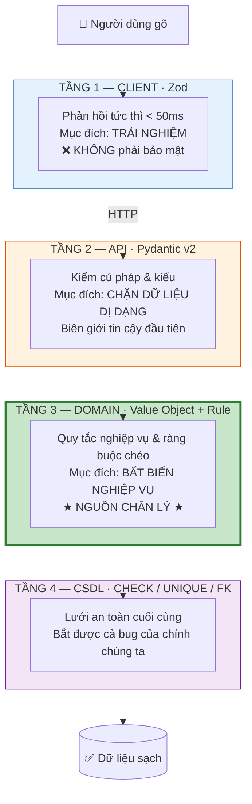
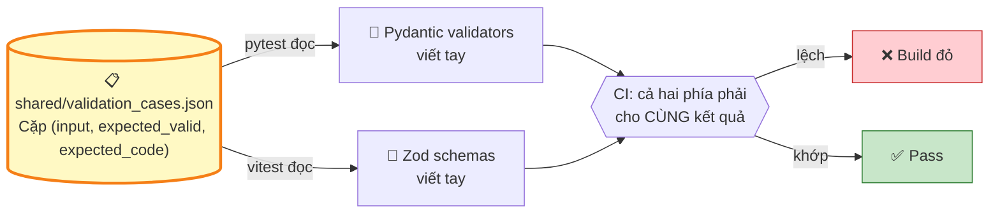

# 08 — Thiết kế module Validation

[← Mục lục](README.md)

**4 tầng phòng thủ · 56 quy tắc · 10 bảng Regex**

---

## 8.1. Kiến trúc bốn tầng

Validation không phải một hàm — nó là **bốn lớp phòng thủ độc lập**, mỗi lớp có mục đích riêng và **không lớp nào được tin tưởng lớp khác**.



| Tầng | Công nghệ | Bắt được gì | Không bắt được gì |
|---|---|---|---|
| **1 — Client** | Zod + React Hook Form | Sai định dạng, trống, sai độ dài | Trùng lặp, ràng buộc chéo cần CSDL |
| **2 — API** | Pydantic v2 | Kiểu sai, thiếu trường, JSON dị dạng, chuỗi quá dài | Quy tắc nghiệp vụ |
| **3 — Domain** | Value Object + Rule Engine | ⭐ Mọi quy tắc nghiệp vụ, ràng buộc chéo, trùng lặp | Lỗi lập trình ở tầng dưới |
| **4 — CSDL** | CHECK / UNIQUE / FK | Bug của chính hệ thống, race condition | — |

> ⭐ **Nguyên tắc bất di dịch:** Tầng 1 có thể bị vô hiệu hoá hoàn toàn (gọi API trực tiếp) mà **không** dẫn tới dữ liệu bẩn. Mọi quy tắc ở Tầng 1 đều có bản sao ở Tầng 2 hoặc 3.

---

## 8.2. Ba mức nghiêm trọng

| Mức | Ý nghĩa | Hành vi UI | Chặn? |
|---|---|---|---|
| 🔴 **ERROR** | Vi phạm bất biến — dữ liệu không thể chấp nhận | Ô viền đỏ, thông báo dưới ô, nút "Tiếp tục" **tắt** | ✅ Chặn cứng |
| 🟡 **WARNING** | Đáng ngờ nhưng có thể đúng | Ô viền vàng + biểu tượng ⚠️ + % cụ thể, cần tick checkbox | ⚠️ Chặn mềm |
| 🔵 **INFO** | Thông tin bổ trợ | Chú thích xám dưới ô | ❌ Không chặn |

---

## 8.3. ⭐ Bảng biểu thức chính quy đầy đủ

### 8.3.1. Số CCCD

| Mục | Nội dung |
|---|---|
| **Chuẩn hoá trước** | Bỏ mọi ký tự không phải chữ số. Sửa nhầm OCR: `O→0`, `I,l→1`, `S→5`, `B→8`, `Z→2`, `G→6`, `D→0` |
| **Regex cơ sở** | `^\d{12}$` |
| **Regex có cấu trúc** | `^(?P<province>0\d{2})(?P<gender_century>[0-9])(?P<birth_yy>\d{2})(?P<seq>\d{6})$` |
| **Thông báo lỗi** | *"Số CCCD phải có đúng 12 chữ số. Hiện có {n} chữ số."* |

**Kiểm tra cấu trúc bổ sung (đặc thù CCCD Việt Nam):**

| Vị trí | Ý nghĩa | Quy tắc kiểm tra | Mức |
|---|---|---|---|
| Ký tự 1–3 | Mã tỉnh nơi đăng ký khai sinh | Phải tồn tại trong `province_code` (001–096) | 🟡 |
| Ký tự 4 | Giới tính + thế kỷ sinh | `0`=Nam TK20 · `1`=Nữ TK20 · `2`=Nam TK21 · `3`=Nữ TK21 · `4`=Nam TK22 · `5`=Nữ TK22 | — |
| ↳ | Đối chiếu với giới tính đã trích | Chẵn ⇒ Nam, lẻ ⇒ Nữ | 🟡 |
| ↳ | Đối chiếu với năm sinh | `0,1` ⇒ 1900–1999 · `2,3` ⇒ 2000–2099 · `4,5` ⇒ 2100–2199 | 🟡 |
| Ký tự 5–6 | Hai số cuối năm sinh | Phải khớp `dob.year % 100` | 🟡 |
| Ký tự 7–12 | Số ngẫu nhiên | Không kiểm tra | — |

> ⭐ **Đây là kiểm tra rất mạnh mà ít hệ thống làm.** Nó phát hiện được lỗi OCR đọc sai **một chữ số ở giữa** — điều mà `^\d{12}$` không bao giờ bắt được.
> Ví dụ: CCCD `001199012345` với ngày sinh `14/05/1990`, giới tính "Nam" → ký tự 4 = `1` (Nữ TK20) và ký tự 5–6 = `99` (năm 1999) → **hai cảnh báo ngay lập tức**.

---

### 8.3.2. Số điện thoại Việt Nam

| Mục | Nội dung |
|---|---|
| **Chuẩn hoá trước** | Bỏ khoảng trắng, `.`, `-`, `(`, `)`. Đổi `+84`/`84` ở đầu thành `0` |
| **Regex di động** | `^0(3[2-9]\|5[2689]\|7[06-9]\|8[1-9]\|9[0-9])\d{7}$` |
| **Regex chấp nhận đầu vào** | `^(?:\+?84\|0)(3[2-9]\|5[2689]\|7[06-9]\|8[1-9]\|9[0-9])\d{7}$` |
| **Regex cố định (tuỳ chọn, mặc định tắt)** | `^0(2\d{1,2})\d{7,8}$` |
| **Kết quả lưu** | Luôn dạng `0xxxxxxxxx` (10 chữ số) |
| **Thông báo lỗi** | *"Số điện thoại không hợp lệ. Cần 10 chữ số bắt đầu bằng 03, 05, 07, 08 hoặc 09."* |

**Bảng nhà mạng** (hiển thị ngay dưới ô — giúp phát hiện gõ nhầm đầu số):

| Nhà mạng | Đầu số |
|---|---|
| Viettel | 032 033 034 035 036 037 038 039 · 086 096 097 098 |
| Vinaphone | 081 082 083 084 085 · 088 091 094 |
| Mobifone | 070 076 077 078 079 · 089 090 093 |
| Vietnamobile | 052 056 058 · 092 |
| Gmobile | 059 · 099 |
| Itelecom | 087 |

Đầu số hợp lệ regex nhưng không thuộc bảng → 🟡 *"Đầu số không thuộc nhà mạng nào đã biết."*

---

### 8.3.3. Email

| Mục | Nội dung |
|---|---|
| **Chuẩn hoá trước** | `trim()` → `lower()` |
| **Regex** | `^[A-Za-z0-9](?:[A-Za-z0-9._%+-]*[A-Za-z0-9])?@[A-Za-z0-9](?:[A-Za-z0-9-]*[A-Za-z0-9])?(?:\.[A-Za-z0-9](?:[A-Za-z0-9-]*[A-Za-z0-9])?)*\.[A-Za-z]{2,63}$` |
| **Kiểm tra bổ sung** | Phần cục bộ ≤ 64 ký tự · toàn chuỗi ≤ 254 ký tự · không có `..` liên tiếp · không bắt đầu/kết thúc bằng `.` hoặc `-` |
| **Cảnh báo lỗi gõ phổ biến** | 🟡 `gmai.com`, `gmial.com`, `gmail.co`, `yaho.com`, `hotmial.com`, `outlok.com` → gợi ý sửa |
| **Thông báo lỗi** | *"Email không hợp lệ. Ví dụ đúng: ten@example.com"* |

> **Chủ ý không dùng regex RFC 5322 đầy đủ.** Nó dài hàng nghìn ký tự, không đọc nổi, và vẫn chấp nhận địa chỉ hợp lệ về lý thuyết nhưng vô nghĩa trong thực tế. Regex trên bắt 99.9% trường hợp thật và **đọc hiểu được** — quan trọng hơn cho bảo trì.

---

### 8.3.4. Số tài khoản ngân hàng

| Mục | Nội dung |
|---|---|
| **Chuẩn hoá trước** | Bỏ mọi ký tự không phải chữ số |
| **Regex cơ sở** | `^\d{6,20}$` |
| **Kiểm tra theo ngân hàng** | Độ dài phải ∈ `[bank_directory.account_min_len, account_max_len]` của NH đã chọn |
| **UI** | Bộ đếm sống: `13/13 chữ số — đúng định dạng VCB` |
| **Thông báo lỗi** | *"Số tài khoản chỉ được chứa chữ số."* / *"Vietcombank yêu cầu 13 chữ số, bạn đã nhập 12."* |

---

### 8.3.5. ⭐ Số tài khoản chứng khoán

| Mục | Nội dung |
|---|---|
| **Chuẩn hoá trước** | Bỏ khoảng trắng/gạch → UPPERCASE → ⭐ nếu chỉ có 6 chữ số thì **tự thêm tiền tố** `008C` |
| **Regex chuẩn** | `^008C\d{6}$` |
| **Regex tổng quát** | `^(?P<member>\d{3})C(?P<customer>\d{6})$` |
| **Cấu hình** | `validation.securities_account.member_code = "008"` · `validation.securities_account.strict = true` |
| **Hiển thị UI** | `008C 123456` (nhóm cho dễ đọc) |
| **Lưu CSDL** | `008C123456` (liền) |
| ⭐ **Render tài liệu** | **`008C123456`** — **in đậm** (`render_style: {bold: true}`) |
| **Kiểm tra trùng** | Không được trùng khách hàng khác (blind index) → `COCAS-5007` |
| **Thông báo lỗi** | *"Số tài khoản chứng khoán phải có dạng 008C theo sau 6 chữ số. Ví dụ: 008C123456"* |

---

### 8.3.6. ⭐ Họ và tên tiếng Việt

> ⚠️ **KHÔNG dùng dải Unicode `À-Ỹ`.** Dải U+00C0–U+1EF9 bao gồm cả chữ thường và nhiều ký tự không thuộc tiếng Việt (`Ð`, `×`, `÷`, ký tự Bắc Âu). Đây là lỗi phổ biến và **đã bị loại bỏ khỏi thiết kế**.

| Mục | Nội dung |
|---|---|
| **Chuẩn hoá trước** | ⭐ **Unicode NFC TRƯỚC, rồi mới UPPERCASE** → thu gọn khoảng trắng liên tiếp → `trim()` |
| **Quy tắc kiểm tra** | Duyệt **từng ký tự**, chấp nhận nếu thuộc tập chữ hoa tiếng Việt (dưới) hoặc là khoảng trắng / `-` / `'` |
| **Độ dài** | 2–100 ký tự |
| **Số từ** | ≥ 2 từ (họ + tên) — dưới 2 từ → 🟡 WARNING |
| **Cấm** | Chữ số, ký tự đặc biệt khác, chuỗi rỗng |
| **Thông báo lỗi** | *"Họ và tên chỉ được chứa chữ cái tiếng Việt và khoảng trắng."* |

**Tập chữ hoa tiếng Việt hợp lệ (89 ký tự):**

```
A B C D E F G H I J K L M N O P Q R S T U V W X Y Z
Ă Â Đ Ê Ô Ơ Ư
À Á Ả Ã Ạ    Ằ Ắ Ẳ Ẵ Ặ    Ầ Ấ Ẩ Ẫ Ậ
È É Ẻ Ẽ Ẹ    Ề Ế Ể Ễ Ệ
Ì Í Ỉ Ĩ Ị
Ò Ó Ỏ Õ Ọ    Ồ Ố Ổ Ỗ Ộ    Ờ Ớ Ở Ỡ Ợ
Ù Ú Ủ Ũ Ụ    Ừ Ứ Ử Ữ Ự
Ỳ Ý Ỷ Ỹ Ỵ
```

**Sửa nhầm OCR trong ngữ cảnh chữ:** `0→O`, `1→I`, `5→S`, `8→B` — ⭐ **chỉ áp dụng khi chữ số nằm giữa các chữ cái**.

**Ca kiểm thử bắt buộc:** cùng một tên ở dạng **NFC** và **NFD** phải cho kết quả giống hệt nhau.

---

### 8.3.7. Địa chỉ

| Mục | Nội dung |
|---|---|
| **Chuẩn hoá trước** | NFC → thu gọn khoảng trắng → `trim()` |
| **Ký tự cho phép** | Chữ cái mọi ngôn ngữ, chữ số, và dấu câu địa chỉ: `,` `.` `/` `(` `)` `-` `–` `'` `#` `khoảng trắng` |
| **Độ dài** | 10–300 ký tự |
| **Cảnh báo** | 🟡 Không chứa chữ cái nào · 🟡 < 20 ký tự (*"Địa chỉ có vẻ quá ngắn"*) |
| **Thông báo lỗi** | *"Địa chỉ phải có ít nhất 10 ký tự."* |

---

### 8.3.8. Ngày tháng

| Mục | Nội dung |
|---|---|
| **Định dạng chấp nhận** | `dd/MM/yyyy`, `dd-MM-yyyy`, `dd.MM.yyyy`, `ddMMyyyy` |
| **Regex** | `^(?P<d>0[1-9]\|[12]\d\|3[01])[/\-.]?(?P<m>0[1-9]\|1[0-2])[/\-.]?(?P<y>(?:19\|20)\d{2})$` |
| **Kiểm tra bổ sung** | ⭐ Phải là **ngày có thật** — regex chấp nhận `31/02/2024` nhưng phải bị loại ở bước dựng đối tượng `date` |
| **Sửa nhầm OCR** | Thử hoán vị `1↔7`, `3↔8`, `0↔6` ở từng vị trí; nếu chỉ **một** biến thể cho ngày hợp lệ và hợp lý thì dùng nó với `confidence = 0.75` |
| **Chuẩn hoá đầu ra** | Đối tượng `date` (ISO trong JSON), hiển thị `dd/MM/yyyy` |

---

### 8.3.9. Nơi cấp CCCD

| Mục | Nội dung |
|---|---|
| **Giá trị hợp lệ** | Đúng **2**: `BỘ CÔNG AN` · `CỤC CẢNH SÁT QUẢN LÝ HÀNH CHÍNH VỀ TRẬT TỰ XÃ HỘI` |
| **Regex** | ⭐ **Không dùng regex** — dùng so khớp **danh sách trắng** |
| **UI** | Dropdown, không cho nhập tự do |
| **Cưỡng chế** | Value Object `IssuePlace` (Domain) + Pydantic `Literal` (API) + `CHECK` constraint (CSDL) — **3 tầng** |
| **Thông báo lỗi** | *"Nơi cấp phải là một trong hai giá trị chuẩn."* |

---

### 8.3.10. Mã số thuế (dự phòng — dùng khi mở rộng sang tổ chức)

| Mục | Nội dung |
|---|---|
| **Regex** | `^\d{10}(-\d{3})?$` |
| **Số kiểm tra** | Chữ số thứ 10 = kết quả thuật toán trọng số `31,29,23,19,17,13,7,5,3` áp lên 9 chữ số đầu, modulo 11, lấy `10 - kết quả` |
| **Mức** | Sai checksum → 🟡 WARNING (có MST cũ không theo chuẩn) |
| **Trạng thái** | ⚪ **Chưa áp dụng ở v1.0** — kích hoạt cùng lúc với mô hình Tổ chức |

---

## 8.4. Danh mục quy tắc validation OCR (23)

| Mã | Quy tắc | Mức | Thông báo |
|---|---|---|---|
| `V-OCR-001` | Có đủ cả ảnh mặt trước và mặt sau | 🔴 | "Thiếu ảnh {mặt trước/mặt sau}." |
| `V-OCR-002` | Hai ảnh không được cùng một mặt | 🔴 | "Bạn đã tải hai ảnh của cùng một mặt." |
| `V-OCR-003` | Số CCCD đúng 12 chữ số | 🔴 | §8.3.1 |
| `V-OCR-004` | Họ tên không trống, ≥ 2 từ | 🔴 / 🟡 | Trống → ERROR; 1 từ → WARNING |
| `V-OCR-005` | Ngày sinh là ngày có thật | 🔴 | "Ngày sinh không hợp lệ." |
| `V-OCR-006` | Ngày cấp là ngày có thật | 🔴 | |
| `V-OCR-007` | Ngày hết hạn là ngày có thật **hoặc** `KHÔNG THỜI HẠN` | 🔴 | |
| `V-OCR-008` | ⭐ `issue_date <= expiry_date` | 🔴 | "Ngày cấp phải trước hoặc bằng ngày hết hạn." |
| `V-OCR-009` | `date_of_birth < issue_date` | 🔴 | "Ngày sinh phải trước ngày cấp." |
| `V-OCR-010` | Tuổi tại thời điểm cấp ≥ 14 | 🟡 | "Công dân dưới 14 tuổi không được cấp CCCD. Kiểm tra lại ngày sinh/ngày cấp." |
| `V-OCR-011` | Tuổi hiện tại ∈ [14, 120] | 🟡 | "Tuổi tính ra là {n} — có vẻ bất thường." |
| `V-OCR-012` | `issue_date <= hôm nay` | 🔴 | "Ngày cấp không thể ở tương lai." |
| `V-OCR-013` | Thẻ còn hiệu lực (`expiry_date >= hôm nay`) | 🟡 | "CCCD đã hết hạn ngày {d}." |
| `V-OCR-014` | Thẻ sắp hết hạn (< 90 ngày) | 🔵 | "CCCD sẽ hết hạn sau {n} ngày." |
| `V-OCR-015` | ⭐ Nếu tuổi tại ngày cấp ≥ 60 thì `no_expiry` nên là `true` | 🔵 | "Công dân đủ 60 tuổi khi cấp — thẻ thường có giá trị không thời hạn." |
| `V-OCR-016` | Nơi cấp thuộc 2 giá trị chuẩn | 🔴 | §8.3.9 |
| `V-OCR-017` | Mọi trường bắt buộc không trống | 🔴 | "Trường '{label}' không được để trống." |
| `V-OCR-018` | `confidence >= ocr.review_threshold` | 🟡 | "Trường '{label}' được nhận dạng với độ tin cậy {p}%." |
| `V-OCR-019` | ⭐ Không có cờ `CARD_MISMATCH` | 🔴 | "Hai ảnh có vẻ không thuộc cùng một thẻ (số CCCD từ QR khác từ MRZ)." |
| `V-OCR-020` | Không có cờ `SOURCE_CONFLICT` chưa giải quyết | 🟡 | "Hai nguồn cho giá trị khác nhau ở trường '{label}'. Vui lòng chọn." |
| `V-OCR-021` | Mã tỉnh (3 số đầu) hợp lệ | 🟡 | §8.3.1 |
| `V-OCR-022` | Ký tự thứ 4 khớp giới tính | 🟡 | "Số CCCD cho thấy giới tính {x}, nhưng đã ghi {y}." |
| `V-OCR-023` | Ký tự 5–6 khớp năm sinh | 🟡 | "Số CCCD cho thấy năm sinh {19xx}, nhưng đã ghi {yyyy}." |

---

## 8.5. Danh mục quy tắc validation Form (15)

| Mã | Quy tắc | Mức | Áp dụng mẫu |
|---|---|---|---|
| `V-FRM-001` | SĐT khớp regex di động Việt Nam | 🔴 | Cả hai |
| `V-FRM-002` | Đầu số thuộc nhà mạng đã biết | 🟡 | Cả hai |
| `V-FRM-003` | Email hợp lệ | 🔴 | Cả hai |
| `V-FRM-004` | Không phải lỗi gõ tên miền phổ biến | 🟡 | Cả hai |
| `V-FRM-005` | Địa chỉ 10–300 ký tự | 🔴 | Cả hai |
| `V-FRM-006` | STK ngân hàng chỉ chứa chữ số | 🔴 | `01A/HĐ-GĐN` |
| `V-FRM-007` | Độ dài STK khớp ngân hàng đã chọn | 🟡 | `01A/HĐ-GĐN` |
| `V-FRM-008` | Tên ngân hàng không trống | 🔴 | `01A/HĐ-GĐN` |
| `V-FRM-009` | Chi nhánh không trống | 🔴 | `01A/HĐ-GĐN` |
| `V-FRM-010` | ⭐ STK chứng khoán khớp `^008C\d{6}$` | 🔴 | `01A/GDKQ` |
| `V-FRM-011` | ⭐ STK chứng khoán không trùng khách hàng khác | 🔴 | `01A/GDKQ` |
| `V-FRM-012` | Số CCCD không trùng khách hàng khác đang hoạt động | 🟡 | Cả hai (cho chọn: cập nhật hay tạo mới) |
| `V-FRM-013` | STK ngân hàng không trùng trong cùng khách hàng | 🔴 | `01A/HĐ-GĐN` |
| `V-FRM-014` | Mọi trường có dấu `*` không được trống | 🔴 | Cả hai |
| `V-FRM-015` | Không có ký tự điều khiển / ký tự vô hình trong ô văn bản | 🔴 | Cả hai |

> ⭐ **Các quy tắc ngân hàng chỉ được áp dụng khi `party_schema.collect` chứa `"bank_account"`.** Engine đọc khai báo, không hardcode theo mẫu.

---

## 8.6. Danh mục quy tắc sinh hợp đồng (10)

| Mã | Quy tắc | Mức | Mã lỗi API |
|---|---|---|---|
| `V-CTR-001` | Mẫu có phiên bản đang kích hoạt | 🔴 | `COCAS-6005` |
| `V-CTR-002` | File mẫu tồn tại trên đĩa và checksum khớp | 🔴 | `COCAS-6006/6007` |
| `V-CTR-003` | ⭐ Mọi biến trong `required_variables` có giá trị không rỗng | 🔴 | `COCAS-7002` |
| `V-CTR-004` | Số bên khớp `party_schema` (`min`/`max`) | 🔴 | `COCAS-7010` |
| `V-CTR-005` | `entity_type` mỗi bên khớp khai báo | 🔴 | `COCAS-7011` |
| `V-CTR-006` | Bên khai báo `collect: bank_account` phải có `bank_account_id` | 🔴 | `COCAS-7012` |
| `V-CTR-007` | Một chủ thể không đóng hai vai trong cùng hợp đồng | 🔴 | `COCAS-7013` |
| `V-CTR-008` | Đủ dung lượng đĩa (≥ 100 MB) | 🔴 | `COCAS-8003` |
| `V-CTR-009` | Khách hàng chưa bị soft-delete | 🔴 | `COCAS-5001` |
| `V-CTR-010` | CCCD của khách hàng chưa hết hạn | 🟡 | cảnh báo, không chặn |

---

## 8.7. Danh mục quy tắc đăng ký template (8)

| Mã | Quy tắc | Mức | Mã lỗi API |
|---|---|---|---|
| `V-TPL-001` | File là DOCX hợp lệ (magic bytes `PK\x03\x04` + có `word/document.xml`) | 🔴 | `COCAS-6002` |
| `V-TPL-002` | Cú pháp Jinja2 hợp lệ | 🔴 | `COCAS-6003` (kèm số dòng) |
| `V-TPL-003` | ⭐ Không chứa cấu trúc nguy hiểm (`__`, `class`, `mro`, `globals`, `import`, `eval`, `lipsum`…) | 🔴 | `COCAS-6014` |
| `V-TPL-004` | Không dùng `` / `` / `` | 🔴 | `COCAS-6014` |
| `V-TPL-005` | ⭐ Biến khai báo `render_style` phải viết dạng `{{r var }}` | 🟡 | `COCAS-6008` |
| `V-TPL-006` | Biến không có trong từ điển → cảnh báo, không chặn | 🟡 | `COCAS-6009` |
| `V-TPL-007` | Chứa placeholder ảnh (``) → cảnh báo (v1.0 không nhúng ảnh) | 🟡 | `COCAS-6010` |
| `V-TPL-008` | ⭐ `party_schema` chỉ dùng tính năng đã hỗ trợ ở v1.0 (`entity_type=INDIVIDUAL`, `min=max=1`) | 🔴 | `COCAS-6016` |

---

## 8.8. Đồng bộ Zod ⟷ Pydantic

**Vấn đề:** hai bộ luật viết bằng hai ngôn ngữ, ở hai nơi. Không sớm thì muộn chúng sẽ lệch nhau, và lệch âm thầm.

**Giải pháp — file ca kiểm thử dùng chung:**



> ⭐ **Không có bộ sinh mã.** Với 56 quy tắc, chi phí xây và bảo trì bộ sinh mã (~300 dòng, xử lý mọi kiểu, mọi thông điệp) **lớn hơn** chi phí viết tay hai bộ luật. File ca kiểm thử chung mới là cơ chế phòng lệch thực sự.

### Ví dụ mục trong `validation_cases.json`

| field | input | expected_valid | expected_code |
|---|---|---|---|
| `phone` | `"0912345678"` | ✅ | — |
| `phone` | `"+84912345678"` | ✅ | — *(chuẩn hoá → `0912345678`)* |
| `phone` | `"0112345678"` | ❌ | `INVALID_PHONE_PREFIX` |
| `phone` | `"091234567"` | ❌ | `INVALID_PHONE_LENGTH` |
| `securities_account` | `"008C123456"` | ✅ | — |
| `securities_account` | `"123456"` | ✅ | — *(tự thêm tiền tố)* |
| `securities_account` | `"008C12345"` | ❌ | `INVALID_SECURITIES_ACCOUNT` |
| `securities_account` | `"009C123456"` | ❌ | `INVALID_MEMBER_CODE` |
| `id_number` | `"001199012345"` | ✅ | — |
| `id_number` | `"00119901234"` | ❌ | `INVALID_LENGTH` |
| `full_name` | `"NGUYỄN VĂN AN"` *(NFC)* | ✅ | — |
| `full_name` | `"NGUYỄN VĂN AN"` *(NFD)* | ✅ | — ⭐ **phải cho kết quả giống NFC** |
| `full_name` | `"NGUYỄN×VĂN"` | ❌ | `INVALID_CHARACTER` |
| `full_name` | `"nguyễn văn an"` | ✅ | — *(tự UPPERCASE)* |
| `issue_place` | `"BỘ CÔNG AN"` | ✅ | — |
| `issue_place` | `"Bộ công an"` | ✅ | — *(chuẩn hoá tầng 1)* |
| `issue_place` | `"CUC CS QLHC VE TTXH"` | ✅ | — *(alias tầng 2)* |
| `issue_place` | `"XYZ"` | ❌ | `ISSUE_PLACE_UNRECOGNIZED` |
| `date` | `"29/02/2024"` | ✅ | — *(năm nhuận)* |
| `date` | `"29/02/2023"` | ❌ | `INVALID_DATE` |
| `email` | `"a@b.co"` | ✅ | — |
| `email` | `"a..b@c.com"` | ❌ | `INVALID_EMAIL` |

---

## 8.9. Nguyên tắc viết thông điệp lỗi

Mọi thông điệp phải trả lời **ba câu hỏi**:

| Câu hỏi | Trường |
|---|---|
| Cái gì sai? | `message` |
| Sai ở đâu? | `details[].field` |
| Tôi phải làm gì? | `hint` |

| ❌ Không chấp nhận | ✅ Chuẩn |
|---|---|
| "Dữ liệu không hợp lệ" | "Số CCCD phải có đúng 12 chữ số. Hiện có 11 chữ số." + hint "Kiểm tra lại trường 'Số CCCD'. Nếu ảnh mờ, hãy chụp lại mặt trước." |
| "Validation error" | "Ngày cấp (25/08/2021) không thể sau ngày hết hạn (14/05/2021)." + hint "Kiểm tra lại hai trường ngày trên ảnh mặt sau." |
| "Lỗi 422" | "Mẫu hợp đồng yêu cầu 'Số tài khoản chứng khoán' nhưng chưa có giá trị." + hint "Nhập số TK chứng khoán dạng 008C123456 ở bước Khách hàng." |

**Ba quy tắc bổ sung:**
1. ⭐ **Luôn nêu giá trị thực tế** — "Hiện có 11 chữ số", không phải "sai độ dài".
2. **Không dùng thuật ngữ kỹ thuật** — không "regex", "null", "constraint violation", "NoneType".
3. **Không đổ lỗi cho người dùng** — "Số CCCD cần 12 chữ số", không phải "Bạn đã nhập sai".

---

## 8.10. Đặc tả `ValidationEngine`

| Mục | Nội dung |
|---|---|
| **Tầng** | Domain |
| **Phương thức** | `validate(target: Any, rule_set: RuleSetKey, context: RuleContext) -> ValidationReport` |
| **Tập quy tắc** | `OCR_RESULT` (23) · `CUSTOMER_FORM` (15) · `CONTRACT_GENERATION` (10) · `TEMPLATE_REGISTRATION` (8) |
| **Tiền điều kiện** | `rule_set` tồn tại trong registry |
| **Hậu điều kiện** | ⭐ **Chạy hết tất cả quy tắc**, không dừng ở lỗi đầu tiên — người dùng cần thấy toàn bộ vấn đề trong một lần |
| **Bất biến** | `report.is_valid == (len(report.errors) == 0)` |
| **Đầu ra** | `ValidationReport{ is_valid, errors[], warnings[], infos[] }` — mỗi mục `{code, field, message_vi, hint, severity}` |
| **Không được làm** | ❌ Sửa dữ liệu · ❌ Truy cập CSDL trực tiếp (quy tắc cần tra CSDL nhận repository qua `RuleContext`) |
| **Mở rộng** | Thêm quy tắc = thêm một đối tượng Rule vào registry, **không sửa engine** |

---

## 8.11. Chiến lược kiểm thử validation

| Loại | Nội dung | Số ca |
|---|---|---|
| **Unit — Value Object** | Mỗi VO có bộ ca hợp lệ / không hợp lệ / biên (tối thiểu 8 ca) | ~180 |
| **Unit — Rule** | Mỗi quy tắc có ≥ 1 ca đúng + 2 ca sai | ~170 |
| **Property-based** | Hypothesis — xem dưới | 6 property |
| **Ca kiểm thử chung** | `validation_cases.json` chạy ở cả pytest và vitest | ~90 |
| **Integration** | Gửi payload sai lên API, kiểm mã lỗi và cấu trúc `details` | ~40 |
| **Ca thực tế** | Mọi lỗi phát sinh trong vận hành được thêm vào bộ hồi quy | tăng dần |

### Property-based test bắt buộc

| # | Property |
|---|---|
| 1 | ⭐ `IssuePlaceNormalizer.normalize(bất kỳ chuỗi nào)` luôn trả 1 trong 3 giá trị cho phép |
| 2 | `CitizenId` chấp nhận **mọi** chuỗi 12 chữ số, từ chối **mọi** chuỗi khác |
| 3 | `VietnamesePhone` chuẩn hoá luôn cho ra đúng 10 ký tự bắt đầu bằng `0` |
| 4 | `SecuritiesAccountNumber` chuẩn hoá luôn cho ra `^\d{3}C\d{6}$` hoặc ném lỗi |
| 5 | ⭐ `PersonName` cho **cùng kết quả** với dạng NFC và NFD của cùng một tên |
| 6 | `FusedField.confidence` ∈ [0, 1] với mọi tổ hợp ứng viên |

### Ca biên bắt buộc phải có

- CCCD `000000000000` (12 số nhưng mã tỉnh không hợp lệ)
- Ngày `29/02/2024` (hợp lệ — năm nhuận) và `29/02/2023` (không hợp lệ)
- Ngày cấp **bằng** ngày hết hạn (hợp lệ, biên `<=`)
- CCCD "KHÔNG THỜI HẠN" với `expiry_date = NULL`
- ⭐ Họ tên tiếng Việt ở **cả hai dạng Unicode NFC và NFD**
- Họ tên chứa ký tự ngoài tập cho phép (`NGUYỄN×VĂN`)
- Email dài đúng 254 và 255 ký tự
- STK chứng khoán `008C000000` (toàn số 0 — hợp lệ về định dạng)
- STK chứng khoán chỉ nhập 6 số `123456` (phải tự thêm tiền tố)

---

[← 07 — Module OCR](07-module-ocr.md) · [Mục lục](README.md) · [Tiếp: 09 — Template & Tài liệu →](09-template-va-tai-lieu.md)
