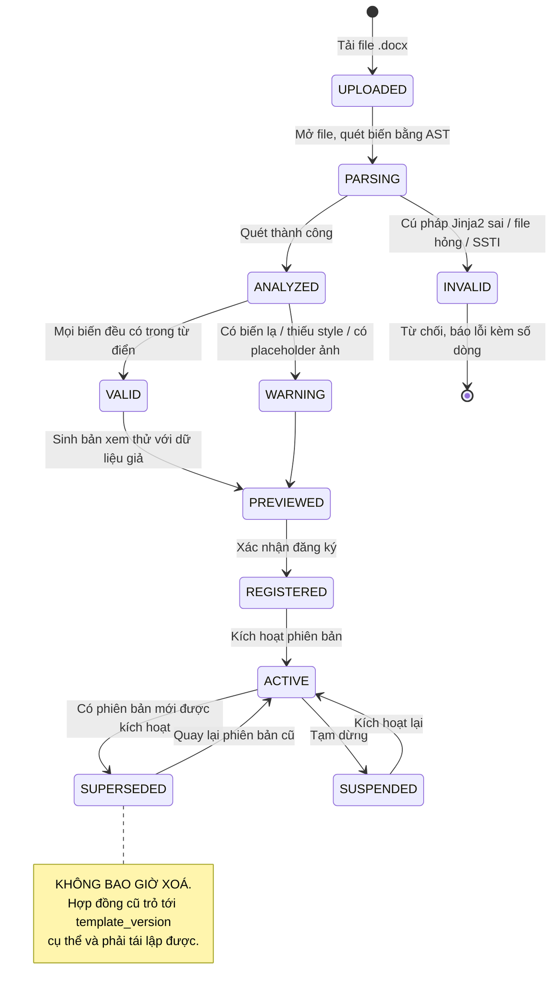
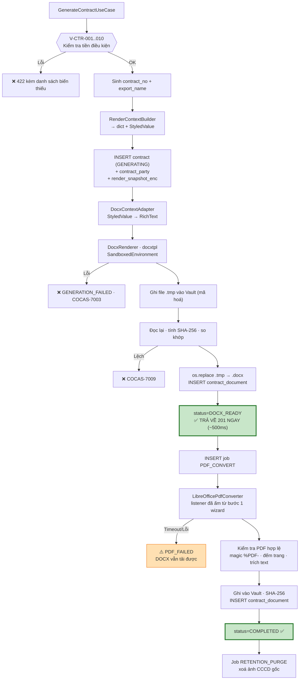

# 09 — Template Engine & Sinh tài liệu

[← Mục lục](README.md)

**docxtpl (Jinja2 sandboxed) · LibreOffice headless · Từ điển 25 biến**

---

# PHẦN A — TEMPLATE ENGINE

## 9.1. Vòng đời một mẫu hợp đồng



---

## 9.2. Quét biến (Template Introspection)

**Cách làm:** dùng chính bộ phân tích cú pháp của Jinja2 để lấy **cây AST**, rồi thu thập các nút biến.

> ⭐ **Không dùng regex quét text.** Regex không hiểu ``, ``, bộ lọc `|`, và sẽ bỏ sót hoặc bắt nhầm.

| # | Bước | Chi tiết |
|---|---|---|
| 1 | Kiểm tra định dạng file | Phải là ZIP hợp lệ chứa `word/document.xml` — kiểm magic bytes `PK\x03\x04`, **không tin đuôi file** |
| 2 | Trích văn bản mẫu | docxtpl gộp các `run` bị chẻ (Word hay chẻ `{{ full_name }}` thành nhiều run khi soạn thảo) |
| 3 | Phân tích cú pháp Jinja2 | Lấy AST. Lỗi → `COCAS-6003` **kèm số dòng và mô tả** |
| 4 | Thu thập biến | Duyệt AST lấy `Name`, `Getattr`, `Getitem`. Phân biệt biến gốc (`full_name`), thuộc tính (`holder.full_name`), phần tử mảng (`co_holder[0]`) |
| 5 | Phân loại | Đối chiếu từ điển biến hệ thống → `required` / `optional` / `unknown` |
| 6 | Phát hiện cấu trúc | Có ``? ``? `{{r ... }}` (rich text)? `` (paragraph/ảnh)? |
| 7 | ⭐ Quét bảo mật | Từ chối mẫu chứa cấu trúc nguy hiểm (§9.9) |

**Kết quả lưu vào `template_version`:** `declared_variables`, `required_variables`, `optional_variables`, `unknown_variables`, `richtext_variables`, `has_loops`, `has_conditionals`, `validation_status`, `validation_report`.

---

## 9.3. Danh mục chẩn đoán khi kiểm tra mẫu

| Mã | Mức | Điều kiện | Thông điệp cho người dùng |
|---|---|---|---|
| `COCAS-6002` | 🔴 | File không phải DOCX hợp lệ | "File không đúng định dạng Word (.docx)." |
| `COCAS-6003` | 🔴 | Lỗi cú pháp Jinja2 | "Lỗi cú pháp tại dòng {n}: {chi tiết}. Kiểm tra dấu ngoặc `{{ }}` và ``." |
| `COCAS-6008` | 🟡 | Biến khai báo `render_style` nhưng viết dạng thường | ⭐ "Biến '{v}' cần in đậm. Sửa `{{ v }}` thành `{{r v }}`." |
| `COCAS-6009` | 🟡 | Biến không có trong từ điển | "Biến '{v}' không xác định — sẽ được thay bằng chuỗi rỗng. Nếu cần, khai báo ở 'Trường bổ sung'." |
| `COCAS-6010` | 🟡 | Chứa placeholder ảnh (``) | "Hệ thống không nhúng ảnh vào hợp đồng. Placeholder này sẽ bị bỏ trống." |
| `COCAS-6011` | 🟡 | Biến bắt buộc của `party_schema` không xuất hiện | "Mẫu khai báo cần '{v}' nhưng file không dùng biến này." |
| `COCAS-6012` | 🟡 | `` trên biến không phải mảng | "Biến '{v}' không lặp được." |
| `COCAS-6014` | 🔴 | ⭐ Cấu trúc Jinja2 nguy hiểm | "Mẫu chứa cấu trúc không được phép vì lý do an toàn." |
| `COCAS-6015` | 🟡 | File > 10 MB | "File khá lớn — có thể chứa ảnh nền không cần thiết." |
| `COCAS-6016` | 🔴 | ⭐ `party_schema` dùng tính năng chưa hỗ trợ ở v1.0 | "Mẫu hợp đồng dành cho tổ chức / nhiều bên chưa được hỗ trợ ở phiên bản này." |

---

## 9.4. Phiên bản hoá

| Nguyên tắc | Chi tiết |
|---|---|
| **Không ghi đè** | Tải file mới = tạo `template_version` mới với `version_no + 1`. File cũ giữ nguyên trên đĩa |
| **Kích hoạt tường minh** | Phiên bản mới **không** tự động thành `active`. Phải xem thử rồi bấm "Kích hoạt" |
| **Quay lui được** | Bấm "Kích hoạt" trên phiên bản cũ bất kỳ → nó thành `active` ngay |
| ⭐ **Hợp đồng khoá phiên bản** | `contract.template_version_id` trỏ **phiên bản cụ thể** — cập nhật mẫu không đụng hợp đồng cũ |
| ⭐ **Toàn vẹn file** | Mỗi lần dùng, so `SHA-256` file trên đĩa với CSDL. Lệch → `COCAS-6006`, **chặn sinh hợp đồng** |
| **Nhật ký thay đổi** | `changelog` bắt buộc ≥ 10 ký tự khi tải phiên bản mới |
| **Không xoá** | Phiên bản chỉ được `archived_at`, không bao giờ DELETE |

**Bố cục lưu trữ:**
```
data/templates/
└── {template_id}/
    ├── v1/  template.docx  +  manifest.json
    ├── v2/  template.docx  +  manifest.json
    └── v3/  template.docx  +  manifest.json   ← active
```

`manifest.json` chứa bản sao metadata (sha256, biến, ngày tạo) — để phục hồi CSDL từ thư mục nếu cần.

---

## 9.5. ⭐ Từ điển biến hệ thống v1.0 (25 biến)

Đây là danh sách biến người soạn template được dùng trong `.docx`. Endpoint `GET /templates/variables` trả về bảng này.

### Biến từ CCCD (11)

| Biến | Nhãn tiếng Việt | Kiểu | Render | Ví dụ | GĐN | GDKQ |
|---|---|---|---|---|:---:|:---:|
| `{{full_name}}` | Họ và tên | text | UPPERCASE có dấu | NGUYỄN VĂN AN | ✅ | ✅ |
| `{{id_number}}` | Số CCCD | text | 12 chữ số liền | 001199012345 | ✅ | ✅ |
| `{{id_number_spaced}}` | Số CCCD (nhóm 4) | text | `0011 9901 2345` | | ⬜ | ⬜ |
| `{{dob}}` | Ngày sinh | date | `dd/MM/yyyy` | 14/05/1990 | ✅ | ✅ |
| `{{dob_text}}` | Ngày sinh (chữ) | text | `ngày 14 tháng 05 năm 1990` | | ⬜ | ⬜ |
| `{{issue_date}}` | Ngày cấp | date | `dd/MM/yyyy` | 20/08/2021 | ✅ | ✅ |
| `{{issue_date_text}}` | Ngày cấp (chữ) | text | `ngày 20 tháng 08 năm 2021` | | ⬜ | ⬜ |
| `{{expiry_date}}` | Ngày hết hạn | date | `dd/MM/yyyy` **hoặc** `KHÔNG THỜI HẠN` | 14/05/2030 | ✅ | ✅ |
| `{{issue_place}}` | Nơi cấp | enum | 1 trong 2 giá trị chuẩn | CỤC CẢNH SÁT QUẢN LÝ HÀNH CHÍNH VỀ TRẬT TỰ XÃ HỘI | ✅ | ✅ |
| `{{issue_place_short}}` | Nơi cấp (viết tắt) | enum | `BCA` / `CỤC CS QLHC VỀ TTXH` | | ⬜ | ⬜ |
| `{{gender}}` | Giới tính | enum | Nam / Nữ | Nam | ⬜ | ⬜ |

### Biến liên hệ (3)

| Biến | Nhãn | Ví dụ | GĐN | GDKQ |
|---|---|---|:---:|:---:|
| `{{phone}}` | Số điện thoại | 0912345678 | ✅ | ✅ |
| `{{email}}` | Email | an@example.com | ✅ | ✅ |
| `{{address}}` | Địa chỉ | Số 12, ngõ 34, phố Kim Mã, phường Kim Mã, quận Ba Đình, Hà Nội | ✅ | ✅ |

### Biến ngân hàng (5)

| Biến | Nhãn | Ví dụ | GĐN | GDKQ |
|---|---|---|:---:|:---:|
| `{{bank_account}}` | Số tài khoản ngân hàng | 1234567890123 | ✅ | ❌ |
| `{{bank_name}}` | Tên ngân hàng | Ngân hàng TMCP Ngoại thương Việt Nam | ✅ | ❌ |
| `{{bank_short_name}}` | Tên NH viết tắt | Vietcombank | ⬜ | ❌ |
| `{{branch}}` | Chi nhánh | Chi nhánh Ba Đình | ✅ | ❌ |
| `{{account_holder_name}}` | Chủ tài khoản | NGUYEN VAN AN | ⬜ | ❌ |

### Biến chứng khoán (1) ⭐

| Biến | Nhãn | Kiểu | `render_style` | Cú pháp trong DOCX | GĐN | GDKQ |
|---|---|---|---|---|:---:|:---:|
| `{{securities_account_no}}` | Số tài khoản chứng khoán | securities_account | ⭐ `{bold: true}` | ⭐ **`{{r securities_account_no }}`** | ⬜ | ✅ |

### Biến hệ thống (6)

| Biến | Nhãn | Ví dụ | Ghi chú |
|---|---|---|---|
| `{{contract_no}}` | Số hợp đồng | 01A-GDN-202608-00042 | Tự sinh |
| `{{contract_date}}` | Ngày hợp đồng | *(rỗng)* | ⭐ Nằm trong `suppressed_variables` của cả 2 mẫu |
| `{{contract_date_text}}` | Ngày HĐ (chữ) | *(rỗng)* | ⭐ Bị tắt |
| `{{today}}` | Ngày hiện tại | 08/08/2026 | |
| `{{day}}` / `{{month}}` / `{{year}}` | Ngày / Tháng / Năm | *(rỗng)* | ⭐ Bị tắt |
| `{{created_by_name}}` | Người lập | nvnghiep | Tài khoản Windows |

**Chú giải:** ✅ mẫu dùng · ⬜ có sẵn nhưng mẫu chưa dùng · ❌ không áp dụng.

> ⭐ Các biến `_text` (ngày dạng chữ) rất hay dùng trong hợp đồng Việt Nam — dòng *"Hôm nay, ngày 08 tháng 08 năm 2026, tại…"*. Chúng được cung cấp sẵn để người soạn template không phải ghép thủ công.

---

## 9.6. Bộ dựng ngữ cảnh render

⭐ **Tách làm hai thành phần để không vi phạm Clean Architecture:**

| Thành phần | Tầng | Trách nhiệm |
|---|---|---|
| **`RenderContextBuilder`** | **Application** | Dựng từ điển **chỉ chứa kiểu nguyên thuỷ**. Biến cần định dạng bọc trong `StyledValue{text, style}` — Value Object thuần của Domain |
| **`DocxContextAdapter`** | **Infrastructure** | Duyệt ngữ cảnh, chuyển `StyledValue` → `docxtpl.RichText` ngay trước khi render |

> **Vì sao tách:** `RichText` là lớp của thư viện `docxtpl` (Infrastructure). Nếu tầng Application tạo nó, đó là rò rỉ kiến trúc vi phạm P-02. Lợi ích phụ: đổi sang thư viện render khác (hoặc render HTML) chỉ cần đổi adapter.

### Bảy bước dựng ngữ cảnh

| # | Bước | Chi tiết |
|---|---|---|
| 1 | Nạp các bên | Đọc `contract_party`, giải mã PII |
| 2 | Dựng cây nhiều bên | `{"holder": {...}}` |
| 3 | ⭐ **Làm phẳng cho mẫu một bên** | `party_schema` chỉ có 1 bên → **sao chép** mọi khoá của bên đó lên cấp gốc. Kết quả: cả `{{full_name}}` và `{{holder.full_name}}` đều chạy |
| 4 | Thêm biến hệ thống | `contract_no`, `today`, `day/month/year`, `created_by_name` |
| 5 | Thêm biến bổ sung | Từ `contract.extra_variables` và `contract_party.party_extra` |
| 6 | ⭐ **Định dạng theo kiểu** | Ngày → `dd/MM/yyyy`; tiền tệ → phân cách hàng nghìn; `None` → chuỗi rỗng |
| 7 | ⭐ **Bọc `StyledValue`** | Biến có `render_style` → bọc thành `StyledValue(text, style)` |
| 8 | ⭐ **Áp `suppressed_variables`** | Biến trong danh sách → ghi đè thành chuỗi rỗng |

### Ngữ cảnh cho mẫu `01A_GDKQ`

| Khoá | Giá trị | Ghi chú |
|---|---|---|
| `securities_account_no` | `StyledValue("008C123456", {bold: true})` | ⭐ → `RichText` ở adapter |
| `full_name` | `"NGUYỄN VĂN AN"` | |
| `id_number` | `"001199012345"` | |
| `dob` | `"14/05/1990"` | Đã định dạng |
| `issue_date` | `"20/08/2021"` | |
| `expiry_date` | `"14/05/2030"` | Hoặc `"KHÔNG THỜI HẠN"` |
| `issue_place` | `"CỤC CẢNH SÁT QUẢN LÝ HÀNH CHÍNH VỀ TRẬT TỰ XÃ HỘI"` | |
| `phone` · `email` · `address` | … | |
| `contract_no` | `"01A-KQ-202608-00042"` | Hệ thống sinh |
| `contract_date` · `contract_date_text` · `day` · `month` · `year` | `""` | ⭐ **Suppressed** |
| `holder.*` | *(bản sao mọi khoá trên)* | Tương thích cả 2 cách viết |

⭐ Sau khi dựng xong, toàn bộ ngữ cảnh được lưu vào `contract.render_snapshot_enc` — hiện thực của P-09.

---

## 9.7. Bảng định dạng theo kiểu dữ liệu

| Kiểu khai báo | Đầu vào | Đầu ra render | Khi rỗng |
|---|---|---|---|
| `text` | chuỗi | nguyên văn, đã `trim()` | `""` |
| `date` | `date` | `08/08/2026` | `""` |
| `date_text` | `date` | `ngày 08 tháng 08 năm 2026` | `""` |
| `number` | int | `1234` | `""` |
| `decimal` | float | `12,50` *(dấu phẩy thập phân kiểu Việt Nam)* | `""` |
| `currency` | int | `1.500.000` | `""` |
| `currency_text` | int | `Một triệu năm trăm nghìn đồng` | `""` |
| `percent` | float | `50%` | `""` |
| `boolean` | bool | `Có` / `Không` | `Không` |
| `enum` | chuỗi | nhãn tiếng Việt của giá trị | `""` |
| `securities_account` | chuỗi | `008C123456` **in đậm** | `""` |

> ⭐ **Quy tắc vàng:** giá trị `None`/`null` **luôn** render thành chuỗi rỗng, **không bao giờ** thành `"None"`, `"null"`, hay `"{{ variable }}"`. Đây là lỗi kinh điển của mọi hệ thống template — chặn nó bằng lớp `Undefined` tuỳ chỉnh áp cho toàn ngữ cảnh.

---

## 9.8. Xử lý biến thiếu và biến thừa

| Tình huống | Xử lý | Lý do |
|---|---|---|
| Biến **bắt buộc** thiếu giá trị | 🔴 Chặn sinh hợp đồng, `COCAS-7002` kèm danh sách biến thiếu **và nhãn tiếng Việt** | Hợp đồng thiếu thông tin bắt buộc là tài liệu hỏng |
| Biến **tuỳ chọn** thiếu giá trị | Render chuỗi rỗng, ghi log mức DEBUG | Bình thường |
| Biến **không xác định** trong file | Render chuỗi rỗng + cảnh báo lúc đăng ký mẫu | Không nên làm hỏng cả hợp đồng vì một biến gõ nhầm |
| Biến trong `suppressed_variables` | Ghi đè thành chuỗi rỗng | ⭐ Ngày HĐ và chữ ký để trống cho người dùng viết tay |
| Biến có trong từ điển nhưng file không dùng | Không sao, ghi INFO | Mẫu không bắt buộc dùng hết biến |
| ⭐ Cấu hình Jinja2 | Dùng `Undefined` tuỳ chỉnh trả chuỗi rỗng — **không dùng `StrictUndefined`** | `StrictUndefined` ném lỗi **giữa chừng render** → hợp đồng hỏng một nửa. Ta muốn kiểm tra **trước** khi render |

---

## 9.9. ⭐ Bảo mật Template Engine — Chống SSTI

> **Đây là lỗ hổng nguy hiểm nhất của toàn hệ thống.** Jinja2 là ngôn ngữ Turing-complete. Một file `.docx` độc hại (đến từ email hoặc USB) có thể chứa biểu thức truy cập được vào đối tượng Python nội bộ và **thực thi mã tuỳ ý** trên máy người dùng.

| # | Biện pháp | Chi tiết |
|---|---|---|
| 1 | ⭐ **`SandboxedEnvironment`** | Jinja2 cung cấp sẵn môi trường sandbox chặn truy cập thuộc tính bắt đầu bằng `_`, chặn `__class__`, `__globals__`, `__subclasses__`, `__builtins__`. **Bắt buộc, không tuỳ chọn** |
| 2 | **Danh sách trắng bộ lọc** | Chỉ cho phép: `upper`, `lower`, `title`, `trim`, `default`, `length`, `join`, `replace`, `first`, `last`. Chặn tất cả bộ lọc khác |
| 3 | **Quét mẫu nguy hiểm khi đăng ký** | Từ chối file chứa `__`, `class`, `mro`, `subclasses`, `globals`, `builtins`, `import`, `eval`, `exec`, `open`, `os.`, `sys.`, `config`, `self`, `request`, `lipsum`, `cycler`, `namespace` → `COCAS-6014` |
| 4 | **Giới hạn tài nguyên khi render** | Timeout 10 giây · giới hạn số vòng lặp 1000 · giới hạn kích thước output 50 MB |
| 5 | **Ghi nhật ký mọi thao tác template** | `TEMPLATE_REGISTERED`, `TEMPLATE_VERSION_ACTIVATED` kèm SHA-256 của file |
| 6 | **Cấm `` / `` / ``** | Chống đọc file tuỳ ý qua template |
| 7 | ⭐ **Ngữ cảnh chỉ chứa kiểu nguyên thuỷ** | **Không bao giờ** đưa đối tượng ORM, `Settings`, hay bất kỳ đối tượng có thuộc tính riêng nào vào ngữ cảnh. Chỉ `str`, `int`, `float`, `bool`, `date`, `list`, `dict`, `RichText` |

> ⭐ **Biện pháp #7 là quan trọng nhất.** Ngay cả khi sandbox bị vượt qua, nếu ngữ cảnh chỉ chứa chuỗi và số thì kẻ tấn công không có "bàn đạp" nào để leo lên đối tượng hệ thống. Đây là phòng thủ theo chiều sâu đúng nghĩa.

---

## 9.10. Xem thử mẫu với dữ liệu giả

`POST /templates/{id}/preview` sinh PDF từ **dữ liệu giả cố định**, không đụng dữ liệu thật:

| Biến | Giá trị giả |
|---|---|
| `full_name` | `NGUYỄN VĂN MẪU` |
| `id_number` | `000000000000` |
| `dob` | `01/01/1990` |
| `issue_date` | `01/01/2021` |
| `expiry_date` | `01/01/2030` |
| `issue_place` | `BỘ CÔNG AN` |
| `phone` | `0900000000` |
| `email` | `mau@example.com` |
| `address` | `Số 1, đường Mẫu, phường Mẫu, quận Mẫu, thành phố Mẫu` |
| `bank_account` | `0000000000000` |
| `bank_name` | `Ngân hàng Mẫu` |
| `branch` | `Chi nhánh Mẫu` |
| ⭐ `securities_account_no` | **`008C000000`** *(in đậm — để kiểm tra định dạng đúng chưa)* |
| `contract_no` | `MẪU-XEM-THỬ` |

Bản xem thử **không tạo bản ghi `contract`**, không ghi vào Vault, file tạm bị xoá sau 5 phút. Có **watermark chéo "BẢN XEM THỬ"** trên mọi trang.

---

# PHẦN B — SINH DOCX VÀ PDF

## 9.11. Kiến trúc pipeline sinh tài liệu



> ⭐ **Quyết định then chốt:** DOCX sinh **đồng bộ** và trả `201` ngay (~500 ms). PDF sinh **bất đồng bộ**. Người dùng có tài liệu dùng được sau nửa giây thay vì chờ LibreOffice 3–5 giây. Nếu LibreOffice chết, họ vẫn có DOCX — hệ thống không bao giờ đưa người dùng vào ngõ cụt (P-08).

---

## 9.12. Bộ render DOCX

| Mục | Thiết kế |
|---|---|
| Thư viện | `docxtpl` (bọc `python-docx` + Jinja2) |
| Môi trường Jinja2 | ⭐ `SandboxedEnvironment` + danh sách trắng 10 bộ lọc (§9.9) |
| `undefined` | Lớp tuỳ chỉnh trả chuỗi rỗng, ghi log DEBUG tên biến thiếu |
| Rich text | `DocxContextAdapter` chuyển `StyledValue` → `RichText`; template dùng cú pháp `{{r var }}` |
| Toàn vẹn nguồn | Kiểm SHA-256 file mẫu **trước** khi mở |
| Ghi file | ⭐ Mẫu *write-temp → verify → rename*: ghi `.tmp` → đọc lại → so hash → `os.replace()` (nguyên tử trên NTFS) |
| Mã hoá | File trong Vault mã hoá AES-256-GCM; giải mã khi tải xuống |
| Timeout | 10 giây (render thực tế < 1 giây; timeout chỉ để bắt vòng lặp vô hạn) |
| Hiệu năng mục tiêu | p95 ≤ 800 ms (NFR-03) |
| Luồng | ⭐ Chạy trong `run_in_executor` — CPU-bound, không chặn event loop |

---

## 9.13. Bộ chuyển đổi PDF

### 9.13.1. Chiến lược LibreOffice — KHỞI ĐỘNG LƯỜI

| Vấn đề | Giải pháp |
|---|---|
| **Cold start ~10 giây** | ⭐ **Khởi động listener LƯỜI**: bật ngay khi người dùng vào **bước 1 wizard (chọn mẫu)**, chạy nền song song với OCR → đến lúc sinh PDF thì đã ấm |
| **Lãng phí RAM khi nghỉ** | ⭐ **Tắt sau 20 phút không dùng** (`document.libreoffice_idle_shutdown_min`). RAM nghỉ giảm từ 640 MB → **460 MB** |
| **Xung đột hồ sơ người dùng** | Mỗi lần chạy dùng `-env:UserInstallation=file:///.../data/lo-profile` |
| **Treo không phản hồi** | Timeout `document.libreoffice_timeout_sec` (mặc định 60). Quá hạn → **kill cây tiến trình**, khởi động lại listener |
| **Rò rỉ tiến trình** | Tauri supervisor theo dõi PID; khi thoát ứng dụng, kill toàn bộ tiến trình `soffice` do mình tạo |
| ⭐ **Font tiếng Việt** | **Đóng gói sẵn** font metric-compatible với Times New Roman / Arial / Calibri vào LibreOffice portable. **Thiếu font = PDF sai layout hoàn toàn** — đây là lỗi hay gặp nhất khi chuyển DOCX→PDF |
| **Không có MS Office** | LibreOffice không cần Office cài sẵn (ADR-05) |

### 9.13.2. Tham số dòng lệnh

```
soffice --headless --norestore --nolockcheck --nodefault --nologo
        -env:UserInstallation=file:///<data>/lo-profile
        --convert-to pdf:writer_pdf_Export
        --outdir <thư_mục_tạm>
        <file_docx>
```

### 9.13.3. Kiểm tra PDF sau khi sinh

| # | Kiểm tra | Nếu thất bại |
|---|---|---|
| 1 | File tồn tại và kích thước > 1 KB | `COCAS-7004` |
| 2 | 5 byte đầu là `%PDF-` | `COCAS-7004` |
| 3 | Đọc được số trang (bằng `pypdf`) | `COCAS-7004` |
| 4 | Số trang > 0 | `COCAS-7004` |
| 5 | ⭐ Trích được văn bản, chứa số hợp đồng | 🟡 cảnh báo — có thể font bị lỗi |

---

## 9.14. ⭐ Đặt tên file xuất

### 9.14.1. Tách bạch hai khái niệm

| | **Số hợp đồng nội bộ** | **Tên file xuất** |
|---|---|---|
| Cột | `contract.contract_no` | `contract.export_name` |
| Ví dụ | `01A-GDN-202608-00042` | `Mẫu 01A - NGUYỄN VĂN A` |
| Duy nhất? | ✅ **Bắt buộc UNIQUE** | ❌ Có thể trùng |
| Ai nhìn thấy? | Nhật ký, tra cứu nội bộ, mã truy vết | Người dùng — tên file khi tải/in |
| Vì sao cần cả hai | Không có định danh duy nhất thì không thể kiểm toán, tra cứu chính xác, phát hiện trùng | Người dùng cần tên file dễ nhận biết, không cần mã máy |

### 9.14.2. Thuật toán sinh tên file

| # | Bước | Ví dụ |
|---|---|---|
| 1 | Lấy `export_name_pattern` của mẫu | `Mẫu 01A - {full_name}` |
| 2 | Thay biến | `Mẫu 01A - NGUYỄN VĂN A` |
| 3 | Thay ký tự Windows cấm `\ / : * ? " < > \|` bằng khoảng trắng | — |
| 4 | Thu gọn khoảng trắng liên tiếp, `trim()` | — |
| 5 | Kiểm tên dành riêng (`CON`, `PRN`, `AUX`, `NUL`, `COM1`–`COM9`, `LPT1`–`LPT9`) → thêm `_` | — |
| 6 | Cắt nếu > 180 ký tự (cắt phần tên khách hàng, giữ tiền tố mẫu) | — |
| 7 | Bỏ dấu nếu `export.strip_diacritics = true` (mặc định **không**) | — |
| 8 | Thêm phần mở rộng | `Mẫu 01A - NGUYỄN VĂN A.pdf` |
| 9 | Nếu file đã tồn tại → thêm ` (2)`, ` (3)`… | `Mẫu 01A - NGUYỄN VĂN A (2).pdf` |

### 9.14.3. Ba nơi tên file xuất hiện

| Nơi | Cách dùng |
|---|---|
| Header HTTP khi tải | ⭐ `Content-Disposition: attachment; filename*=UTF-8''M%E1%BA%ABu...` — **bắt buộc `filename*` theo RFC 5987**; `filename=` thường không hỗ trợ tiếng Việt có dấu |
| Hộp thoại "Lưu tệp" của Tauri | Tên gợi ý mặc định |
| Trong Vault (nội bộ) | ⭐ **KHÔNG dùng** — file trong Vault luôn tên `{uuid}.enc` |

> ⭐ **Tách bạch này quan trọng về bảo mật:** tên file trong Vault không bao giờ chứa dữ liệu người dùng → loại bỏ hoàn toàn Path Traversal, và người xem thư mục Vault không đọc được tên khách hàng.

### 9.14.4. Mẫu tên file cho 2 template

| Mẫu | `export_name_pattern` | Ví dụ |
|---|---|---|
| `01A_HD_GDN` | `Mẫu 01A - {full_name}` | `Mẫu 01A - NGUYỄN VĂN AN.pdf` |
| `01A_GDKQ` | `Mẫu 01A-GDKQ - {full_name}` ⚠️ | `Mẫu 01A-GDKQ - NGUYỄN VĂN AN.pdf` |

> ⚠️ **Cần xác nhận:** cả hai mẫu đều mang số hiệu **01A**. Nếu cùng dùng `Mẫu 01A - {full_name}` thì khi một khách hàng ký cả hai hợp đồng, hai file sẽ **trùng tên**.

---

## 9.15. Bảo đảm toàn vẹn tài liệu

| Thời điểm | Kiểm tra |
|---|---|
| Sau khi render DOCX | Đọc lại file, tính SHA-256, so với giá trị lúc ghi |
| Sau khi chuyển PDF | Tính SHA-256, lưu vào `contract_document.file_sha256` |
| ⭐ **Mỗi lần tải xuống** | Đọc file, tính lại SHA-256, so với CSDL. Lệch → `COCAS-7009`, **từ chối trả file**, ghi nhật ký `DOCUMENT_INTEGRITY_FAILED` |
| Job kiểm tra định kỳ | Hàng tuần đối chiếu toàn bộ `contract_document` với file thật; báo cáo ở màn hình Chẩn đoán |

> **Vì sao kiểm tra mỗi lần tải:** file trên đĩa có thể bị hỏng (lỗi ổ cứng), bị sửa (phần mềm khác), hoặc bị thay thế. Hợp đồng là chứng từ pháp lý — trả về file đã thay đổi mà không biết là rủi ro không chấp nhận được. Chi phí tính hash một file 200 KB là ~1 ms.

---

## 9.16. Xử lý lỗi

| Lỗi | Trạng thái hợp đồng | Người dùng thấy | Retry |
|---|---|---|---|
| Thiếu biến bắt buộc | *(chưa tạo bản ghi)* | `422` + danh sách biến thiếu, nhãn tiếng Việt | Không — phải bổ sung dữ liệu |
| File mẫu mất trên đĩa | `GENERATION_FAILED` | "Không tìm thấy file mẫu. Liên hệ quản trị viên." | Không |
| Checksum mẫu lệch | `GENERATION_FAILED` | "File mẫu đã bị thay đổi. Cần đăng ký lại." | Không |
| Lỗi render Jinja2 | `GENERATION_FAILED` | "Lỗi trong mẫu hợp đồng tại '{v}'." | Không |
| Hết đĩa | `GENERATION_FAILED` | "Không đủ dung lượng. Còn {x} MB." | Sau khi dọn đĩa |
| ⭐ LibreOffice timeout | ⚠️ `PDF_FAILED` | ✅ **DOCX vẫn tải được** + nút "Thử lại tạo PDF" | Tự động ×3, rồi thủ công |
| LibreOffice crash | ⚠️ `PDF_FAILED` | Như trên; listener tự khởi động lại | Như trên |
| PDF sinh ra hỏng | ⚠️ `PDF_FAILED` | Như trên | Như trên |
| Mất điện giữa chừng | `GENERATING` → job phục hồi đánh `FAILED` | "Công việc bị gián đoạn" trên Dashboard | Thủ công |

---

## 9.17. Hiệu năng

| Giai đoạn | p50 | p95 | Ghi chú |
|---|---|---|---|
| Dựng ngữ cảnh (gồm giải mã PII) | 40 ms | 90 ms | |
| Render DOCX | 280 ms | 700 ms | Tài liệu 3–6 trang |
| Ghi + mã hoá + kiểm hash | 30 ms | 80 ms | |
| **Tổng đến khi trả `201`** | **~350 ms** | **~870 ms** | Đạt NFR-03 |
| Chuyển PDF (listener ấm) | 2.1 s | 4.5 s | Đạt NFR-04 |
| Chuyển PDF (cold start) | 11 s | 15 s | ⭐ Không xảy ra nếu listener bật từ bước 1 wizard |

**Ba tối ưu đã đưa vào thiết kế:**
1. ⭐ **Khởi động LibreOffice lười nhưng sớm** — bật ở bước 1 wizard, tắt sau 20 phút nghỉ. Vừa tiết kiệm 180 MB RAM khi không dùng, vừa không ai phải chờ cold start.
2. ⭐ **Tách DOCX/PDF thành 2 giao dịch** — người dùng không chờ.
3. **Cache đối tượng template đã phân tích** trong bộ nhớ theo `(template_version_id, sha256)` — lần render thứ hai của cùng mẫu nhanh hơn ~40%.

---

## 9.18. Kiểm thử module sinh tài liệu

| Loại | Nội dung |
|---|---|
| **Unit** | Bộ dựng ngữ cảnh: mỗi kiểu dữ liệu · giá trị `None` · `suppressed_variables` · `StyledValue` |
| **Unit** | Đặt tên file: ký tự cấm · tên dành riêng · quá dài · trùng tên · dấu tiếng Việt |
| **Integration** | Render 2 mẫu thật → mở lại bằng `python-docx`, kiểm tra: đủ 12/10 biến đã thay · ⭐ **run chứa STK chứng khoán có thuộc tính `bold = True`** · các biến suppressed là chuỗi rỗng |
| **Integration** | Chuyển PDF → `pypdf` trích văn bản → kiểm chứa họ tên, số CCCD, STK CK |
| ⭐ **Golden file** | So sánh output với file kỳ vọng đã duyệt bằng mắt. Bất kỳ thay đổi layout nào cũng làm test đỏ → buộc xem xét có chủ ý |
| **Chaos** | Kill `soffice` giữa lúc chuyển → phải chuyển sang `PDF_FAILED`, DOCX nguyên vẹn, retry thành công |
| ⭐ **Bảo mật** | Template chứa `{{ ''.__class__.__mro__ }}` phải bị **từ chối lúc đăng ký** với `COCAS-6014`; nếu lọt qua thì sandbox phải chặn lúc render |

---

[← 08 — Validation](08-validation.md) · [Mục lục](README.md) · [Tiếp: 10 — Bảo mật & Logging →](10-bao-mat-va-logging.md)
