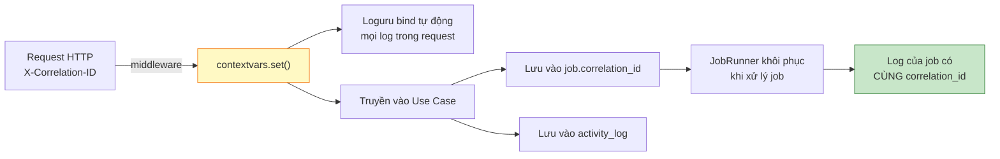

# 10 — Bảo mật & Logging

[← Mục lục](README.md)

**4 biện pháp bảo mật đúng mục tiêu · Loguru che PII bắt buộc · Nhật ký hoạt động**

---

# PHẦN A — BẢO MẬT

## 10.1. Nguyên tắc nền tảng

> **P-13 — Bảo mật đúng một mục tiêu: dữ liệu không rời khỏi máy.**
> Mọi biện pháp phải trả lời được câu hỏi *"nó ngăn dữ liệu thoát ra bằng con đường nào?"*. Biện pháp nào không trả lời được thì bị loại.

> **P-11 — Windows là lớp xác thực. Ứng dụng không dựng lại lớp đó.**
> Người dùng đã đăng nhập Windows để mở được máy. Bắt họ đăng nhập lần thứ hai không tăng bảo mật — chỉ tạo thêm một mật khẩu để quên.

### Bốn con đường dữ liệu có thể thoát ra

| # | Con đường | Biện pháp | Người dùng thấy? |
|---|---|---|---|
| **①** | **Qua mạng** (ứng dụng tự gửi đi) | Không có HTTP client ra ngoài · bind `127.0.0.1` · CSP chặn `connect-src` | ❌ Vô hình |
| **②** | **Qua phần mềm khác trên máy** (trang web độc hại, tiện ích trình duyệt gọi `localhost`) | Local Handshake Token · cổng ngẫu nhiên · kiểm `Origin`/`Host` | ❌ Vô hình |
| **③** | **Qua ổ đĩa** (máy mất, ổ cứng bị tháo, máy thanh lý) | Mã hoá trường PII bằng khoá DPAPI | ❌ Vô hình |
| **④** | **Qua file sao lưu** (USB thất lạc) | Mật khẩu bảo vệ file `.cocasbak` — **đặt một lần** | ⚠️ Một lần duy nhất |

⭐ **Toàn hệ thống chỉ có ĐÚNG MỘT mật khẩu, dùng cho ĐÚNG MỘT việc (mở file sao lưu), nhập ĐÚNG MỘT lần.**

---

## 10.2. Mô hình đe doạ

### 10.2.1. Trong phạm vi phòng thủ

| Mã | Mối đe doạ | Kịch bản thực tế | Mức | Biện pháp |
|---|---|---|---|---|
| **T1** | **Máy mất / ổ cứng bị sao chép** | Laptop bị trộm; SSD tháo ra cắm máy khác; máy thanh lý không xoá dữ liệu | 🔴 Cao | Mã hoá field-level AES-256-GCM, KEK bảo vệ bằng DPAPI **phạm vi tài khoản Windows** |
| **T3** | **Phần mềm khác trên máy gọi API loopback** | Tiện ích trình duyệt, phần mềm bên thứ ba quét cổng `127.0.0.1` | 🟠 Trung bình | Local Handshake Token · cổng ngẫu nhiên · kiểm `Origin` |
| **T4** | **Trang web độc hại tấn công loopback** | Người dùng mở web độc hại; web dùng `fetch('http://127.0.0.1:...')` hoặc DNS rebinding | 🟠 Trung bình | CORS chặt · `Sec-Fetch-Site` · `Host` · `X-Local-Token` · cổng ngẫu nhiên |
| **T5** | **File độc hại được nạp vào** | Ảnh polyglot; DOCX chứa mã SSTI; ZIP bomb | 🔴 Cao | Magic bytes · re-encode ảnh · giới hạn kích thước · `SandboxedEnvironment` |
| **T7** | **Sai sót vận hành** | Xoá nhầm khách hàng; ghi đè hợp đồng; khôi phục nhầm bản sao lưu | 🟠 Trung bình | Soft delete · hợp đồng bất biến sau `COMPLETED` · xác nhận gõ chữ · tự backup trước thao tác nguy hiểm |
| **T8** | **Ransomware trên máy** | Mã hoá tống tiền quét toàn ổ đĩa | 🟠 Trung bình | Sao lưu ra ổ đĩa ngoài · kiểm tra toàn vẹn SHA-256 phát hiện file bị sửa |
| **T9** | **Rò rỉ qua log và file tạm** | PII lọt vào log; file tạm không dọn; crash dump chứa khoá | 🟠 Trung bình | Bộ lọc che PII bắt buộc + test `grep` · file tạm trong Vault mã hoá · tắt Windows Error Reporting |
| **T10** | **Bản sao lưu thất lạc** | File `.cocasbak` copy ra USB rồi mất | 🔴 Cao | ⭐ Mã hoá bằng **mật khẩu do người dùng đặt**, không dùng DPAPI |

### 10.2.2. Ngoài phạm vi (nêu rõ để không tự lừa mình)

| Mối đe doạ | Vì sao ngoài phạm vi |
|---|---|
| Kẻ tấn công có **quyền Administrator** trên chính máy đó | Có thể đọc bộ nhớ tiến trình, cài keylogger, giả mạo DPAPI. Không phần mềm người dùng nào chống được |
| Tấn công phần cứng (cold boot, DMA, chip debug) | Ngoài khả năng của phần mềm ứng dụng |
| Người dùng hợp lệ **chụp màn hình / chép tay** dữ liệu | Vấn đề quy trình và con người |
| Máy đã nhiễm rootkit trước khi cài ứng dụng | Nền tảng đã không đáng tin |
| **Người dùng khác trên cùng máy Windows** | ⭐ Đã bỏ khỏi phạm vi (D1.6) — Windows quản lý việc này. DPAPI phạm vi user vẫn cho bảo vệ phụ |

> **Tuyên bố trung thực (đưa vào tài liệu bàn giao):** hệ thống bảo vệ dữ liệu khi **máy rời khỏi tay người dùng** và khi **có phần mềm khác chạy song song**. Nó **không** giả vờ bảo vệ được trước kẻ đã kiểm soát hoàn toàn máy tính.

---

## 10.3. Bốn biện pháp bảo mật

### 10.3.1. Chặn đường mạng (①)

| Biện pháp | Chi tiết |
|---|---|
| Bind cứng `127.0.0.1` | Không bao giờ `0.0.0.0` |
| Không có HTTP client ra ngoài | ⭐ Kiểm chứng: test tích hợp chạy trong máy ảo **đã ngắt mạng**, toàn bộ luồng phải hoàn tất |
| CSP của Tauri | `connect-src 'self' http://127.0.0.1:<port>` — không có nguồn ngoài nào |
| Model OCR + font đóng gói sẵn | Không tải gì lúc chạy |
| Không telemetry, không auto-update online | Cập nhật bằng cách chạy installer mới |

**Content Security Policy đầy đủ:**
```
default-src 'self';
connect-src 'self' http://127.0.0.1:<port>;
img-src 'self' data: blob: http://127.0.0.1:<port>;
style-src 'self' 'unsafe-inline';
script-src 'self';
font-src 'self';
object-src 'none';
frame-src 'none';
base-uri 'none';
form-action 'none';
```

> `style-src 'unsafe-inline'` là nhượng bộ bắt buộc cho MUI (tiêm CSS runtime). Được bù bằng `script-src 'self'` nghiêm ngặt — XSS không thực thi được mã.

### 10.3.2. Local Handshake Token (②) — lớp duy nhất ở cổng vào

```
Tauri khởi động
  → sinh 32 byte ngẫu nhiên
  → truyền cho backend qua BIẾN MÔI TRƯỜNG của tiến trình con
    (không qua tham số dòng lệnh — tránh lộ trong Task Manager)
  → tiêm vào SPA qua IPC (không lưu localStorage)
  → SPA gắn header X-Local-Token vào mọi request
  → backend so sánh bằng hmac.compare_digest; sai → 403 COCAS-1007 ngay
```

Kèm 3 kiểm tra phụ, đều miễn phí:

| Kiểm tra | Chống |
|---|---|
| `Origin` phải là origin Tauri | Trang web độc hại |
| `Host` phải là `127.0.0.1:<port>` | ⭐ DNS rebinding (tên miền trỏ về 127.0.0.1) |
| `Sec-Fetch-Site: same-origin` | Cross-site request |

> ⭐ **Nói đúng mức:** Local Token **chặn hoàn toàn** trang web độc hại và tiện ích trình duyệt (T4) — đây là con đường thoát dữ liệu thực tế và phổ biến nhất. Nó **làm khó nhưng không chặn tuyệt đối** phần mềm chạy cùng tài khoản Windows và cố tình dò tìm (T3) — trên Windows, biến môi trường của tiến trình con đọc được bởi tiến trình khác cùng quyền. Chống malware cùng quyền là trách nhiệm của giải pháp endpoint.

### 10.3.3. Mã hoá tại chỗ (③) — một khoá, tự động

| Mục | Chi tiết |
|---|---|
| Khoá | 32 byte ngẫu nhiên, sinh lần chạy đầu |
| Bảo vệ khoá | Windows DPAPI, `CRYPTPROTECT_LOCAL_MACHINE = false` (phạm vi **tài khoản người dùng**), có `optional_entropy` riêng của ứng dụng |
| Vị trí | `%LOCALAPPDATA%\COCAS\data\keys\master.key.dpapi` |
| Thuật toán | AES-256-GCM · nonce 12 byte ngẫu nhiên mỗi lần · ⭐ AAD = `entity_id ‖ table ‖ column` |
| Dẫn xuất | `PEPPER` (blind index) và `VAULT_KEY` dẫn từ KEK bằng HKDF |
| Trường mã hoá | Số CCCD · ngày sinh · địa chỉ · STK ngân hàng · `render_snapshot` · text OCR thô · toàn bộ file Vault |
| Người dùng thấy gì | ⭐ **Không gì cả** |

Chi tiết đầy đủ: xem [04-co-so-du-lieu.md §4.8](04-co-so-du-lieu.md#48-chiến-lược-mã-hoá).

**Ba kịch bản mất khoá:**

| Kịch bản | Hậu quả | Khắc phục |
|---|---|---|
| File `master.key.dpapi` bị xoá | Không giải mã được gì | Khôi phục từ bản sao lưu |
| ⭐ **Admin reset mật khẩu Windows** của người dùng | DPAPI mất khả năng giải bọc | Như trên — **đây là lý do bắt buộc phải sao lưu định kỳ** |
| Cài lại Windows / đổi máy | Như trên | Như trên |
| Quên mật khẩu backup | ❌ **Không khôi phục được** | Không có cửa hậu — thiết kế có chủ ý |

⭐ Màn hình "Thiết lập lần đầu" **bắt buộc** hiển thị cảnh báo này và yêu cầu tick xác nhận.

### 10.3.4. Mật khẩu sao lưu (④) — điểm ma sát duy nhất

| Mục | Chi tiết |
|---|---|
| Khi nào đặt | Lần đầu tạo bản sao lưu (hoặc trong Cài đặt → Dữ liệu & Sao lưu) |
| Yêu cầu | ≥ 12 ký tự |
| Lưu ở đâu | Windows Credential Manager — để job tự động hàng ngày dùng lại, **không hỏi lại** |
| Khi nào phải nhập | Chỉ khi **khôi phục** bản sao lưu |
| Vì sao cần | ⭐ DPAPI gắn với tài khoản Windows của máy này. Không có mật khẩu riêng, file backup **không khôi phục được trên máy khác** — làm mất ý nghĩa của việc sao lưu |
| Cấu hình tắt được | `backup.encrypt = false` — **không khuyến nghị**, có cảnh báo rõ |
| Quên mật khẩu | ❌ Không khôi phục được. Có cảnh báo tại thời điểm đặt |

---

## 10.4. Ba nhóm biện pháp giữ vì là "code đúng", không phải "bảo mật thêm"

| Nhóm | Nội dung | Chi phí |
|---|---|---|
| **Kiểm định đầu vào** | Magic bytes · re-encode ảnh · giới hạn dung lượng · giới hạn kích thước ảnh · Pydantic validate | 0 — nếu bỏ thì ứng dụng crash khi gặp file lạ |
| **Truy cập dữ liệu đúng cách** | SQLAlchemy tham số hoá · danh sách trắng cột `sort` · đường dẫn lấy từ CSDL rồi `resolve()` + kiểm nằm trong Vault | 0 — cách viết code bình thường |
| **Sandbox template** | `SandboxedEnvironment` + danh sách trắng bộ lọc + quét mẫu nguy hiểm | 0 — một dòng cấu hình. File `.docx` có thể đến từ email hoặc USB |

### 10.4.1. Bảo mật nạp file

| # | Biện pháp | Chống |
|---|---|---|
| 1 | Giới hạn `Content-Length`, **đọc theo chunk có giới hạn** | DoS bộ nhớ |
| 2 | ⭐ Xác định MIME bằng **magic bytes**, không tin `Content-Type` từ client | Giả mạo loại file |
| 3 | Đối chiếu magic bytes ↔ danh sách trắng ↔ đuôi file | Polyglot |
| 4 | `Image.MAX_IMAGE_PIXELS` giới hạn, `verify()` rồi `load()` | Decompression bomb |
| 5 | ⭐ **Re-encode toàn bộ ảnh** sang JPEG/PNG sạch | Payload nhúng, EXIF độc hại, polyglot |
| 6 | Xoá toàn bộ EXIF (giữ riêng `Orientation`) | ⭐ Rò rỉ GPS — EXIF ảnh chụp bằng điện thoại chứa toạ độ chính xác |
| 7 | Tên file lưu = UUID, **không bao giờ** tên gốc | Path Traversal |
| 8 | Template `.docx`: kiểm ZIP hợp lệ, giới hạn số entry, giới hạn tỉ lệ nén | ZIP bomb |
| 9 | Quét mẫu Jinja2 nguy hiểm trước khi lưu | SSTI |
| 10 | Kiểm dung lượng đĩa trống trước khi ghi | Đầy đĩa gây hỏng CSDL |

### 10.4.2. Chống Path Traversal

> **Nguyên tắc tuyệt đối: đường dẫn file không bao giờ đến từ đầu vào người dùng.**

| # | Quy tắc |
|---|---|
| 1 | Client chỉ gửi **UUID** — không endpoint nào nhận tham số kiểu `path`/`filename` |
| 2 | Server tra `file_path` **tương đối** từ CSDL |
| ⭐ 2b | **Kiểm hình dạng TRƯỚC KHI ghép**: khớp đúng `{category}/{yyyy}/{mm}/{dd}/{uuid}.enc` bằng biểu thức chính quy. Không khớp ⇒ từ chối ngay |
| 3 | Ghép với gốc Vault rồi **chuẩn hoá** (`Path.resolve()`) — giải quyết `..`, symlink, junction |
| 4 | ⭐ Kiểm tra kết quả **thực sự nằm trong** thư mục Vault bằng `Path.is_relative_to()`, **không so sánh chuỗi** |
| 5 | Từ chối nếu là symlink trỏ ra ngoài |
| 6 | Tên file trong Vault luôn `{uuid}.enc` |

> ⚠️ **Vì sao thêm bước 2b:** trên Windows, phép ghép `gốc / tương_đối` của `pathlib` **không bảo vệ gì cả** — vế phải tuyệt đối sẽ **thay thế** vế trái. `PureWindowsPath("C:/vault") / "C:/Windows/x"` cho ra `C:/Windows/x`, và `… / "/Windows/x"` cũng vậy. Bước 3+4 vẫn bắt được, nhưng chỉ nhờ **một** phép kiểm; đọc bước 3 rồi tưởng "đã ghép vào gốc nên chắc chắn nằm trong gốc" là hiểu sai và là kiểu hiểu sai dễ lan sang chỗ khác. Bước 2b khiến chuỗi không do hệ thống sinh ra **không bao giờ trở thành một `Path`**. Hiện thực: `infrastructure/storage/path_guard.py` (§12.13.2).
| 7 | Ngoại lệ duy nhất: thư mục backup — người dùng chọn qua **hộp thoại native của Tauri**, không gõ đường dẫn; kiểm tra là thư mục tồn tại, ghi được, không nằm trong `app/` |

### 10.4.3. Chống SQL Injection

| # | Biện pháp |
|---|---|
| 1 | ⭐ **Toàn bộ truy vấn qua SQLAlchemy ORM hoặc Core với tham số ràng buộc.** Cấm tuyệt đối `text()` có nội suy chuỗi |
| 2 | Nếu bắt buộc `text()` → **chỉ với `bindparam()`**, phải review riêng |
| 3 | ⭐ Tham số `sort`/`filter` khớp **danh sách trắng** tên cột cho từng endpoint |
| 4 | `page`, `page_size` ép kiểu int, giới hạn khoảng |
| 5 | Chuỗi tìm kiếm ≤ 100 ký tự, dùng tham số ràng buộc cho `ILIKE`/`pg_trgm` |
| 6 | Quét tĩnh trong CI: `bandit` + luật tuỳ chỉnh chặn `f"SELECT`, `.format(` gần `execute` |
| 7 | Tài khoản CSDL của ứng dụng **không phải superuser**; không có `CREATE`/`DROP` sau migration |

---

## 10.5. Bảo mật gói cài đặt

| # | Biện pháp |
|---|---|
| 1 | **Ký số installer** bằng chứng chỉ Code Signing (khuyến nghị EV để tránh SmartScreen) |
| 2 | **Ký số các `.exe` bên trong**: `ContractSystem.exe`, `cocas-backend.exe`, uninstaller |
| 3 | Công bố **SHA-256 của installer** kèm bản phát hành |
| 4 | ⭐ **Không có cơ chế tự cập nhật qua mạng** — vi phạm P-01 |
| 5 | Installer kiểm tra phiên bản schema trước khi ghi đè |
| 6 | ⭐ **Tự tạo backup trước khi nâng cấp** (`PRE_UPGRADE`) |
| 7 | Không đóng gói dữ liệu mẫu chứa PII thật — chỉ `NGUYỄN VĂN MẪU` |
| 8 | Quét virus gói cài trước khi phát hành (tránh dương tính giả do PyInstaller) |

---

## 10.6. Danh mục kiểm tra bảo mật trước phát hành

| # | Hạng mục | Cách xác minh |
|---|---|---|
| 1 | ⭐ **Không có kết nối ra ngoài** | Chạy toàn luồng trong VM đã ngắt mạng |
| 2 | Không có bí mật hardcode | `gitleaks` trong CI |
| 3 | Không có CVE nghiêm trọng | `pip-audit` + `npm audit` |
| 4 | Local Token thực sự chặn | Gọi API không có header → phải `403` |
| 5 | Mã hoá hoạt động | Mở file CSDL bằng `psql` ngoài app, xác nhận `id_number_enc` là nhị phân không đọc được |
| 6 | ⭐ **Không có PII trong log** | Chạy luồng đầy đủ rồi `grep` log tìm số CCCD mẫu |
| 7 | Path Traversal | Gửi UUID không tồn tại và chuỗi `../` |
| 8 | SSTI | Đăng ký template chứa `{{ ''.__class__ }}` → phải bị từ chối |
| 9 | Khôi phục backup trên máy khác | Kiểm thử thủ công trên máy sạch |

---

# PHẦN B — LOGGING VÀ NHẬT KÝ HOẠT ĐỘNG

## 10.7. Hai hệ thống ghi chép hoàn toàn tách biệt

| | **Application Log** | **Activity Log** (Nhật ký hoạt động) |
|---|---|---|
| **Mục đích** | Gỡ lỗi, chẩn đoán sự cố kỹ thuật | Truy vết sự cố nghiệp vụ + tuân thủ NĐ 13/2023 |
| **Người đọc** | Lập trình viên, bộ phận hỗ trợ | Người dùng, kiểm toán nội bộ |
| **Nơi lưu** | File văn bản, xoay vòng theo ngày | ⭐ Bảng `activity_log` trong PostgreSQL |
| **Nội dung** | Chi tiết kỹ thuật, stack trace, thời gian | Chủ thể · hành động · đối tượng · kết quả |
| **PII** | ⭐ **Bị che bắt buộc** | Đã che sẵn (chỉ lưu ID và mã, không lưu giá trị) |
| **Sửa/xoá được?** | Có — xoay vòng, xoá sau 30 ngày | ❌ Chỉ `SELECT`/`INSERT` ở tầng ứng dụng |
| **Mất log có sao không?** | Không nghiêm trọng | 🔴 Nghiêm trọng — vi phạm tuân thủ |
| **Ghi khi nào** | Bất cứ lúc nào, không chặn | ⭐ Trong **cùng transaction** với hành động |

---

## 10.8. Cấu hình Loguru

### 10.8.1. Ba đích ghi (sink)

| Sink | Cấp độ | Định dạng | Xoay vòng | Giữ |
|---|---|---|---|---|
| **Console** | `DEBUG` (dev) / `WARNING` (prod) | Có màu, ngắn gọn | — | — |
| **File chính** | `INFO` | ⭐ **JSON có cấu trúc** | Hàng ngày, hoặc > 50 MB | 30 ngày, nén `.zip` |
| **File lỗi** | `ERROR` | JSON + stack trace đầy đủ | Hàng tuần | 90 ngày |

### 10.8.2. Cấu trúc một dòng log

| Trường | Ví dụ | Ghi chú |
|---|---|---|
| `timestamp` | `2026-08-08T09:14:22.481Z` | UTC, ISO-8601 |
| `level` | `INFO` | |
| `correlation_id` | `c1a4e0b2-9f33-...` | ⭐ Xuyên suốt một request/job |
| `user` | `nvnghiep` | Tên tài khoản Windows |
| `module` | `ocr.pipeline` | |
| `function` / `line` | `run_extraction` / `142` | |
| `message` | `OCR completed for session` | ⭐ **Tiếng Anh** — log là cho lập trình viên |
| `context` | `{"session_id":"...","duration_ms":3820,"confidence":0.91}` | Dữ liệu có cấu trúc, **đã che PII** |
| `duration_ms` | `3820` | Nếu là thao tác có đo thời gian |

> **Vì sao log tiếng Anh còn giao diện tiếng Việt:** log đọc bởi lập trình viên và tra cứu bằng công cụ; thuật ngữ kỹ thuật tiếng Anh nhất quán hơn. Thông điệp cho người dùng cuối luôn tiếng Việt, nằm ở `error.message`.

### 10.8.3. Quy ước cấp độ

| Cấp | Dùng khi | Ví dụ | Bản phát hành? |
|---|---|---|---|
| `TRACE` | Chi tiết từng bước thuật toán | Toạ độ bbox từng vùng OCR | ❌ Chỉ khi bật gỡ lỗi |
| `DEBUG` | Thông tin phát triển | Ngữ cảnh render đã dựng (che PII) | ❌ Chỉ khi bật |
| `INFO` | ⭐ Sự kiện nghiệp vụ bình thường | "OCR completed", "Contract generated" | ✅ |
| `SUCCESS` | Hoàn tất tác vụ quan trọng | "Backup completed: 47 MB in 68s" | ✅ |
| `WARNING` | Bất thường nhưng đã xử lý | "QR decode failed, falling back to MRZ" | ✅ |
| `ERROR` | Thao tác thất bại, người dùng bị ảnh hưởng | "DOCX render failed: undefined variable" | ✅ |
| `CRITICAL` | Hệ thống không hoạt động đúng | "Cannot load KEK from DPAPI" | ✅ |

**Ba quy tắc bắt buộc:**
1. **Mọi `ERROR` phải có `correlation_id`.**
2. **Không log trong vòng lặp chặt** — gộp lại và log một dòng tổng kết.
3. **Không log thành công của thao tác tần suất cao** — chỉ log thất bại.

---

## 10.9. ⭐ Che PII tự động trong log

Biện pháp **bắt buộc, không có ngoại lệ**. Bộ lọc Loguru xử lý mọi bản ghi trước khi ghi ra đích.

| Loại dữ liệu | Mẫu nhận diện | Thay bằng | Ví dụ |
|---|---|---|---|
| Số CCCD | `\b\d{12}\b` | 8 chấm + 4 số cuối | `001199012345` → `••••••••2345` |
| Số điện thoại | `\b0\d{9}\b` | 7 chấm + 3 số cuối | `0912345678` → `•••••••678` |
| Email | `\b[\w.%+-]+@[\w.-]+\.\w+\b` | Chữ đầu + tên miền che | `an@example.com` → `a***@e***.com` |
| STK ngân hàng | `\b\d{9,20}\b` | 4 số cuối | `1234567890123` → `•••••••••0123` |
| ⭐ STK chứng khoán | `\b\d{3}C\d{6}\b` | 3 số cuối | `008C123456` → `008C•••456` |
| Họ tên | Theo tên khoá (`full_name`, `name`, `holder_name`) | Chữ cái đầu mỗi từ | `NGUYỄN VĂN AN` → `N** V** A*` |
| Địa chỉ | Theo tên khoá (`address`) | Chỉ giữ tỉnh/thành cuối | → `[địa chỉ] Hà Nội` |
| Chuỗi QR/MRZ thô | Theo tên khoá | Thay hoàn toàn | → `[REDACTED:qr_payload]` |
| Khoá, token, mật khẩu | Theo tên khoá (`password`, `token`, `secret`, `key`, `passphrase`) | Thay hoàn toàn | → `[REDACTED]` |

**Ba lớp bảo đảm:**

| Lớp | Cách làm |
|---|---|
| 1 — Bộ lọc regex | Quét toàn bộ nội dung `message` và `context` |
| 2 — Danh sách khoá nhạy cảm | Bất kỳ khoá nào trong danh sách bị thay giá trị, không cần khớp regex |
| 3 — ⭐ **Test hồi quy bắt buộc** | Chạy toàn bộ luồng nghiệp vụ với dữ liệu mẫu đã biết, rồi `grep` file log tìm `001199012345`, `0912345678`, `nguyenvanan@example.com`, `008C123456`. **Tìm thấy = test đỏ = không được phát hành** |

> ⭐ **Lớp 3 là lớp duy nhất thực sự đáng tin.** Bộ lọc có thể sót; test tự động thì không nói dối. Test này phải chạy trong mọi lần CI.

---

## 10.10. Correlation ID



| Đặc điểm | Chi tiết |
|---|---|
| Nguồn | Client gửi `X-Correlation-ID`; không có thì server sinh UUIDv4 |
| Truyền | `contextvars` — tự động theo async task, không cần truyền tham số thủ công |
| ⭐ Xuyên job nền | Lưu vào `job.correlation_id` khi enqueue; JobRunner khôi phục vào contextvars → **log của job OCR nối liền được với request tải ảnh** |
| Trả lại | Luôn có trong response header và trong `error.correlation_id` |
| Hiển thị | Ở khối "Chi tiết kỹ thuật" và màn hình lỗi, có nút "Sao chép" |

**Giá trị thực tế:** người dùng báo *"hợp đồng lúc 9 giờ sáng tạo không được"* → hỏi mã truy vết → `grep` một chuỗi trong log → thấy toàn bộ chuỗi sự kiện từ lúc tải ảnh đến lúc render thất bại.

---

## 10.11. Nhật ký hoạt động (`activity_log`)

### 10.11.1. Hai mục đích thực dụng

| Mục đích | Câu hỏi trả lời được |
|---|---|
| **Truy vết sự cố** | "Hợp đồng 01A-GDN-…00042 được tạo lúc mấy giờ, từ mẫu phiên bản nào, mất bao lâu?" |
| **Tuân thủ NĐ 13/2023** | "Dữ liệu cá nhân của khách hàng X đã được xử lý những lần nào?" |

### 10.11.2. Ghi trong cùng transaction

```
BEGIN
  ├── INSERT customer (...)
  ├── INSERT bank_account (...)
  ├── INSERT activity_log (action=CUSTOMER_CREATED, ...)   ⭐ cùng transaction
COMMIT
```

**Hệ quả:** không tồn tại trạng thái "khách hàng đã tạo nhưng không có nhật ký". Ghi nhật ký thất bại → toàn bộ giao dịch rollback. Đây là đánh đổi có chủ ý: **thà không tạo được khách hàng còn hơn tạo mà không có dấu vết**.

### 10.11.3. Nội dung trường `detail`

⭐ **Chỉ chứa mã và định danh, KHÔNG chứa giá trị PII.**

| Hành động | `detail` |
|---|---|
| `CUSTOMER_CREATED` | `{"fields_from_ocr":["full_name","id_number","dob"],"fields_manual":["phone","email"],"ocr_session_id":"...","data_quality":"MIXED"}` |
| `CUSTOMER_UPDATED` | `{"changed_fields":["phone","address"]}` ⭐ *chỉ tên trường, không giá trị cũ/mới* |
| `CONTRACT_GENERATED` | `{"contract_no":"01A-GDN-202608-00042","template_code":"01A_HD_GDN","template_version":1,"party_count":1,"docx_sha256":"a1b2...","duration_ms":712}` |
| `DOCUMENT_DOWNLOADED` | `{"contract_id":"...","doc_type":"DOCX","file_sha256":"9f8e..."}` |
| `OCR_FIELD_CORRECTED` | `{"session_id":"...","field":"issue_place","source_was":"OCR","confidence_was":0.72}` ⭐ *không có giá trị trước/sau* |
| `SETTING_CHANGED` | `{"key":"ocr.review_threshold","from":0.85,"to":0.80}` |
| `BACKUP_CREATED` | `{"file_sha256":"...","size_bytes":49283847,"customer_count":137,"duration_ms":68120}` |
| `IMAGE_PURGED` | `{"image_ids":["...","..."],"reason":"CONTRACT_COMPLETED"}` |

> ⭐ **Vì sao không lưu giá trị cũ/mới khi sửa dữ liệu:** làm vậy sẽ biến nhật ký thành một bản sao **không mã hoá** của toàn bộ PII — đúng thứ ta đang cố bảo vệ. Cần biết *ai đã sửa trường nào lúc nào* là đủ; giá trị hiện tại nằm ở bảng chính, giá trị lịch sử nằm trong `render_snapshot` của hợp đồng.

### 10.11.4. Chính sách lưu trữ

| Mục | Chi tiết |
|---|---|
| Giữ tối thiểu | **5 năm** (`retention.activity_log_years = 5`) |
| Sau đó | Xuất bằng `GET /activity-logs/export` rồi xoá thủ công |
| Cảnh báo | Màn hình Chẩn đoán hiện dung lượng bảng, cảnh báo khi > 2 GB |
| Job tự động xoá | ⚪ **Chưa triển khai ở v1.0** — chỉ có khoá cấu hình và endpoint xuất (bản lề) |
| Ước tính tăng trưởng | ~25 bản ghi/hợp đồng × 1.5 KB = ~38 KB/HĐ → 10.000 HĐ ≈ 380 MB |

---

## 10.12. Màn hình xem nhật ký

```
┌──────────────────────────────────────────────────────────────────────────────┐
│  Nhật ký hoạt động            [Mọi hành động ▾] [Mọi người ▾] [30 ngày ▾]    │
│  🔍 [Tìm theo ID đối tượng...]                                  [⬇ Xuất]     │
├──────────────────────────────────────────────────────────────────────────────┤
│  THỜI GIAN         │ NGƯỜI      │ HÀNH ĐỘNG            │ ĐỐI TƯỢNG    │ KQ   │
│ ───────────────────┼────────────┼──────────────────────┼──────────────┼──────│
│  08/08 09:16:11    │ nvnghiep   │ CONTRACT_GENERATED   │ 01A-GDN-…42  │ ✅   │
│  08/08 09:15:02    │ nvnghiep   │ CUSTOMER_CREATED     │ NGUYỄN V. A  │ ✅   │
│  08/08 09:14:34    │ nvnghiep   │ OCR_FIELD_CORRECTED  │ issue_place  │ ✅   │
│  08/08 09:12:31    │ nvnghiep   │ OCR_SESSION_CREATED  │ session 0192 │ ✅   │
│  08/08 09:12:04    │ nvnghiep   │ IMAGE_UPLOADED       │ image 0192f4 │ ✅   │
│  07/08 18:00:12    │ (hệ thống) │ BACKUP_CREATED       │ 47.2 MB      │ ✅   │
│  07/08 16:20:55    │ nvnghiep   │ 🔴 CONTRACT_VOIDED   │ 01A-GDN-…38  │ ✅   │
│    └─ Lý do: Khách hàng thay đổi thông tin tài khoản                         │
├──────────────────────────────────────────────────────────────────────────────┤
│  Hiển thị 1–50 / 48.213        ◀ 1 [2] 3 ... 965 ▶                           │
└──────────────────────────────────────────────────────────────────────────────┘
```

**Hành động được làm nổi bật:** `CONTRACT_VOIDED` (đỏ) · `BACKUP_RESTORED` (đỏ) · `CUSTOMER_DELETED` (đỏ) · `SETTING_CHANGED` (xanh dương) · `TEMPLATE_VERSION_ACTIVATED` (xanh dương).

### Xuất

| Định dạng | Nội dung | Ghi chú |
|---|---|---|
| CSV | Toàn bộ cột, mã hoá **UTF-8 có BOM** | ⭐ BOM cần thiết để Excel mở đúng tiếng Việt |
| JSON Lines | Đầy đủ cột | Cho công cụ phân tích bên ngoài |

Việc xuất **cũng được ghi nhật ký** (`DATA_EXPORTED`).

---

## 10.13. Gói chẩn đoán (Diagnostic Bundle)

Người dùng bấm **"Xuất gói chẩn đoán"** ở màn hình Chẩn đoán → tạo file ZIP:

| Nội dung | Có PII? | Ghi chú |
|---|---|---|
| Log ứng dụng 7 ngày gần nhất | ❌ Đã che | |
| Log lỗi 30 ngày | ❌ Đã che | |
| Thông tin hệ thống | ❌ | Phiên bản Windows, RAM, CPU, dung lượng đĩa |
| Phiên bản các thành phần | ❌ | App, schema, PaddleOCR, PostgreSQL |
| Kết quả health check | ❌ | |
| Cấu hình hệ thống | ❌ | ⭐ Khoá có `is_sensitive=true` bị thay bằng `[REDACTED]` |
| 200 bản ghi nhật ký gần nhất | ❌ | Chỉ mã hành động, không giá trị |
| Thống kê CSDL | ❌ | Số bản ghi mỗi bảng, kích thước |
| ⭐ **Không bao giờ có** | | Ảnh · file hợp đồng · dữ liệu khách hàng · khoá mã hoá · dump CSDL |

⭐ Trước khi tạo, hiển thị **danh sách chính xác những gì sẽ có trong gói** để người dùng yên tâm.

---

## 10.14. Chỉ số hiệu năng

⭐ **Không có bảng `perf_metric`** — chỉ số ghi vào log có cấu trúc và các cột đã có sẵn.

| Chỉ số | Nguồn | Dùng để |
|---|---|---|
| Thời gian từng chặng OCR | `ocr_session.diagnostics` (JSONB) | Xác định chặng nào chậm |
| Tổng thời gian OCR | `ocr_session.duration_ms` | Theo dõi hiệu năng |
| Confidence theo trường | `ocr_field.confidence` | Chất lượng theo thời gian |
| ⭐ **Correction Rate** | `ocr_field.user_corrected` | **Báo cáo độ chính xác thật** (Dashboard) |
| Thời gian render DOCX | `contract_document.generation_ms` | |
| Thời gian sinh DOCX | `contract_document.generation_ms` | |
| Truy vấn chậm > 100 ms | Log `WARNING` | Phát hiện truy vấn cần index |
| Thời gian chờ hàng đợi | `job.started_at - job.created_at` | |
| Dung lượng Vault | Health check | Cảnh báo dung lượng |

⭐ **Không gửi metric đi đâu** (P-01). Chỉ lưu cục bộ.

---

[← 09 — Template & Tài liệu](09-template-va-tai-lieu.md) · [Mục lục](README.md) · [Tiếp: 11 — Cấu trúc & Thư viện →](11-cau-truc-va-thu-vien.md)
