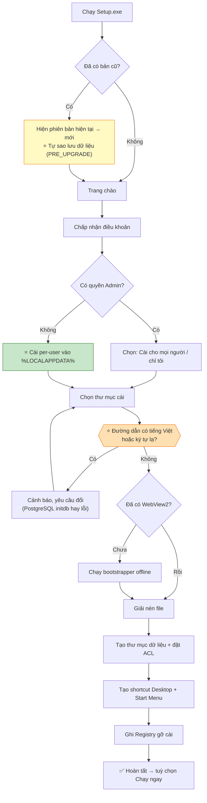

# 13 — Kiểm thử & Đóng gói Windows

[← Mục lục](README.md)

**~845 test · Kim tự tháp 5 tầng · PyInstaller + Tauri + NSIS**

---

# PHẦN A — CHIẾN LƯỢC KIỂM THỬ

## 13.1. Kim tự tháp kiểm thử

```
                    ╱╲
                   ╱E2E╲          ~15 kịch bản  ·  chậm (2–5 phút)
                  ╱──────╲        Playwright + app thật
                 ╱ Integr. ╲      ~180 test  ·  trung bình (10–60s)
                ╱────────────╲    DB thật · OCR thật · LibreOffice thật
               ╱     Unit     ╲   ~650 test  ·  nhanh (< 5s toàn bộ)
              ╱────────────────╲  Domain + Application, không I/O
             ╱   Static Checks  ╲ ruff · mypy · import-linter · bandit
            ╱────────────────────╲
```

---

## 13.2. Kiểm tra tĩnh (chạy trước mọi thứ)

| Công cụ | Kiểm gì | Ngưỡng |
|---|---|---|
| `ruff` | Lint + format | 0 lỗi |
| `mypy --strict` | Kiểu tĩnh cho `domain/` và `application/` | 0 lỗi |
| ⭐ `import-linter` | **Dependency Rule** — Domain không import Infrastructure/Presentation | 0 vi phạm |
| `bandit` | Mẫu mã nguy hiểm | 0 mức HIGH |
| `radon cc` | Độ phức tạp vòng | ≤ 10 mỗi hàm |
| `gitleaks` | Bí mật lọt vào Git | 0 |
| `pip-audit` / `npm audit` | CVE | 0 mức CRITICAL/HIGH |
| `tsc --noEmit` | Kiểu TypeScript | 0 lỗi |
| ⭐ Script quét `dist/` | URL ngoài trong bundle frontend | 0 kết quả |

---

## 13.3. Unit Test (~650)

| Nhóm | Số ca | Trọng tâm |
|---|---|---|
| **Value Object** | ~180 | Hợp lệ · không hợp lệ · biên · chuẩn hoá. Mỗi VO tối thiểu 8 ca |
| **Domain Service** | ~120 | `IssuePlaceNormalizer` (4 tầng × nhiều alias) · `FieldFusionService` (8 quy tắc) · `CardValidityPolicy` · `ExportNameGenerator` |
| **Validation Rules** | ~170 | 56 quy tắc × (1 ca đúng + 2 ca sai) |
| **Use Case** | ~140 | Với fake repository và fake port. Kiểm luồng, không kiểm hạ tầng |
| **Tiện ích** | ~60 | Đặt tên file · che PII · định dạng ngày · chuẩn hoá tiếng Việt |
| **Frontend** | ~90 | Zod schema · hook · component thuần |

### Property-based test bắt buộc (Hypothesis)

| # | Property |
|---|---|
| 1 | ⭐ `IssuePlaceNormalizer.normalize(bất kỳ chuỗi nào)` luôn trả 1 trong 3 giá trị cho phép |
| 2 | `CitizenId` chấp nhận **mọi** chuỗi 12 chữ số, từ chối **mọi** chuỗi khác |
| 3 | `VietnamesePhone` chuẩn hoá luôn cho ra đúng 10 ký tự bắt đầu bằng `0` |
| 4 | `SecuritiesAccountNumber` chuẩn hoá luôn cho `^\d{3}C\d{6}$` hoặc ném lỗi |
| 5 | ⭐ `PersonName` cho **cùng kết quả** với dạng NFC và NFD của cùng một tên |
| 6 | Mã hoá → giải mã luôn ra đúng dữ liệu gốc (round-trip) |
| 7 | ⭐ `ExportNameGenerator` luôn cho tên file hợp lệ trên Windows, với mọi họ tên đầu vào |
| 8 | `FusedField.confidence ∈ [0, 1]` với mọi tổ hợp ứng viên |

---

## 13.4. Integration Test (~180)

| Nhóm | Hạ tầng thật | Số ca | Nội dung |
|---|---|---|---|
| **Repository** | PostgreSQL (`testcontainers`) | ~50 | CRUD · phân trang · blind index · optimistic lock (chỉ `contract`) · dịch ngoại lệ |
| **Migration** | PostgreSQL | 3 | `upgrade head` → `downgrade base` → `upgrade head` · seed idempotent · phát hiện schema mới hơn app |
| ⭐ **OCR Pipeline** | PaddleOCR thật + Golden Set | ~40 | Xem §13.5 |
| **Sinh tài liệu** | docxtpl + LibreOffice thật | ~25 | Render 2 mẫu thật · ⭐ kiểm run của STK CK có `bold=True` · biến suppressed là chuỗi rỗng · PDF trích được văn bản |
| **Template Engine** | File `.docx` thật | ~20 | Quét biến bằng AST · 10 mã chẩn đoán · ⭐ chặn SSTI |
| **API** | App đầy đủ + DB | ~45 | 64 endpoint · mã trạng thái · cấu trúc lỗi · `next_actions` |
| **Vault** | Hệ thống tệp thật | ~15 | Mã hoá/giải mã · chống traversal · write-temp-rename |
| **Backup** | DB + Vault thật | ~10 | Tạo · kiểm tra · khôi phục · sai mật khẩu · schema không khớp |

---

## 13.5. ⭐ Bộ dữ liệu OCR và cách đo

| Bộ | Số cặp ảnh | Chạy khi nào | Mục đích |
|---|---|---|---|
| **Golden Set** | 200 | Mỗi lần đổi engine/tham số/model + hàng đêm | Đo 7 chỉ tiêu |
| **Edge Set** | 40 | Mỗi lần CI | Nhầm thứ tự · trùng mặt · QR che · MRZ mờ · KHÔNG THỜI HẠN · xoay 180° |
| **Smoke Set** | 10 | Mỗi commit | Chạy nhanh (< 60s), bắt hồi quy lớn |
| **Regression Set** | tăng dần | Mỗi lần CI | Mọi ảnh từng gây lỗi thật |

### Bảng chỉ số ghi lại mỗi lần chạy

Lưu vào file JSON, so sánh với lần trước:

| Chỉ số | Mục tiêu | Ngưỡng CI đỏ |
|---|---|---|
| Field Accuracy tổng | ≥ 95% (OCR thuần) · ≥ 99% (có QR/MRZ) | Giảm > 1% so với baseline |
| Full-Card Accuracy | ≥ 92% | < 92% |
| ⭐ **False Confidence** | ≤ 0.5% | **> 0.5%** — chặn phát hành |
| Side Classification Accuracy | ≥ 99% | < 99% |
| ⭐ **MRZ checksum hợp lệ** | ≥ 75% | < 70% |
| QR đọc được | ≥ 90% | < 85% |
| p95 latency | ≤ 9s | > 9s |

> ⭐ **False Confidence là chỉ số chặn phát hành.** Một trường sai được gắn nhãn "100% tin cậy" nguy hiểm hơn một trường bỏ trống — vì nó lọt thẳng vào hợp đồng mà không ai nhìn.

---

## 13.6. End-to-End Test (~15)

Chạy bằng Playwright trên ứng dụng Tauri đã build (WebDriver của Tauri).

| # | Kịch bản | Bước chính |
|---|---|---|
| E1 | ⭐ **Luồng vàng — mẫu 01A/HĐ-GĐN** | Mở app → chọn mẫu → tải 2 ảnh → chờ OCR → sửa 1 trường → nhập liên hệ + ngân hàng → tạo → tải PDF → ⭐ xác nhận tên file `Mẫu 01A - NGUYỄN VĂN AN.pdf` |
| E2 | ⭐ **Luồng vàng — mẫu 01A/GDKQ** | Như trên nhưng có ô STK chứng khoán, **không có** khối ngân hàng → ⭐ PDF có STK **in đậm** |
| E3 | Khách hàng đã có | Chọn mẫu → "Chọn khách hàng đã có" → bỏ qua OCR → tạo hợp đồng (~20 giây) |
| E4 | Tải nhầm thứ tự 2 mặt | Hệ thống tự hoán đổi, hiện thông báo + [Hoàn tác], vẫn tạo được |
| E5 | Tải trùng một mặt | Hiện lỗi rõ ràng, chặn tiếp tục |
| E6 | Ảnh chất lượng kém | Cảnh báo vàng, nhiều ô cần kiểm tra, vẫn hoàn tất được |
| E7 | CCCD trùng | Hộp thoại chọn "cập nhật" hay "tạo mới" |
| E8 | Đăng ký mẫu mới | Tải `.docx` → xem báo cáo biến → xem thử → kích hoạt → tạo hợp đồng bằng mẫu mới |
| E9 | LibreOffice chết | Kill `soffice` → PDF `FAILED` → ⭐ **DOCX vẫn tải được** → thử lại thành công |
| E10 | Sao lưu & khôi phục | Tạo backup → xoá dữ liệu → khôi phục → dữ liệu quay lại đủ |
| E11 | ⭐ **Mất điện giữa chừng** | Kill toàn bộ tiến trình khi đang OCR → mở lại → job `FAILED`, nháp form được khôi phục |
| E12 | Khôi phục nháp | Đóng app giữa bước 2 → mở lại → dữ liệu đang nhập còn nguyên |
| E13 | Lần chạy đầu tiên | Máy sạch → cài → mở → bootstrap → tạo hợp đồng đầu tiên |
| E14 | Hết dung lượng đĩa | Giả lập đĩa đầy → thông báo rõ ràng, không hỏng dữ liệu |
| E15 | ⭐ **Chạy hoàn toàn ngoại tuyến** | VM đã ngắt mạng → E1 phải hoàn tất |

---

## 13.7. Test bảo mật (chặn phát hành)

| # | Test | Kỳ vọng |
|---|---|---|
| S1 | ⭐ **Ngắt mạng** — chạy E1 trong VM không có card mạng | Hoàn tất bình thường |
| S2 | ⭐ **Không có PII trong log** — chạy E1 với dữ liệu mẫu, `grep` toàn bộ log tìm `001199012345`, `0912345678`, `nguyenvanan@example.com`, `008C123456` | **0 kết quả** |
| S3 | Gọi API không có `X-Local-Token` | `403 COCAS-1007` |
| S4 | Gọi API với `Origin` lạ | Bị CORS chặn |
| S5 | Gọi API với `Host` là tên miền ngoài | Bị chặn (chống DNS rebinding) |
| S6 | Path Traversal — gửi UUID không tồn tại và chuỗi `../` | `404`, không đọc file ngoài Vault |
| S7 | ⭐ **SSTI** — đăng ký template chứa `{{ ''.__class__.__mro__ }}` | Bị từ chối `COCAS-6014` **lúc đăng ký** |
| S8 | Ảnh polyglot (JPEG hợp lệ + payload nhúng) | Được re-encode, payload biến mất |
| S9 | ZIP bomb dưới dạng `.docx` | Bị từ chối, không cạn bộ nhớ |
| S10 | Decompression bomb ảnh | Bị từ chối `COCAS-3006` |
| S11 | ⭐ **Mã hoá thật sự** — mở file CSDL bằng `psql` ngoài app | `id_number_enc` là nhị phân không đọc được |
| S12 | SQL injection qua `sort` và `q` | Bị từ chối `COCAS-9004` hoặc thoát an toàn |
| S13 | ⭐ **Khôi phục backup trên máy khác** | Thành công với đúng mật khẩu, thất bại `COCAS-8009` với sai mật khẩu |
| S14 | EXIF GPS trong ảnh tải lên | Bị xoá hoàn toàn khỏi ảnh lưu |

---

## 13.8. Test hỗn loạn (Chaos)

| # | Kịch bản | Kỳ vọng |
|---|---|---|
| C1 | `taskkill /F` backend giữa lúc OCR | Tauri restart · job `STALE_JOB_RECOVERED` · không hỏng DB |
| C2 | `taskkill /F` PostgreSQL | Health `UNHEALTHY` · màn hình chẩn đoán · khởi động lại được |
| C3 | Kill `soffice` giữa lúc convert | `PDF_FAILED` · DOCX nguyên vẹn · listener tự khởi động lại |
| C4 | Xoá file trong Vault khi app đang chạy | Tải xuống trả `COCAS-8002` · job đối chiếu phát hiện |
| C5 | ⭐ Sửa 1 byte trong file PDF đã sinh | Tải xuống **bị chặn** với `COCAS-7009` |
| C6 | Làm đầy ổ đĩa giữa lúc sinh hợp đồng | `507` · rollback · không có file mồ côi |
| C7 | Đổi giờ hệ thống lùi lại | Không sinh trùng `contract_no` |
| C8 | Xoá file `master.key.dpapi` | Health `UNHEALTHY` · hướng dẫn khôi phục từ backup |

---

## 13.9. Mục tiêu độ phủ

| Phạm vi | Mục tiêu | Chặn phát hành nếu |
|---|---|---|
| `domain/` | **≥ 95%** | < 90% |
| `application/` | **≥ 85%** | < 80% |
| `infrastructure/` | ≥ 65% | < 55% |
| `presentation/` | ≥ 70% | < 60% |
| Frontend | ≥ 60% | < 50% |
| **Tổng backend** | ≥ 80% | < 75% |

> **Vì sao Domain đòi 95%:** nó không có I/O, không có phụ thuộc, test rất rẻ. Không đạt 95% ở đây là dấu hiệu có mã chết hoặc thiết kế lẫn lộn.

---

## 13.10. Đường ống CI

| Giai đoạn | Chạy khi | Thời gian | Chặn merge? |
|---|---|---|---|
| **1. Static** | Mỗi push | ~2 phút | ✅ |
| **2. Unit** | Mỗi push | ~3 phút | ✅ |
| **3. Smoke OCR** (10 cặp) | Mỗi push | ~1 phút | ✅ |
| **4. Ca kiểm thử chung Zod↔Pydantic** | Mỗi push | ~30 giây | ✅ |
| **5. Integration** | Mỗi PR | ~12 phút | ✅ |
| **6. Security** | Mỗi PR | ~5 phút | ✅ |
| **7. Golden Set** (200 cặp) | Hàng đêm + trước phát hành | ~25 phút | ✅ trước phát hành |
| **8. E2E** | Hàng đêm + trước phát hành | ~20 phút | ✅ trước phát hành |
| **9. Chaos** | Trước phát hành | ~15 phút | ✅ |
| **10. Build `.exe`** | ⭐ **Mỗi PR từ P1** | ~10 phút | ✅ |

> ⭐ **Giai đoạn 10 chạy từ P1** là quyết định quan trọng: phát hiện sớm việc PyInstaller không đóng gói được PaddleOCR, thay vì đợi tới P6 mới vỡ lở.

---

## 13.11. Quản lý dữ liệu thử

| Loại | Nguồn | Lưu ở đâu |
|---|---|---|
| Ảnh CCCD Golden Set | ⭐ **Ảnh thật đã được đồng ý sử dụng**, hoặc phôi mẫu tự tạo với dữ liệu giả | Kho riêng, **không** trong Git công khai, có mã hoá |
| Nhãn vàng | Gán tay bởi 2 người độc lập, đối chiếu | JSON cạnh ảnh |
| Dữ liệu khách hàng giả | `faker` locale `vi_VN` | Sinh lúc chạy test |
| Template thử | File `.docx` tự soạn | Trong Git |
| ⭐ **Quy tắc tuyệt đối** | **Không bao giờ** đưa dữ liệu khách hàng thật vào kho mã, CI, hoặc gói cài | — |

---

# PHẦN B — ĐÓNG GÓI WINDOWS

## 13.12. Kiến trúc gói cài

```
ContractSystem-Setup-1.0.0.exe   (NSIS · ~1.1 GB · đã ký số)
│
├── ContractSystem.exe           15 MB   Tauri shell
├── cocas-backend/              180 MB   PyInstaller onedir
├── postgres/                   250 MB   Nhị phân portable
├── libreoffice/                420 MB   Portable + FONT TIẾNG VIỆT
├── ocr-models/                  45 MB   PP-OCRv4 det/rec/cls
├── fonts/                        8 MB   Inter · JetBrains Mono
├── sample-templates/             1 MB   2 mẫu HĐ (dữ liệu giả)
└── webview2-bootstrapper.exe    130 MB  Bộ cài offline (chỉ chạy nếu thiếu)
```

---

## 13.13. Bước 1 — Đóng gói Backend (PyInstaller)

### Cấu hình then chốt trong `build.spec`

| Mục | Nội dung | Vì sao |
|---|---|---|
| `datas` | ⭐ Thư mục model PaddleOCR · dữ liệu của gói `paddleocr` · migration Alembic | PyInstaller **không tự phát hiện** dữ liệu nạp động |
| `binaries` | `libzbar.dll` (pyzbar) · `libmagic.dll` (python-magic) | DLL ngoài không được tự thu thập |
| `hiddenimports` | `paddle.*` (nạp động) · `asyncpg.pgproto` · `uvicorn.protocols.*` · `alembic.ddl.postgresql` | Module import bằng chuỗi |
| `excludes` | `tkinter` · `matplotlib` · `PyQt5` · `IPython` · `pytest` · `notebook` | Giảm ~120 MB |
| `console` | `False` | ⭐ Không hiện cửa sổ đen — yêu cầu "không cần mở Terminal" |
| `upx` | `True` **nhưng** `upx_exclude` cho DLL của OpenCV và Paddle | ⭐ UPX nén các DLL này **gây crash** |
| `onefile` vs `onedir` | ⭐ **`onedir`** | `onefile` giải nén ra temp mỗi lần chạy → khởi động chậm thêm 8–15 giây và để lại rác |

### Danh mục kiểm tra sau khi build

| # | Kiểm tra | Cách |
|---|---|---|
| 1 | Chạy được trên **máy sạch** (không cài Python) | VM mới |
| 2 | ⭐ Không tải model từ mạng | Chạy trong VM đã ngắt mạng |
| 3 | Đọc được QR và MRZ | Chạy Smoke Set |
| 4 | Kết nối được PostgreSQL | Health check |
| 5 | Không có cửa sổ console nào bật lên | Quan sát |
| 6 | Kích thước thư mục đầu ra | ≤ 200 MB |
| 7 | ⭐ Phiên bản NumPy đúng `<2.0` | Test kiểm tra lúc khởi động |

---

## 13.14. Bước 2 — Build Frontend và Tauri

| Bước | Nội dung |
|---|---|
| 1 | `npm ci` → `npm run build` → asset tĩnh trong `dist/` |
| 2 | ⭐ Kiểm tra `dist/` **không tham chiếu URL ngoài nào** — script quét tự động tìm `http://`/`https://` không phải `127.0.0.1` |
| 3 | Copy `cocas-backend/` vào `desktop/binaries/` làm sidecar |
| 4 | `tauri build` → `ContractSystem.exe` |
| 5 | Xác minh CSP trong `tauri.conf.json` đã áp dụng — mở DevTools thử nạp script ngoài |

---

## 13.15. Bước 3 — Installer (NSIS)

### Luồng cài đặt



### Các điểm bắt buộc

| # | Yêu cầu | Cách làm |
|---|---|---|
| 1 | ⭐ **Cài được không cần quyền Administrator** | Mặc định per-user vào `%LOCALAPPDATA%\COCAS`. Chỉ hỏi elevate nếu chọn cài cho mọi người |
| 2 | ⭐ **Không cần cài Python** | Đã đóng gói trong `cocas-backend/` |
| 3 | ⭐ **Không cần mở Terminal** | Mọi bước bootstrap chạy nền, có thanh tiến độ |
| 4 | ⭐ **Đường dẫn không được có tiếng Việt hoặc ký tự lạ** | Kiểm tra và cảnh báo — PostgreSQL `initdb` hay lỗi với đường dẫn Unicode |
| 5 | Kiểm tra dung lượng trống ≥ 3 GB | Chặn nếu không đủ |
| 6 | Kiểm tra Windows ≥ 10 build 1809 x64 | Chặn nếu thấp hơn |
| 7 | WebView2 offline bootstrapper | Chỉ chạy nếu registry cho thấy chưa cài |
| 8 | ACL thư mục `data/` | Chỉ tài khoản người dùng hiện tại có quyền đọc/ghi |
| 9 | Đăng ký gỡ cài | Registry `Uninstall` với icon, phiên bản, publisher |

---

## 13.16. Bước 4 — Bootstrap lần chạy đầu tiên

Chạy **trong ứng dụng**, không trong installer — để có giao diện đẹp và xử lý lỗi tốt hơn.

| Bước | Thời gian | Hiển thị cho người dùng |
|---|---|---|
| 1 | Tạo cây thư mục `data/` | ~1s | "Đang chuẩn bị thư mục dữ liệu…" |
| 2 | ⭐ `initdb` cụm PostgreSQL | ~20s | "Đang khởi tạo cơ sở dữ liệu… (1/5)" |
| 3 | `pg_ctl start` cổng 55432 | ~3s | "Đang khởi động dịch vụ… (2/5)" |
| 4 | ⭐ Sinh KEK → bọc DPAPI → lưu | ~1s | "Đang thiết lập bảo mật… (3/5)" |
| 5 | `alembic upgrade head` | ~5s | "Đang tạo cấu trúc dữ liệu… (4/5)" |
| 6 | Seed: document_type · 16 alias · 63 tỉnh · 50 NH · 30 cấu hình · 2 mẫu HĐ | ~2s | "Đang nạp dữ liệu ban đầu… (5/5)" |
| 7 | ⭐ Nạp model OCR **ở luồng nền** | ~5s | *(UI đã hiện, không chặn)* |
| 8 | ⭐ Màn hình cảnh báo sao lưu | — | "Dữ liệu chỉ nằm trên máy này. Hãy đặt mật khẩu sao lưu." + ô đặt mật khẩu + tick xác nhận |
| **Tổng** | | **~35 giây** | |

**Nếu bootstrap thất bại:** hiển thị màn hình chẩn đoán với log lỗi, nút "Thử lại", nút "Xuất log", và hướng dẫn khắc phục 3 lỗi phổ biến nhất.

---

## 13.17. Bước 5 — Ký số

| Đối tượng | Bắt buộc |
|---|---|
| `ContractSystem-Setup-1.0.0.exe` | ✅ |
| `ContractSystem.exe` | ✅ |
| `cocas-backend.exe` | ✅ |
| Uninstaller | ✅ |

Dùng chứng chỉ **Code Signing** (khuyến nghị EV để tránh cảnh báo SmartScreen ngay từ đầu), timestamp server RFC 3161. Công bố SHA-256 của installer kèm bản phát hành.

---

## 13.18. Nâng cấp và gỡ cài

### Nâng cấp

| Bước | Nội dung |
|---|---|
| 1 | Phát hiện bản cũ qua Registry |
| 2 | ⭐ **Tự tạo backup** `trigger = PRE_UPGRADE` |
| 3 | Dừng ứng dụng đang chạy (nếu có) |
| 4 | ⭐ Ghi đè **chỉ thư mục `app/`** — `data/` không đụng tới |
| 5 | Lần chạy đầu sau nâng cấp: tự chạy migration mới |
| 6 | ⭐ Migration thất bại → tự khôi phục backup `PRE_UPGRADE` |
| 7 | ⭐ Nếu `schema_version` trong DB **mới hơn** app (cài bản cũ đè bản mới) → **từ chối khởi động**, hướng dẫn cài lại bản mới |

### Gỡ cài

```
┌──────────────── GỠ CÀI ĐẶT COCAS ────────────────┐
│  Bạn có muốn giữ lại dữ liệu không?              │
│                                                  │
│  (•) Giữ dữ liệu  ⭐ khuyến nghị                 │
│      142 khách hàng · 291 hợp đồng · 3.2 GB      │
│      Cài lại sau này sẽ dùng lại được            │
│                                                  │
│  ( ) Xoá toàn bộ dữ liệu                         │
│      ⚠️ KHÔNG THỂ HOÀN TÁC                       │
│                                                  │
│                          [Huỷ]  [Gỡ cài đặt]     │
└──────────────────────────────────────────────────┘
```

Nếu chọn xoá toàn bộ → yêu cầu **gõ chữ `XOA TAT CA`** để xác nhận, và đề nghị tạo backup trước.

---

## 13.19. Khắc phục sự cố thường gặp

| Triệu chứng | Nguyên nhân | Cách xử lý |
|---|---|---|
| Ứng dụng không mở, không báo lỗi | Thiếu WebView2 | Chạy lại installer, chọn "Sửa chữa" |
| "Không kết nối được cơ sở dữ liệu" | PostgreSQL chưa khởi động | Màn hình chẩn đoán → "Khởi động lại dịch vụ" |
| Bootstrap dừng ở bước 2 | ⭐ Đường dẫn có tiếng Việt / ký tự lạ | Cài lại vào đường dẫn không dấu |
| "OCR chưa sẵn sàng" | Model thiếu hoặc hỏng | Chạy lại installer chọn "Sửa chữa" |
| PDF không tạo được | LibreOffice bị chặn bởi antivirus | Thêm ngoại lệ cho `soffice.bin` |
| ⭐ PDF sai font, mất dấu tiếng Việt | Thiếu font trong LibreOffice portable | Lỗi đóng gói — phát hành bản vá |
| Khởi động rất chậm (> 60s) | Antivirus quét toàn bộ thư mục app mỗi lần | Thêm ngoại lệ cho thư mục cài đặt |
| Cảnh báo SmartScreen | Chứng chỉ chưa đủ uy tín | Bấm "Thông tin thêm" → "Vẫn chạy"; sẽ hết sau vài trăm lượt cài |
| ⭐ "Không giải mã được dữ liệu" | Admin đã reset mật khẩu Windows → DPAPI mất khoá | Khôi phục từ bản sao lưu |

---

[← 12 — Đặc tả module](12-dac-ta-module.md) · [Mục lục](README.md) · [Tiếp: 14 — Roadmap & Tương lai →](14-roadmap-va-tuong-lai.md)
