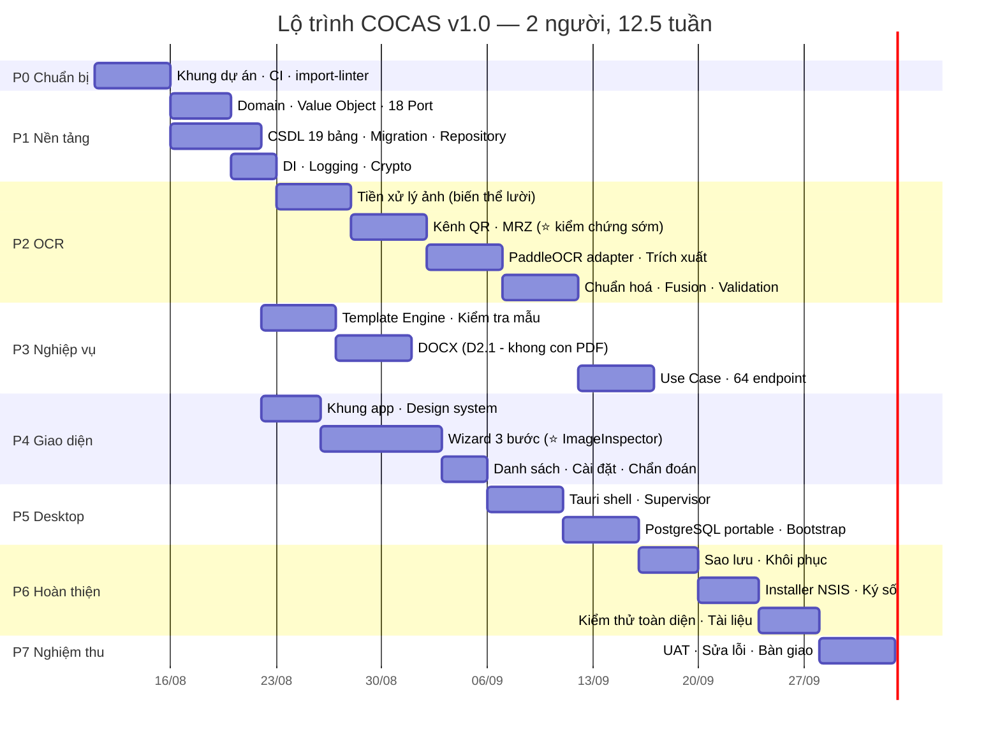

# 14 — Roadmap & Cải tiến tương lai

[← Mục lục](README.md)

**12.5 tuần / 2 người · 7 giai đoạn · 26 đề xuất nâng cấp**

---

# PHẦN A — ROADMAP PHÁT TRIỂN

## 14.1. Giả định lập kế hoạch

| Mục | Giả định |
|---|---|
| Nhân sự | **2 người**: 1 Backend/OCR + 1 Frontend/Desktop. Nếu 1 người thì ~24 tuần |
| Ngày công | 5 ngày/tuần, ~6 giờ tập trung/ngày |
| Phạm vi | Đúng những gì đã chốt tới D2.0 — không có tính năng ngoài tài liệu |
| Môi trường | Có máy Windows 11 để kiểm thử, có ảnh CCCD (thật hoặc phôi mẫu) để gán nhãn |
| Không tính | Thời gian chờ phản hồi nghiệp vụ, thời gian đào tạo người dùng |

---

## 14.2. Sơ đồ giai đoạn

---

## 14.3. Chi tiết từng giai đoạn

### P0 — Chuẩn bị (1 tuần)

| Đầu ra | Tiêu chí hoàn thành |
|---|---|
| Cấu trúc kho mã theo [11-cau-truc-va-thu-vien.md](11-cau-truc-va-thu-vien.md) | Cây thư mục đầy đủ |
| `pyproject.toml` + `package.json` với phụ thuộc đã ghim | `pip install` và `npm ci` chạy sạch |
| CI: ruff · mypy · ⭐ **import-linter** · pytest · vitest | ⭐ CI **đỏ** khi cố tình cho Domain import Infrastructure |
| `shared/validation_cases.json` khung ban đầu | Chạy được ở cả pytest và vitest |
| `pre-commit` hooks | gitleaks · ruff · mypy chạy trước mỗi commit |
| Tài liệu thiết kế đưa vào `docs/design/` | ✅ Đã hoàn thành |

**Rủi ro:** 🟢 Không có — giai đoạn cơ học.

---

### P1 — Nền tảng (1.5 tuần)

| Đầu ra | Tiêu chí hoàn thành |
|---|---|
| **Domain layer đầy đủ** | 10 Value Object · 8 Entity · 5 Domain Service · **18 Port** · cây ngoại lệ. ⭐ `domain/` **không import thư viện ngoài nào** — import-linter xác nhận |
| **19 bảng CSDL** + 8 migration | `upgrade head` → `downgrade base` → `upgrade head` đều thành công trên DB rỗng |
| **Dữ liệu seed** | document_type · 16 alias · 63 tỉnh · ~50 NH · ~30 cấu hình · **2 mẫu HĐ**. Idempotent |
| **Repository + UnitOfWork** | Test tích hợp với `testcontainers[postgres]`. ⭐ Tách `IReadRepository`/`IWriteRepository` |
| **Crypto Service** | Round-trip mã hoá/giải mã · AAD chống hoán vị ô · DPAPI bọc/mở bọc · blind index |
| **Logging** | Loguru 3 sink · ⭐ **test `grep` xác nhận không có PII trong log** |
| **Composition Root** | `container.py` khởi tạo được toàn bộ đồ thị phụ thuộc |
| ⭐ **Build `.exe` thử lần đầu** | PyInstaller đóng gói được, chạy trên VM sạch |

**Mốc demo M1:** script tạo Customer giả trong CSDL, đọc lại, ⭐ xác nhận `id_number_enc` là nhị phân không đọc được bằng công cụ DB bên ngoài.

**Rủi ro:** 🟡 PostgreSQL portable trên Windows có thể vướng `initdb` với tài khoản không admin → ⭐ **giải quyết ngay ở P1, không để tới P5**.

---

### P2 — Module OCR (4 tuần) ⭐ Giai đoạn khó nhất

| Tuần | Đầu ra | Tiêu chí hoàn thành |
|---|---|---|
| 1 | **Tiền xử lý ảnh** — 9 phép biến đổi, 5 biến thể **tạo lười** | Bộ ảnh test (nghiêng, tối, loá, xoay 180°) ra ảnh chuẩn hoá tốt hơn ảnh gốc |
| 2 | **Kênh QR** (3 lần thử) + **Kênh MRZ** | ⭐ **QR đọc được ≥ 90%** · **MRZ checksum hợp lệ ≥ 75%** trên Golden Set. **Nếu MRZ dưới 70%, phải điều chỉnh chiến lược NGAY** |
| 3 | **PaddleOCR adapter** + **Field Extractor** (zone + anchor) | 6 trường trích được từ ảnh không có QR/MRZ · ⭐ Test thay bằng `NullOcrAdapter` không làm hỏng gì |
| 4 | **Chuẩn hoá** + **Fusion** + **Validation OCR** | ⭐ Nơi cấp luôn ra 1 trong 2 giá trị chuẩn hoặc `None` · 23 quy tắc `V-OCR-*` có test |

**Mốc demo M2 (quan trọng nhất dự án):** đưa vào 2 ảnh CCCD thật → nhận về 6 trường đúng với confidence hợp lý, chạy trên máy **đã ngắt mạng**.

**Chỉ tiêu nghiệm thu P2:**

| Chỉ số | Mục tiêu |
|---|---|
| Field Accuracy (có QR/MRZ) | ≥ 99% |
| Field Accuracy (OCR thuần) | ≥ 95% |
| Full-Card Accuracy | ≥ 92% |
| ⭐ **False Confidence** | **≤ 0.5%** |
| Phân loại mặt đúng | ≥ 99% |
| ⭐ **MRZ checksum hợp lệ** | **≥ 75%** |
| QR đọc được | ≥ 90% |
| p95 thời gian 1 cặp ảnh | ≤ 9 giây |

**Rủi ro:**

| Rủi ro | Mức | Xử lý |
|---|---|---|
| ⭐ **PaddleOCR tự tải model từ mạng** | 🔴 | Xử lý ngay tuần 3, chỉ định `*_model_dir` tường minh, test ngắt mạng |
| ⭐ **MRZ không đạt 75% vì không có charset whitelist** | 🔴 | Kiểm chứng ngay tuần 2. Nếu thấp, tăng số vị trí sửa checksum hoặc bổ sung model chuyên MRZ |
| Chưa đủ ảnh CCCD để gán nhãn | 🔴 | Chuẩn bị Golden Set **song song từ P0**, không đợi |
| Bố cục QR khác dự đoán | 🟡 | Thiết kế đã có `layout_recognized=false` để không vỡ |

---

### P3 — Nghiệp vụ & Sinh tài liệu (3 tuần)

| Đầu ra | Tiêu chí hoàn thành |
|---|---|
| **Template Engine** | Quét biến bằng **AST Jinja2** · 10 mã chẩn đoán · ⭐ **SandboxedEnvironment chặn `{{ ''.__class__ }}`** |
| **RenderContextBuilder + DocxContextAdapter** | ⭐ Application chỉ tạo `StyledValue`; Infrastructure chuyển thành `RichText` |
| **DOCX Renderer** | Render 2 mẫu thật · write-temp→verify→rename · p95 ≤ 800 ms · ⭐ **STK chứng khoán in đậm** |
| **Đặt tên file xuất** | `Mẫu 01A - NGUYỄN VĂN AN.docx` · ký tự cấm · tên dành riêng · chống trùng |
| **Toàn bộ 64 endpoint** | OpenAPI đầy đủ · test tích hợp cho mọi endpoint |
| **JobRunner** | ⭐ Polling bảng `job` (không có `asyncio.Queue`) · bền qua crash · phục hồi job treo |

**Mốc demo M3:** gọi API tuần tự bằng script → nhận file `Mẫu 01A - NGUYỄN VĂN AN.docx` mở được bằng Word, ⭐ số TK chứng khoán **in đậm**, ngày hợp đồng **trống**.

**Rủi ro:** ✅ ⭐ **Đã triệt tiêu ở D2.1** — rủi ro font tiếng Việt biến mất cùng LibreOffice. Đây là lý do #2 của quyết định §9.13.

---

### P4 — Giao diện (3 tuần)

| Đầu ra | Tiêu chí hoàn thành |
|---|---|
| **App Shell + Design System** | Token màu · font Inter/JetBrains Mono **nhúng** · sáng/tối · 3 thanh cố định |
| ⭐ **Wizard 3 bước** | Chọn mẫu → Khách hàng (chia đôi) → Hoàn tất. Số bước **sinh động từ `party_schema`** |
| ⭐ **`<ImageInspector>` + `<ConfidenceField>`** | **Bấm ô → vùng trên ảnh sáng lên** · zoom/pan/xoay · UX-07 (chỉ hiện % khi dưới ngưỡng) |
| ⭐ **`<DynamicFieldSet>`** | 5 kiểu ô sinh từ `extra_fields` — 2 mẫu ra 2 form khác nhau, **không sửa code** |
| **Tự lưu nháp** | Đóng app giữa chừng → mở lại khôi phục được |
| **Các màn hình còn lại** | Dashboard · Danh sách (mẫu chung) · Chi tiết HĐ · Mẫu HĐ · Cài đặt 5 tab |
| **Trạng thái đầy đủ** | Skeleton · rỗng · lỗi có `hint` cho mọi màn hình |
| **Phím tắt** | 14 phím tắt · toàn wizard đi được bằng bàn phím |

**Mốc demo M4:** người thật ngồi trước máy, chọn mẫu, tải 2 ảnh, tạo xong hợp đồng — **không cần hướng dẫn**.

**Rủi ro:** 🟡 Đồng bộ highlight ảnh ⟷ ô nhập phức tạp hơn dự kiến → làm sớm trong tuần 2 của P4; có thể giản lược xuống "chỉ chuyển mặt ảnh" nếu quá khó.

---

### P5 — Tích hợp Desktop (2 tuần)

| Đầu ra | Tiêu chí hoàn thành |
|---|---|
| **Tauri Shell** | Cửa sổ · ⭐ CSP nghiêm ngặt · single-instance mutex · hộp thoại file native |
| ⭐ **Supervisor tiến trình** | Spawn backend · health probe 5s · restart tối đa 3 lần · kill sạch khi thoát |
| **Local Handshake Token** | Sinh + truyền qua **biến môi trường** + tiêm vào SPA qua IPC |
| **PostgreSQL portable** | `initdb` lần đầu · `pg_ctl start/stop` · cổng 55432 · ⭐ không cần quyền admin |
| **Bootstrap lần đầu** | Migration + seed tự chạy · màn hình "Thiết lập lần đầu" + đặt mật khẩu backup |
| ⭐ **Nạp model OCR ở luồng nền** | Dashboard hiện sau ~7 giây |

**Mốc demo M5:** double-click `ContractSystem.exe` trên máy sạch → ~35 giây sau vào Dashboard, tạo được hợp đồng.

**Rủi ro:** 🔴 ⭐ **Đây là giai đoạn nhiều bất ngờ nhất.** Vấn đề hay gặp: PostgreSQL từ chối `initdb` khi đường dẫn có tiếng Việt hoặc khoảng trắng; WebView2 chưa cài. → Dành sẵn **3 ngày đệm**.

---

### P6 — Hoàn thiện & Đóng gói (2 tuần)

| Đầu ra | Tiêu chí hoàn thành |
|---|---|
| **Sao lưu & Khôi phục** | Tạo `.cocasbak` có mật khẩu · ⭐ **khôi phục thành công trên máy khác** · tự sao lưu trước thao tác nguy hiểm |
| **Màn hình Chẩn đoán** | Health · kích thước dữ liệu · đối chiếu tệp ↔ CSDL · xuất gói chẩn đoán |
| **Installer NSIS** | Cài per-user không cần admin · WebView2 offline · ⭐ cảnh báo đường dẫn có dấu · gỡ cài giữ dữ liệu |
| **Ký số** | Installer + 2 file `.exe` + uninstaller |
| **Kiểm thử toàn diện** | Toàn bộ [13-kiem-thu-va-dong-goi.md](13-kiem-thu-va-dong-goi.md) · coverage ≥ 95% Domain, ≥ 85% Application |
| **Tài liệu người dùng** | Hướng dẫn tiếng Việt có ảnh chụp màn hình · hướng dẫn khắc phục sự cố |

**Mốc demo M6:** cài từ installer trên 3 máy khác nhau (Win10, Win11, tài khoản standard user) — cả 3 chạy được.

---

### P7 — Nghiệm thu (1 tuần)

| Hoạt động | Nội dung |
|---|---|
| UAT | 2–3 nhân viên nghiệp vụ dùng thật 3 ngày, tạo ≥ 50 hợp đồng |
| Đo chỉ số thật | Correction Rate thực tế · thời gian trung bình mỗi hợp đồng |
| Sửa lỗi | Ưu tiên: chặn nghiệp vụ > sai dữ liệu > khó dùng > thẩm mỹ |
| Bàn giao | Mã nguồn · tài liệu · installer đã ký · buổi đào tạo 2 giờ |

---

## 14.4. Tổng hợp thời gian

| Giai đoạn | Tuần | Ghi chú |
|---|---|---|
| P0 Chuẩn bị | 1 | |
| P1 Nền tảng | 1.5 | |
| P2 OCR | 4 | Đường găng |
| P3 Nghiệp vụ | 3 | *(song song một phần với P4)* |
| P4 Giao diện | 3 | *(song song với P3)* |
| P5 Desktop | 2 | |
| P6 Hoàn thiện | 2 | |
| P7 Nghiệm thu | 1 | |
| **TỔNG** | **≈ 12.5 tuần** | **2 người** · ~24 tuần nếu 1 người |

---

## 14.5. Sổ rủi ro

| Rủi ro | Khả năng | Tác động | Giảm thiểu |
|---|---|---|---|
| ⭐ PaddleOCR tải model từ mạng | Cao | 🔴 Vi phạm P-01 | Xử lý ở P2 tuần 3 · test ngắt mạng bắt buộc |
| ⭐ MRZ không đạt 75% (không có charset whitelist) | Trung bình | 🔴 Hụt chỉ tiêu độ chính xác | Kiểm chứng ngay P2 tuần 2 · phương án B: model chuyên MRZ |
| Không đủ ảnh CCCD để gán nhãn | Cao | 🔴 Không đo được độ chính xác | ⭐ Chuẩn bị Golden Set **từ P0**, song song |
| PostgreSQL portable trên Windows | Trung bình | 🔴 Chặn P5 | ⭐ Spike ở **P1**, không đợi P5 |
| ~~LibreOffice thiếu font tiếng Việt~~ | — | ✅ **ĐÃ ĐÓNG (D2.1)** | Gỡ hẳn khâu xuất PDF (§9.13) |
| NumPy 2.0 phá PaddleOCR | Trung bình | 🟠 Build hỏng | Ghim `<2.0` từ P0 + test kiểm phiên bản |
| PyInstaller sót dữ liệu/DLL | Cao | 🟠 Chạy được ở dev, hỏng khi đóng gói | ⭐ **Build `.exe` từ P1**, không đợi P6 |
| Kích thước gói > 1.5 GB | Trung bình | 🟡 Khó phân phối | Đo từ P1 · cân nhắc tách gói OCR model |
| Bố cục QR/MRZ khác dự đoán | Thấp | 🟡 Mất 1 kênh trích xuất | Thiết kế có đường lui về OCR thuần |
| `zone_map` khởi tạo sai lệch nhiều | Trung bình | 🟡 Giảm độ chính xác ZONE | Hiệu chỉnh bằng ảnh thật ở P2 · lưu trong CSDL sửa được |

> ⭐ **Ba nguyên tắc chống rủi ro quan trọng nhất:**
> 1. **Build `.exe` thử từ P1** — đừng để đến P6 mới phát hiện PyInstaller không đóng gói được PaddleOCR.
> 2. **Spike PostgreSQL portable ở P1** — rủi ro chặn duy nhất có thể làm hỏng cả kiến trúc.
> 3. **Kiểm chứng MRZ ở P2 tuần 2** — chỉ tiêu độ chính xác phụ thuộc vào nó.

---

# PHẦN B — CẢI TIẾN TƯƠNG LAI

## 14.6. Ma trận ưu tiên

| Ưu tiên | Cải tiến | Giá trị | Công sức | Rủi ro |
|---|---|---|---|---|
| 🥇 **1** | Vòng lặp phản hồi tự cải thiện OCR | 🔥🔥🔥 | 1 tuần | Thấp |
| 🥇 **2** | ⭐ Bật mô hình Tổ chức & nhiều bên | 🔥🔥🔥 | 2 tuần | Thấp |
| 🥇 **3** | Đọc chip NFC của CCCD | 🔥🔥🔥 | 3 tuần | Trung bình (cần đầu đọc) |
| 🥈 **4** | OCR Giấy phép kinh doanh | 🔥🔥 | 3 tuần | Trung bình |
| 🥈 **5** | Xuất Excel / báo cáo nghiệp vụ | 🔥🔥 | 1 tuần | Thấp |
| 🥈 **6** | Chữ ký số vào PDF | 🔥🔥 | 2 tuần | Trung bình |
| 🥈 **7** | Fine-tune model cho phông chữ CCCD | 🔥🔥 | 3 tuần | Trung bình |
| 🥉 **8** | Hộ chiếu và GPLX | 🔥 | 2 tuần/loại | Thấp |
| 🥉 **9** | Chế độ LAN nhiều người | 🔥 | 4 tuần | Cao |
| 🥉 **10** | Quét hàng loạt (batch) | 🔥 | 2 tuần | Thấp |

---

## 14.7. Nhóm A — Nâng độ chính xác

### A1. ⭐ Vòng lặp phản hồi tự cải thiện *(ưu tiên cao nhất)*

Bảng `ocr_field` đã lưu **cả giá trị máy đoán lẫn giá trị người sửa**. Đây là mỏ vàng chưa khai thác.

| Tính năng | Mô tả |
|---|---|
| **Đề xuất alias tự động** | Job hàng tuần gom cặp `(raw_value, user_value)` của `issue_place` xuất hiện ≥ 3 lần → đề xuất thêm vào bảng alias. Admin bấm "Chấp nhận" là xong |
| **Cảnh báo suy giảm** | Correction Rate của một trường tăng > 5% so với tháng trước → cảnh báo ở Dashboard (dấu hiệu phôi thẻ đổi hoặc tham số sai) |
| **Đề xuất ngưỡng** | Phân tích phân bố confidence của trường bị sửa → đề xuất `review_threshold` tối ưu |
| **Tinh chỉnh zone map** | Thống kê `bbox` thực tế của trường đọc đúng → điều chỉnh `document_type.zone_map` |

⭐ **Giá trị:** hệ thống tự tốt lên theo thời gian, dùng chính dữ liệu khách hàng, **trên chính máy của họ, không gửi đi đâu**. Đây là cách duy nhất "học" mà vẫn giữ P-01.

### A2. Đọc chip NFC

CCCD gắn chip chứa dữ liệu đã **ký số bởi Bộ Công an**. Với đầu đọc NFC (~500k VNĐ):

| Lợi ích | Chi tiết |
|---|---|
| Độ chính xác | **100%** — đọc dữ liệu, không nhận dạng |
| ⭐ Xác thực thẻ thật | Kiểm tra chữ ký số → phát hiện thẻ giả |
| Ảnh chân dung | Lấy được ảnh gốc từ chip |
| Kiến trúc | Thêm **kênh thứ tư hạng S** vào Fusion Engine — **không đổi module nào khác** |
| Rào cản | Cần MRZ để mở khoá BAC/PACE (đã có sẵn từ kênh MRZ) · cần thư viện đọc eMRTD |

### A3. Fine-tune model nhận dạng

Huấn luyện lại `rec` model của PaddleOCR trên bộ dữ liệu phông chữ CCCD Việt Nam. Ước tính **+3–6%** cho OCR thuần. Chỉ cần **thay file model** trong `resources/ocr-models/` — adapter không đổi.

### A4. Model phát hiện thẻ chuyên dụng

Thay heuristic contour bằng model nhẹ (YOLO-nano ~5 MB) phát hiện 4 góc thẻ. Nắn phối cảnh thành công từ ~85% lên ~97%, kéo theo toàn bộ pipeline khá hơn.

### A5. Model chuyên đọc MRZ

Nếu chỉ tiêu MRZ 75% không đạt được ở P2, phương án B: model nhận dạng riêng cho bộ ký tự `[A-Z0-9<]` (đơn giản hơn nhiều so với tiếng Việt có dấu). Cắm vào `IRegionRecognizer` mà không đổi `Td1MrzReader`.

---

## 14.8. Nhóm B — Mở rộng phạm vi nghiệp vụ

### B1. ⭐ Bật mô hình Tổ chức & nhiều bên *(bản lề đã sẵn)*

Bốn bước để bật, **không phải làm lại**:

| # | Bước | Chi tiết |
|---|---|---|
| 1 | Thêm bảng `organization` | DEK không cần (đã dùng KEK chung); các cột như đặc tả D1.3 |
| 2 | `ALTER TABLE contract_party ADD COLUMN organization_id UUID NULL` + FK | ⭐ Migration một dòng, không đụng dữ liệu cũ |
| 3 | Nới `CHECK` của `contract_party.entity_type` thêm `'ORGANIZATION'`; thêm ràng buộc XOR giữa `customer_id`/`organization_id` | Migration một dòng |
| 4 | Bỏ điều kiện từ chối `COCAS-6016` trong `TemplateInspector`; nới `min`/`max` | Xoá vài dòng |

Bổ sung: 5 endpoint `/organizations/*` · wireframe Form Tổ chức + Danh sách Tổ chức · `<OrganizationForm>` · validate mã số thuế (§8.3.10 đã đặc tả sẵn).

> ⭐ **Toàn bộ `contract_party`, `party_schema`, `ocr_session.party_key` đã có sẵn từ v1.0** — đây chính là "phần bản lề" được giữ lại có chủ ý (ADR-16).

### B2. Mở rộng loại giấy tờ

Bảng `document_type` đã chừa sẵn chỗ. Thêm một loại = thêm một bản ghi + có thể một adapter chuẩn hoá riêng.

| Loại | Đặc điểm kỹ thuật | Công sức |
|---|---|---|
| **Giấy chứng nhận ĐKDN** | ⭐ Bố cục tự do → cần chiến lược anchor mạnh; bản mới có QR | 3 tuần |
| **Hộ chiếu** | Có MRZ TD3 (2 dòng × 44) — ⭐ **tái dùng gần như toàn bộ `Td1MrzReader`** | 2 tuần |
| **GPLX** | Có QR; bố cục cố định giống CCCD | 2 tuần |
| **CMND 9 số cũ** | Không có QR/MRZ → OCR thuần, độ chính xác thấp hơn | 2 tuần |

### B3. Tính năng nghiệp vụ

| # | Tính năng | Mô tả |
|---|---|---|
| B3.1 | **Xuất Excel & báo cáo** | Danh sách khách hàng · hợp đồng theo kỳ · thống kê theo mẫu · biểu đồ |
| B3.2 | **Chữ ký số vào PDF** | Ký PAdES bằng USB Token. Hạ tầng sẵn: `contract_document.file_sha256` |
| B3.3 | **Quét hàng loạt** | Đưa vào 20 cặp ảnh → OCR tuần tự → bảng kết quả duyệt nhanh → sinh hàng loạt |
| B3.4 | **Máy scan hai mặt** | Tích hợp TWAIN/WIA — quét một lần ra cả 2 mặt, bỏ hẳn bước chọn file |
| B3.5 | **In trực tiếp** | Gửi thẳng tới máy in mặc định, không qua bước mở Word |
| B3.6 | **Nhắc CCCD sắp hết hạn** | Danh sách khách hàng có thẻ hết hạn trong 90 ngày |
| B3.7 | **Mẫu email/SMS** | Sinh sẵn nội dung để nhân viên copy gửi khách *(không tự gửi — vi phạm P-01)* |

---

## 14.9. Nhóm C — Kỹ thuật & Vận hành

| # | Cải tiến | Giá trị |
|---|---|---|
| C1 | **SSE thay polling** | Giảm ~30 lượt gọi API mỗi hợp đồng, cập nhật tiến độ mượt hơn |
| C2 | **Sao lưu gia tăng** | Backup hàng ngày chỉ ~5 MB thay vì toàn bộ |
| C3 | **Job lưu trữ lạnh nhật ký** | ⭐ Endpoint `export` đã có (bản lề C-07) — chỉ cần thêm job tự động xoá sau khi xuất |
| C4 | **Nén ảnh thông minh** | Nếu chọn giữ ảnh, lưu WebP chất lượng 85 → giảm 60% dung lượng |
| C5 | **Chế độ LAN** | Thiết kế đã chừa chỗ: đổi bind, thêm reverse proxy, đổi `IJobQueue` sang Redis, ⭐ **thêm lại tầng xác thực** |
| C6 | **Giao diện tiếng Anh** | Chuỗi đã tập trung một chỗ (`shared/i18n/`) |
| C7 | **Trợ lý sửa lỗi có ngữ cảnh** | Khi OCR sai một trường, gợi ý giá trị gần giống từ lịch sử |
| C8 | **Chế độ tương phản cao** | Cho người dùng thị lực kém |
| C9 | **Trình soạn `party_schema` trực quan** | Kéo thả để định nghĩa các bên thay vì JSON |
| C10 | **Khôi phục khoá lạc quan diện rộng** | Nếu về sau có job nền sửa `customer` → cơ chế chung đã sẵn, chỉ thêm cột `version` |

---

## 14.10. ⭐ Ba nguyên tắc bất di dịch cho mọi cải tiến tương lai

| # | Nguyên tắc | Ý nghĩa |
|---|---|---|
| **1** | ⭐ **Không bao giờ vi phạm P-01** | Mọi tính năng mới phải chạy được offline. **Không** tích hợp API đám mây, **không** telemetry, **không** auto-update online — kể cả khi tiện hơn |
| **2** | ⭐ **Không phá vỡ Dependency Rule** | Cải tiến OCR = thêm adapter. Cải tiến nghiệp vụ = thêm Use Case. Domain chỉ đổi khi **quy tắc nghiệp vụ** thật sự đổi |
| **3** | ⭐ **Mọi thay đổi OCR phải chạy Golden Set trước và sau** | Đặc biệt theo dõi **False Confidence**. Cải tiến làm tăng chỉ số này là cải tiến **xấu**, dù độ chính xác trung bình có tăng |

---

## 14.11. Ba việc cần làm trước khi bắt đầu Giai đoạn 2

| # | Việc | Vì sao gấp |
|---|---|---|
| 1 | ⭐ **Thu thập & gán nhãn Golden Set 200 cặp ảnh CCCD** | **Đường găng dài nhất.** Chỉ tiêu MRZ 75% và False Confidence 0.5% chỉ kiểm chứng được bằng ảnh thật. Nếu không có, cả P2 sẽ mù |
| 2 | ⭐ **Cung cấp 2 file `.docx` thật** | Để quét tên biến chính xác thay vì suy từ danh sách trường. Cũng để xác nhận vị trí `{{r securities_account_no }}` đặt đúng chỗ cần in đậm |
| 3 | ~~Xác nhận tên file xuất cho mẫu `01A/GDKQ`~~ ✅ | Xác nhận 2026-08-09: `01A_GDKQ - {full_name}` — khác `01A_HD_GDN`'s `Mẫu 01A - {full_name}` để không trùng nếu cùng khách hàng ký cả hai |

---

[← 13 — Kiểm thử & Đóng gói](13-kiem-thu-va-dong-goi.md) · [Mục lục](README.md)
